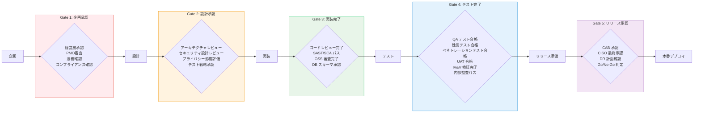
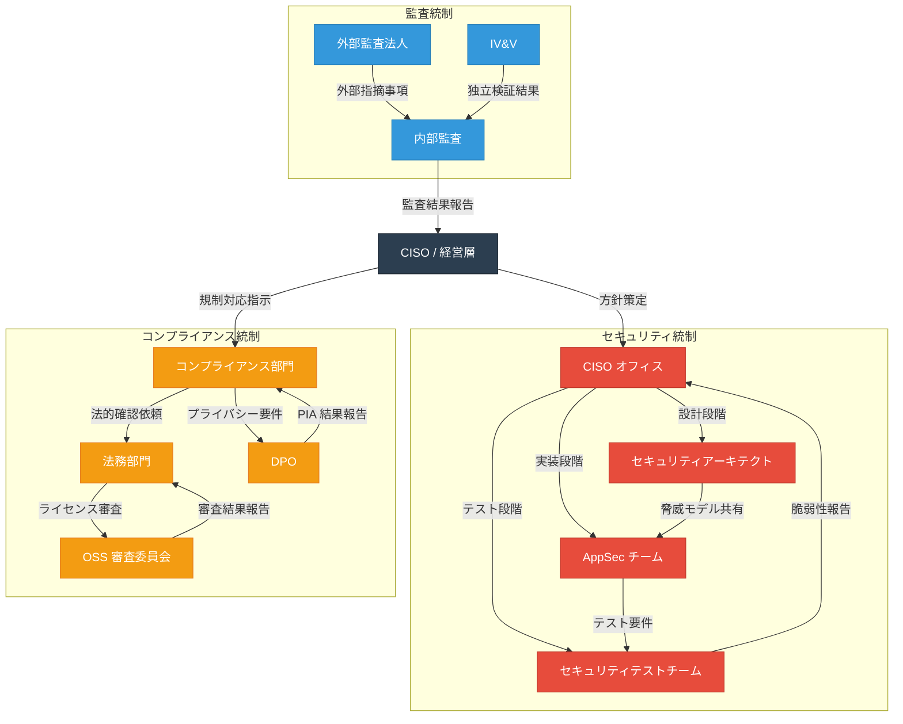

# アプリケーション開発プロセスにおけるステークホルダー一覧

厳格なガバナンス・チェック体制を持つ企業におけるアプリケーション開発の各フェーズに関わるステークホルダーと役割をまとめる。

---

## 1. 企画・構想フェーズ

| ステークホルダー | 役割 |
|---|---|
| **事業部門（ビジネスオーナー）** | ビジネス要件の定義、ROI の承認、予算確保 |
| **経営層（CIO/CTO/CISO）** | 投資判断、IT 戦略との整合性の承認 |
| **IT 企画部門** | 技術戦略との整合性評価、システム全体構成の検討 |
| **PMO（プロジェクト管理室）** | プロジェクトのガバナンス基準適合の審査、ポートフォリオ管理 |
| **法務部門** | 契約・知的財産・ライセンスの法的リスクの確認 |
| **コンプライアンス部門** | 法規制（個人情報保護法、GDPR 等）への適合性確認 |

---

## 2. 要件定義・設計フェーズ

| ステークホルダー | 役割 |
|---|---|
| **プロジェクトマネージャー（PM）** | スケジュール・コスト・品質の管理、関係者間の調整 |
| **ビジネスアナリスト（BA）** | 業務要件の分析・文書化、ユーザーストーリー作成 |
| **アーキテクト（SA/EA）** | システム全体のアーキテクチャ設計、技術選定 |
| **セキュリティアーキテクト** | セキュリティ要件の定義、脅威モデリング、セキュアデザインレビュー |
| **データプライバシー担当（DPO）** | 個人情報の取扱い設計、プライバシー影響評価（PIA）の実施 |
| **UX/UI デザイナー** | ユーザー体験の設計、アクセシビリティ基準の遵守 |
| **インフラ / クラウド設計チーム** | 非機能要件（可用性・拡張性・DR）の設計 |
| **ネットワークチーム** | 通信経路、ファイアウォール、ゾーニング設計 |
| **品質管理部門（QA マネージャー）** | テスト戦略・品質基準の策定 |

---

## 3. 実装フェーズ

| ステークホルダー | 役割 |
|---|---|
| **開発リーダー / テックリード** | 技術的な意思決定、コードレビューの統括 |
| **開発者** | コーディング、単体テスト、ドキュメント作成 |
| **セキュリティチーム（AppSec）** | SAST / SCA ツールの運用、セキュアコーディングガイドラインの提供・レビュー |
| **OSS 審査委員会** | 使用する OSS ライブラリのライセンス・脆弱性審査、利用可否の判断 |
| **構成管理担当** | ソースコード管理ポリシーの策定、ブランチ戦略の管理 |
| **データベース管理者（DBA）** | DB スキーマ変更の承認、パフォーマンスチューニング |

---

## 4. テストフェーズ

| ステークホルダー | 役割 |
|---|---|
| **QA エンジニア / テスター** | テスト計画の実行、結合テスト・システムテストの実施 |
| **パフォーマンステストチーム** | 負荷テスト・性能テストの実施と評価 |
| **セキュリティテストチーム** | DAST、ペネトレーションテストの実施 |
| **UAT 担当（業務ユーザー）** | ユーザー受入テストの実施、業務適合性の確認 |
| **第三者検証チーム（IV&V）** | 独立した検証・妥当性確認（規制業界で必須の場合あり） |
| **監査部門（内部監査）** | 開発プロセスが社内ルール・規制に準拠しているかの監査 |

---

## 5. デプロイ・リリースフェーズ

| ステークホルダー | 役割 |
|---|---|
| **リリースマネージャー** | リリーススケジュールの管理、Go/No-Go 判定の取りまとめ |
| **変更管理委員会（CAB）** | 本番環境への変更の審査・承認 |
| **インフラ / 運用チーム（Ops）** | デプロイ作業の実施、環境の準備・監視 |
| **SRE / 運用監視チーム** | デプロイ後のモニタリング、アラート設定、インシデント対応体制の構築 |
| **CISO / セキュリティ統括** | 本番リリース前のセキュリティ最終承認 |
| **ネットワーク運用チーム** | ファイアウォールルール変更、DNS/ロードバランサ設定の適用 |
| **災害対策（DR）担当** | バックアップ・リカバリ計画の確認 |

---

## 6. 横断的（全フェーズ共通）

| ステークホルダー | 役割 |
|---|---|
| **情報セキュリティ管理責任者（CISO オフィス）** | 全フェーズにわたるセキュリティポリシーの遵守監督 |
| **外部監査法人 / 規制当局** | SOC2、ISMS、PCI-DSS 等の外部監査対応 |
| **ベンダー / SIer** | 外部委託時の開発・テスト・運用の実行、SLA の遵守 |
| **調達部門** | ベンダー選定、契約管理、コスト管理 |
| **教育 / トレーニング部門** | エンドユーザー向け操作研修、開発者向けセキュリティ教育 |
| **サービスデスク / ヘルプデスク** | リリース後のユーザー問合せ対応 |
| **BCP / リスク管理部門** | 事業継続性リスクの評価、災害時の優先復旧対象の決定 |

---

## ステークホルダー相関図

### 全体俯瞰図：ガバナンス階層と承認フロー

```mermaid
graph TB
    subgraph 経営層["経営層 / ガバナンス"]
        CxO["経営層<br/>CIO / CTO / CISO"]
        PMO["PMO<br/>プロジェクト管理室"]
        CAB["変更管理委員会<br/>CAB"]
    end

    subgraph 統制部門["統制・管理部門"]
        Legal["法務部門"]
        Compliance["コンプライアンス部門"]
        DPO["データプライバシー担当<br/>DPO"]
        CISOOffice["CISO オフィス<br/>情報セキュリティ管理"]
        InternalAudit["監査部門<br/>内部監査"]
        ExternalAudit["外部監査法人<br/>規制当局"]
        BCP["BCP / リスク管理部門"]
        Procurement["調達部門"]
    end

    subgraph 事業側["事業部門"]
        BizOwner["事業部門<br/>ビジネスオーナー"]
        UAT["UAT 担当<br/>業務ユーザー"]
        Training["教育 /<br/>トレーニング部門"]
        ServiceDesk["サービスデスク<br/>ヘルプデスク"]
    end

    subgraph 企画設計["企画・設計チーム"]
        ITPlan["IT 企画部門"]
        PM["プロジェクト<br/>マネージャー"]
        BA["ビジネス<br/>アナリスト"]
        Architect["アーキテクト<br/>SA / EA"]
        SecArch["セキュリティ<br/>アーキテクト"]
        UXUI["UX/UI<br/>デザイナー"]
        QAMgr["品質管理部門<br/>QA マネージャー"]
    end

    subgraph 開発チーム["開発・実装チーム"]
        TechLead["開発リーダー<br/>テックリード"]
        Dev["開発者"]
        AppSec["セキュリティチーム<br/>AppSec"]
        OSSReview["OSS 審査委員会"]
        ConfigMgr["構成管理担当"]
        DBA["データベース<br/>管理者 DBA"]
    end

    subgraph テストチーム["テスト・検証チーム"]
        QAEng["QA エンジニア<br/>テスター"]
        PerfTest["パフォーマンス<br/>テストチーム"]
        SecTest["セキュリティ<br/>テストチーム"]
        IVV["第三者検証<br/>IV&V"]
    end

    subgraph インフラ運用["インフラ・運用チーム"]
        Infra["インフラ / クラウド<br/>設計チーム"]
        Network["ネットワーク<br/>チーム"]
        Ops["インフラ / 運用<br/>チーム Ops"]
        SRE["SRE / 運用<br/>監視チーム"]
        NetworkOps["ネットワーク<br/>運用チーム"]
        DR["災害対策<br/>DR 担当"]
        RelMgr["リリース<br/>マネージャー"]
    end

    subgraph 外部["外部パートナー"]
        Vendor["ベンダー / SIer"]
    end

    %% 経営層 → 統制・管理
    CxO -->|"投資判断・戦略承認"| PMO
    CxO -->|"セキュリティ方針指示"| CISOOffice
    CxO -->|"リスク管理方針"| BCP
    PMO -->|"ガバナンス基準適用"| PM

    %% 経営層 → 事業側
    CxO -->|"予算・ROI 承認"| BizOwner

    %% 事業側 → 企画設計
    BizOwner -->|"ビジネス要件提示"| BA
    BizOwner -->|"優先度・スコープ決定"| PM
    UAT -->|"受入テスト結果"| PM

    %% 統制部門の相互関係
    Legal -->|"法的リスク助言"| Compliance
    Compliance -->|"規制要件伝達"| DPO
    CISOOffice -->|"セキュリティポリシー"| SecArch
    CISOOffice -->|"セキュリティポリシー"| AppSec
    CISOOffice -->|"リリース最終承認"| CAB
    InternalAudit -->|"監査結果報告"| CxO
    ExternalAudit -->|"外部監査指摘"| InternalAudit
    Procurement -->|"契約・ベンダー管理"| Vendor

    %% 企画設計チーム内
    PM -->|"プロジェクト計画"| BA
    PM -->|"設計方針調整"| Architect
    BA -->|"要件伝達"| Architect
    BA -->|"UI 要件伝達"| UXUI
    Architect -->|"セキュリティ設計依頼"| SecArch
    Architect -->|"インフラ要件伝達"| Infra
    Architect -->|"NW 要件伝達"| Network
    ITPlan -->|"技術戦略整合"| Architect
    QAMgr -->|"テスト戦略策定"| QAEng
    DPO -->|"プライバシー要件"| Architect

    %% 企画設計 → 開発
    Architect -->|"アーキテクチャ指示"| TechLead
    SecArch -->|"セキュリティ設計指針"| TechLead
    PM -->|"スケジュール・タスク管理"| TechLead

    %% 開発チーム内
    TechLead -->|"技術指導・レビュー"| Dev
    AppSec -->|"SAST/SCA 結果・ガイドライン"| Dev
    OSSReview -->|"OSS 利用可否判定"| Dev
    ConfigMgr -->|"ソース管理ポリシー"| Dev
    DBA -->|"DB スキーマ承認"| Dev
    Legal -->|"ライセンス確認"| OSSReview

    %% 開発 → テスト
    Dev -->|"成果物引渡し"| QAEng
    Dev -->|"テスト対象提供"| PerfTest
    AppSec -->|"セキュリティテスト依頼"| SecTest
    QAMgr -->|"テスト基準管理"| PerfTest
    QAMgr -->|"テスト基準管理"| SecTest
    InternalAudit -->|"プロセス監査"| IVV

    %% テスト → UAT
    QAEng -->|"テスト完了報告"| PM
    QAEng -->|"UAT 環境準備"| UAT
    SecTest -->|"脆弱性レポート"| CISOOffice
    IVV -->|"独立検証結果"| PM

    %% デプロイ・リリース
    PM -->|"リリース計画調整"| RelMgr
    RelMgr -->|"変更申請"| CAB
    CAB -->|"変更承認"| Ops
    Ops -->|"デプロイ実施"| SRE
    NetworkOps -->|"NW 設定変更"| Ops
    DR -->|"DR 計画確認"| Ops
    SRE -->|"監視・運用開始"| ServiceDesk
    BCP -->|"復旧優先度"| DR

    %% 外部パートナー
    Vendor -->|"開発・テスト・運用実行"| TechLead
    Vendor -->|"SLA 報告"| PM
    Training -->|"教育・研修実施"| UAT
    Training -->|"セキュリティ教育"| Dev

    %% スタイリング
    classDef executive fill:#e74c3c,stroke:#c0392b,color:#fff
    classDef control fill:#f39c12,stroke:#e67e22,color:#fff
    classDef business fill:#2ecc71,stroke:#27ae60,color:#fff
    classDef planning fill:#3498db,stroke:#2980b9,color:#fff
    classDef development fill:#9b59b6,stroke:#8e44ad,color:#fff
    classDef testing fill:#1abc9c,stroke:#16a085,color:#fff
    classDef infra fill:#34495e,stroke:#2c3e50,color:#fff
    classDef external fill:#95a5a6,stroke:#7f8c8d,color:#fff

    class CxO,PMO,CAB executive
    class Legal,Compliance,DPO,CISOOffice,InternalAudit,ExternalAudit,BCP,Procurement control
    class BizOwner,UAT,Training,ServiceDesk business
    class ITPlan,PM,BA,Architect,SecArch,UXUI,QAMgr planning
    class TechLead,Dev,AppSec,OSSReview,ConfigMgr,DBA development
    class QAEng,PerfTest,SecTest,IVV testing
    class Infra,Network,Ops,SRE,NetworkOps,DR,RelMgr infra
    class Vendor external
```

### フェーズ別ステージゲートフロー

### セキュリティ・コンプライアンス系ステークホルダーの関係

