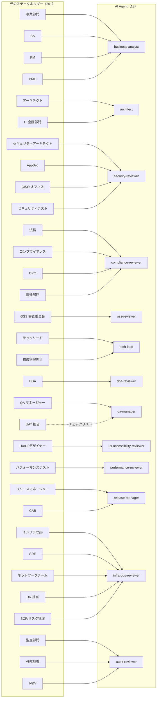
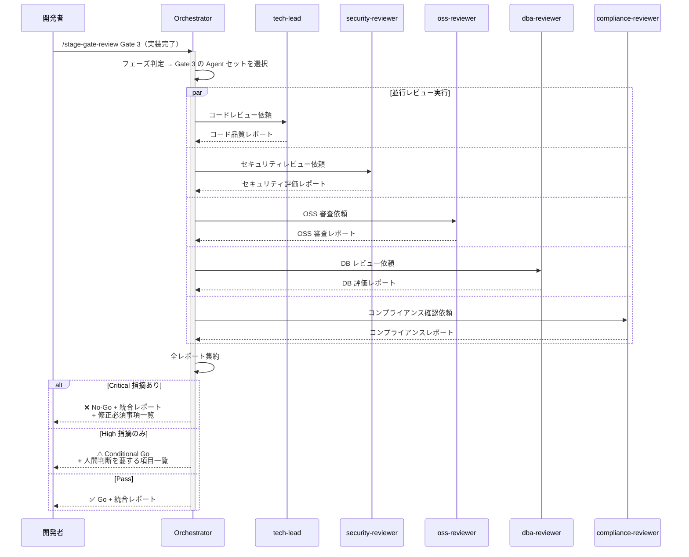
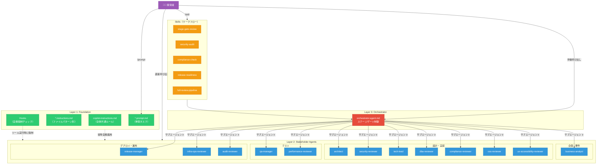

# AI Agent Skills による開発プロセス自動化 — 全体設計計画

## 1. 設計方針とアーキテクチャ概要

### 1.1 基本思想

各ステークホルダーの視点・チェック観点を **AI Agent / Skill / Instruction / Hook / Prompt** として実装し、
開発プロセスの各フェーズで自動的に、または開発者の指示で適切なチェック・レビューが走る仕組みを構築する。

**3 層アーキテクチャ**:

```
┌─────────────────────────────────────────────────────────┐
│  Layer 3: Orchestrator Agent（ステージゲート制御）         │
│    開発フェーズ全体を統括し、各ゲートで必要な Agent を呼び出す  │
├─────────────────────────────────────────────────────────┤
│  Layer 2: Stakeholder Agents（ステークホルダー Agent）      │
│    各ステークホルダーの視点でレビュー・チェックを実行する       │
├─────────────────────────────────────────────────────────┤
│  Layer 1: Foundation（Instructions / Hooks / Prompts）    │
│    常時適用されるルール、自動トリガー、再利用可能なタスク       │
└─────────────────────────────────────────────────────────┘
```

### 1.2 VS Code プリミティブの使い分け原則

| プリミティブ | 用途 | 適用先 |
|---|---|---|
| **Workspace Instructions** (`copilot-instructions.md`) | 全フェーズ共通の品質・セキュリティ基準 | 常時自動適用 |
| **File Instructions** (`.instructions.md`) | ファイルパターン別の自動チェック（例: `*.java` → コーディング規約） | `applyTo` による自動適用 |
| **Custom Agents** (`.agent.md`) | ステークホルダーの視点を持つ専門レビュアー | サブエージェントとして呼び出し |
| **Skills** (`SKILL.md`) | 複数ステップのワークフロー（例: セキュリティ監査全体） | `/` コマンドまたは自動ロード |
| **Hooks** (`.json`) | 強制的なゲートチェック（ツール実行前後の自動検証） | ライフサイクルイベントで自動実行 |
| **Prompts** (`.prompt.md`) | 単発タスクテンプレート（例: テスト計画生成） | `/` コマンドで手動実行 |

### 1.3 重要な設計判断

1. **全ステークホルダーを Agent 化しない** — 類似した観点を持つステークホルダーは統合し、実用的な粒度にまとめる
2. **Layer 1（Foundation）を最初に整備** — Instructions と Hooks で基盤を固め、その上に Agent / Skill を積み上げる
3. **段階的に導入** — Phase 1（基盤構築）→ Phase 2（レビュー体制拡充）→ Phase 3（オーケストレーション構築）→ Phase 4（高度な自動化）
4. **オーケストレーターは薄く保つ** — ルーティングと集約に徹し、判断ロジックは各 Agent に持たせる
5. **Agent 間の競合を防ぐ** — 観点の重複する Agent 間に優先度ルールを設け、矛盾する指摘が出た際の解決プロトコルを定義する
6. **安全側に倒す（Fail-Safe）** — ゲート判定で 1 つでも Critical 指摘があれば自動的に No-Go とし、人間の判断を介在させる

---

## 2. ディレクトリ構成

```
.github/
├── copilot-instructions.md              # 全体共通ルール（Layer 1）
│
├── instructions/                         # ファイル別 Instructions（Layer 1）
│   ├── java-coding-standards.instructions.md
│   ├── sql-schema-review.instructions.md
│   ├── api-design.instructions.md
│   ├── test-standards.instructions.md
│   ├── security-coding.instructions.md
│   ├── pom-dependency.instructions.md
│   ├── dockerfile-infra.instructions.md
│   └── spring-config.instructions.md
│
├── agents/                               # Custom Agents（Layer 2 + 3）
│   │
│   │  # === Layer 3: Orchestrator ===
│   ├── orchestrator.agent.md             # ステージゲート・オーケストレーター
│   │
│   │  # === Layer 2: Phase 1 — 企画・要件 ===
│   ├── business-analyst.agent.md         # BA + PMO: 要件分析・ガバナンス基準
│   ├── architect.agent.md                # アーキテクト + IT企画: 設計レビュー・技術戦略
│   │
│   │  # === Layer 2: Phase 2 — 設計・実装 ===
│   ├── security-reviewer.agent.md        # セキュリティ統合（SecArch + AppSec + CISO）
│   ├── tech-lead.agent.md                # テックリード + 構成管理: コード品質
│   ├── dba-reviewer.agent.md             # DBA: DB スキーマ・クエリレビュー
│   ├── compliance-reviewer.agent.md      # コンプライアンス統合（法務 + DPO + コンプラ + 調達）
│   ├── oss-reviewer.agent.md             # OSS 審査: ライセンス・脆弱性
│   ├── ux-accessibility-reviewer.agent.md # UX/アクセシビリティ: ユーザビリティ審査
│   │
│   │  # === Layer 2: Phase 3 — テスト ===
│   ├── qa-manager.agent.md               # QA マネージャー: テスト戦略・品質基準
│   ├── performance-reviewer.agent.md     # パフォーマンス: 性能観点レビュー
│   │
│   │  # === Layer 2: Phase 4 — デプロイ・運用 ===
│   ├── release-manager.agent.md          # リリースマネージャー: リリース判定
│   ├── infra-ops-reviewer.agent.md       # インフラ/SRE/NW/DR/BCP 統合: 運用性レビュー
│   └── audit-reviewer.agent.md           # 監査 + IV&V: プロセス準拠チェック
│
├── skills/                               # Skills（複数ステップワークフロー）
│   ├── stage-gate-review/
│   │   ├── SKILL.md
│   │   └── references/
│   │       ├── gate-criteria.md
│   │       └── checklist-templates.md
│   ├── security-audit/
│   │   ├── SKILL.md
│   │   ├── scripts/
│   │   │   └── dependency-check.sh
│   │   └── references/
│   │       ├── owasp-top10.md
│   │       └── secure-coding-guide.md
│   ├── compliance-check/
│   │   ├── SKILL.md
│   │   └── references/
│   │       ├── gdpr-checklist.md
│   │       └── license-policy.md
│   ├── release-readiness/
│   │   ├── SKILL.md
│   │   └── references/
│   │       └── go-nogo-criteria.md
│   └── full-review-pipeline/
│       ├── SKILL.md
│       └── references/
│           └── pipeline-flow.md
│
├── test-fixtures/                        # Agent 検証用サンプル（セクション 12 参照）
│   ├── vulnerable-code/
│   ├── bad-architecture/
│   ├── non-compliant-data/
│   ├── poor-tests/
│   └── golden-reports/
│
├── review-reports/                       # 監査証跡（ゲート判定結果の保存先）
│   └── .gitkeep
│
├── prompts/                              # Prompts（単発タスク）
│   ├── generate-test-plan.prompt.md
│   ├── generate-threat-model.prompt.md
│   ├── generate-pia.prompt.md
│   ├── generate-release-notes.prompt.md
│   ├── generate-api-spec.prompt.md
│   └── generate-runbook.prompt.md
│
└── hooks/                                # Hooks（自動強制チェック）
    ├── pre-tool-checks.json
    └── scripts/
        ├── post-edit-check.sh
        └── inject-project-context.sh
```

---

## 3. Layer 1: Foundation 詳細設計

### 3.1 Workspace Instructions (`copilot-instructions.md`)

全対話に自動適用される最小限の共通ルール。

```
含めるべき内容:
- プロジェクトの技術スタック（Java 25, Spring Boot 4.1, Spring AI 2.0）
- コーディング規約の要点（命名規則、パッケージ構成）
- セキュリティの最低基準（OWASP Top 10 の意識、入力検証必須）
- テストカバレッジの目標値
- コミットメッセージ規約
- 禁止事項（ハードコードされた秘密情報、未検証の外部入力等）
```

### 3.2 File Instructions（ファイルパターン別）

| ファイル名 | applyTo | チェック観点 |
|---|---|---|
| `java-coding-standards` | `**/*.java` | 命名規則、例外処理、ログ出力、Null Safety、エラーハンドリング |
| `sql-schema-review` | `**/*.sql` | 正規化、インデックス設計、マイグレーション可逆性 |
| `api-design` | `**/controller/**/*.java` | REST 設計原則、エラーレスポンス形式、バージョニング |
| `test-standards` | `**/*Test.java`, `**/*Tests.java` | テスト命名、AAA パターン、カバレッジ基準 |
| `security-coding` | `**/service/**/*.java`, `**/controller/**/*.java` | 入力検証、SQLi/XSS 防止、認証・認可チェック |
| `pom-dependency` | `**/pom.xml` | 依存関係の最小化、バージョン固定、既知脆弱性 |
| `dockerfile-infra` | `**/Dockerfile`, `**/docker-compose*.yml` | マルチステージビルド、非 root 実行、ヘルスチェック |
| `spring-config` | `**/application*.properties`, `**/application*.yml` | 秘密情報の外部化、プロファイル分離、アクチュエータ設定、ログレベル |

> **注意**: `java-coding-standards` と `security-coding` の `applyTo` は意図的に分離している。
> `java-coding-standards` は全 Java ファイルに適用（軽量な命名規則等）、
> `security-coding` は外部入力を受けるレイヤー（controller, service）に限定し、コンテキスト消費を抑制する。

### 3.3 Hooks（自動強制チェック）

```json
{
  "hooks": {
    "PreToolUse": [
      {
        "matcher": "edit_file|create_file",
        "type": "command",
        "command": "echo '{\"hookSpecificOutput\":{\"hookEventName\":\"PreToolUse\",\"permissionDecision\":\"allow\"},\"systemMessage\":\"編集前確認: OWASP Top 10・秘密情報のハードコード禁止・入力検証の必要性を確認してください\"}'",
        "timeout": 5
      }
    ],
    "PostToolUse": [
      {
        "matcher": "edit_file",
        "type": "command",
        "command": ".github/hooks/scripts/post-edit-check.sh",
        "timeout": 30
      }
    ],
    "SessionStart": [
      {
        "type": "command",
        "command": ".github/hooks/scripts/inject-project-context.sh",
        "timeout": 10
      }
    ]
  }
}
```

**Hook の役割**:
- `PreToolUse`（ファイル編集前）: セキュリティ・コンプライアンス意識のリマインダー注入（OWASP Top 10 の具体項目を明示）
- `PostToolUse`（ファイル編集後）: 静的解析（SAST）やフォーマットチェックの自動実行
- `SessionStart`（セッション開始時）: プロジェクトの現在状態（ブランチ、未解決課題等）をコンテキストに注入

> **安全性の考慮**: Hook スクリプトは `.github/hooks/scripts/` に配置し、Git 管理下でチームレビューを経て変更する。
> タイムアウトは必ず設定し、無限ループを防止する。

---

## 4. Layer 2: Stakeholder Agent 詳細設計

### 4.1 ステークホルダー → Agent マッピング（統合戦略）

類似観点を持つステークホルダーを統合し、**13 の専門 Agent** に集約する。

> **カバレッジ表**: 一部のステークホルダー（経営層、教育/トレーニング部門、サービスデスク）は
> AI Agent での直接的な自動チェックに適さないため、Agent 化せず Orchestrator の
> チェックリスト項目として管理する（後述の「Agent 化しないステークホルダーの扱い」を参照）。



### 4.2 Agent 化しないステークホルダーの扱い

以下のステークホルダーは AI Agent による自動チェックに適さないため、**Orchestrator のチェックリスト項目**として管理する。

| ステークホルダー | 扱い方 | 理由 |
|---|---|---|
| **経営層（CIO/CTO/CISO）** | Orchestrator の Go/No-Go 判定時に「経営層承認要否」をチェックリストに含める | 投資判断・最終承認は人間の意思決定が必須 |
| **教育/トレーニング部門** | `release-readiness` Skill のチェック項目に「ユーザー研修計画」を含める | ドキュメント・研修の計画有無のみ自動確認可能 |
| **サービスデスク/ヘルプデスク** | `release-readiness` Skill のチェック項目に「FAQ・問合せ対応体制」を含める | 体制準備の有無のみ自動確認可能 |
| **UAT 担当（業務ユーザー）** | `qa-manager` のチェック項目に「UAT 計画・受入基準の明確さ」を含める。`release-readiness` Skill に「UAT 完了確認」を追加 | 実際の UAT 実施は人間が行い、Agent は計画・基準の存在と完了状況のみ確認 |
| **ベンダー/SIer** | `compliance-reviewer` で SLA・契約条件のチェック項目として組み込む | ベンダー管理の自動化は限定的 |

### 4.3 各 Agent の設計仕様

#### Agent 1: `business-analyst.agent.md`

| 項目 | 内容 |
|---|---|
| **統合元** | 事業部門、ビジネスアナリスト、PM、PMO |
| **ペルソナ** | ビジネス要件とユーザー価値の専門家。ガバナンス基準の適合も確認する |
| **チェック観点** | 要件の網羅性、ユーザーストーリーの品質、受入基準の明確さ、ROI 妥当性、ガバナンス基準適合 |
| **ツール** | `read`, `search` |
| **モデル** | （デフォルト） |
| **入力** | 要件ドキュメント、ユーザーストーリー、機能仕様 |
| **出力** | 要件レビュー結果、不足要件の指摘、優先度の提案 |
| **user-invocable** | `false`（orchestrator からのサブエージェント呼び出し中心） |

#### Agent 2: `architect.agent.md`

| 項目 | 内容 |
|---|---|
| **統合元** | ソリューション/エンタープライズアーキテクト + IT 企画部門 |
| **ペルソナ** | システムアーキテクチャと技術戦略の専門家 |
| **チェック観点** | レイヤー構成の適切さ、依存関係の方向、SOLID 原則、スケーラビリティ、API 設計、技術戦略との整合性 |
| **ツール** | `read`, `search`, `web` |
| **モデル** | （デフォルト） |
| **入力** | ソースコード、pom.xml、設計ドキュメント |
| **出力** | アーキテクチャ評価レポート、改善提案、設計判断の根拠 |
| **user-invocable** | `true` |

#### Agent 3: `security-reviewer.agent.md`

| 項目 | 内容 |
|---|---|
| **統合元** | セキュリティアーキテクト + AppSec + CISO オフィス + セキュリティテスト |
| **ペルソナ** | セキュリティの専門家（設計〜テストまで一貫） |
| **チェック観点** | OWASP Top 10、入力検証、認証・認可、暗号化、秘密情報管理、脆弱性、脅威モデル |
| **ツール** | `read`, `search`, `execute` |
| **モデル** | 高精度モデル優先（セキュリティは見落としが致命的） |
| **入力** | ソースコード、設定ファイル、依存関係 |
| **出力** | セキュリティ評価レポート（Critical/High/Medium/Low 分類）、修正指示 |
| **user-invocable** | `true` |

#### Agent 4: `compliance-reviewer.agent.md`

| 項目 | 内容 |
|---|---|
| **統合元** | 法務 + コンプライアンス + DPO + 調達部門 |
| **ペルソナ** | 法規制・個人情報保護・契約管理の専門家 |
| **チェック観点** | 個人情報の取扱い、GDPR/個人情報保護法準拠、データ保持期間、同意管理、ログ記録、ベンダー契約・SLA 条件 |
| **ツール** | `read`, `search` |
| **モデル** | 高精度モデル優先（法的判断の正確性が重要） |
| **入力** | データモデル、API 仕様、設定ファイル |
| **出力** | コンプライアンス評価、PIA 要否判定、法的リスク指摘 |
| **user-invocable** | `false` |

#### Agent 5: `oss-reviewer.agent.md`

| 項目 | 内容 |
|---|---|
| **統合元** | OSS 審査委員会 |
| **ペルソナ** | オープンソースライセンス・脆弱性の専門家 |
| **チェック観点** | ライセンス互換性、既知脆弱性（CVE）、メンテナンス状態、推移的依存関係 |
| **ツール** | `read`, `search`, `execute`, `web` |
| **モデル** | （デフォルト） |
| **入力** | pom.xml、dependency tree |
| **出力** | OSS 利用可否判定一覧、ライセンスリスク、CVE レポート |
| **user-invocable** | `true` |

#### Agent 6: `tech-lead.agent.md`

| 項目 | 内容 |
|---|---|
| **統合元** | 開発リーダー / テックリード + 構成管理担当 |
| **ペルソナ** | 技術品質とコード品質の責任者 |
| **チェック観点** | コード品質、DRY/KISS、命名規則、エラーハンドリング、ログ戦略、Git 運用、ブランチ戦略 |
| **ツール** | `read`, `search`, `edit` |
| **モデル** | （デフォルト） |
| **入力** | ソースコード、PR 差分 |
| **出力** | コードレビューコメント、リファクタリング提案 |
| **user-invocable** | `true` |

#### Agent 7: `dba-reviewer.agent.md`

| 項目 | 内容 |
|---|---|
| **統合元** | データベース管理者（DBA） |
| **ペルソナ** | データベース設計・運用の専門家 |
| **チェック観点** | スキーマ設計、インデックス最適化、N+1 問題、マイグレーション安全性、データ整合性 |
| **ツール** | `read`, `search` |
| **モデル** | （デフォルト） |
| **入力** | SQL ファイル、エンティティクラス、Repository クラス |
| **出力** | DB レビュー結果、パフォーマンス改善提案 |
| **user-invocable** | `false` |

#### Agent 8: `qa-manager.agent.md`

| 項目 | 内容 |
|---|---|
| **統合元** | QA マネージャー + QA エンジニア |
| **ペルソナ** | テスト戦略・品質保証の専門家 |
| **チェック観点** | テストカバレッジ、テストケースの網羅性、境界値、異常系、テスト自動化率 |
| **ツール** | `read`, `search`, `execute` |
| **モデル** | （デフォルト） |
| **入力** | テストコード、ソースコード、テスト結果 |
| **出力** | テスト品質評価、不足テストケースの提案、カバレッジレポート |
| **user-invocable** | `true` |

#### Agent 8b: `ux-accessibility-reviewer.agent.md`

| 項目 | 内容 |
|---|---|
| **統合元** | UX/UI デザイナー |
| **ペルソナ** | ユーザビリティ・アクセシビリティの専門家 |
| **チェック観点** | UI 一貫性、アクセシビリティ（WCAG 2.1）、エラーメッセージの分かりやすさ、レスポンシブ対応、国際化（i18n） |
| **ツール** | `read`, `search` |
| **モデル** | （デフォルト） |
| **入力** | フロントエンドコード、テンプレート、API レスポンス形式 |
| **出力** | UX/アクセシビリティ評価レポート、改善提案 |
| **user-invocable** | `false` |

#### Agent 9: `performance-reviewer.agent.md`

| 項目 | 内容 |
|---|---|
| **統合元** | パフォーマンステストチーム |
| **ペルソナ** | パフォーマンス・スケーラビリティの専門家 |
| **チェック観点** | アルゴリズム計算量、メモリ使用、DB クエリ効率、キャッシュ戦略、非同期処理 |
| **ツール** | `read`, `search` |
| **モデル** | （デフォルト） |
| **入力** | ソースコード、設定ファイル |
| **出力** | パフォーマンスリスク評価、ボトルネック指摘、最適化提案 |
| **user-invocable** | `false` |

#### Agent 10: `release-manager.agent.md`

| 項目 | 内容 |
|---|---|
| **統合元** | リリースマネージャー + 変更管理委員会（CAB） |
| **ペルソナ** | リリース判定・変更管理の責任者 |
| **チェック観点** | リリース準備状態、変更影響範囲、ロールバック計画、リリースノート品質 |
| **ツール** | `read`, `search` |
| **モデル** | （デフォルト） |
| **入力** | 全 Agent のレビュー結果、変更差分、リリースノート |
| **出力** | Go/No-Go 判定、リリースチェックリスト、残課題一覧 |
| **user-invocable** | `true` |

#### Agent 11: `infra-ops-reviewer.agent.md`

| 項目 | 内容 |
|---|---|
| **統合元** | インフラ/クラウド設計 + Ops + SRE + ネットワーク + DR + BCP/リスク管理 |
| **ペルソナ** | インフラ・運用性・事業継続性の専門家 |
| **チェック観点** | デプロイ手順、環境設定、監視設定、アラート、ヘルスチェック、DR 対応、BCP 整合性、ネットワーク構成 |
| **ツール** | `read`, `search` |
| **モデル** | （デフォルト） |
| **入力** | Dockerfile、CI/CD 設定、application.properties、インフラ設定 |
| **出力** | 運用性評価、インフラ改善提案、監視項目提案、DR 計画チェック結果 |
| **user-invocable** | `false` |

#### Agent 12: `audit-reviewer.agent.md`

| 項目 | 内容 |
|---|---|
| **統合元** | 内部監査 + 外部監査法人 + IV&V |
| **ペルソナ** | 監査・ガバナンスの専門家 |
| **チェック観点** | 開発プロセス準拠、エビデンス存在確認、トレーサビリティ、承認記録、各ゲート通過証跡 |
| **ツール** | `read`, `search` |
| **モデル** | 高精度モデル優先（監査の正確性が重要） |
| **入力** | 全 Agent のレビュー結果、プロジェクトドキュメント、ゲート判定記録 |
| **出力** | 監査レポート、不適合指摘、是正要求 |
| **user-invocable** | `false` |

---

## 5. Layer 3: Orchestrator 詳細設計

### 5.1 Orchestrator Agent (`orchestrator.agent.md`)

開発フェーズのステージゲートを管理し、適切なサブエージェントを呼び出す **中央制御 Agent**。

```yaml
# frontmatter 設計
description: "開発プロセス全体のステージゲートレビューを実行する。Use when: フェーズゲートレビュー、全体品質チェック、リリース判定、包括的レビュー、ステークホルダーレビュー。DO NOT use when: 個別ファイルの編集やコード生成のみが必要な場合"
argument-hint: "Gate番号（1-5）またはfullを指定。例: Gate 3, full"
tools: [read, search, agent, todo]
agents: [
  business-analyst, architect, security-reviewer,
  compliance-reviewer, oss-reviewer, tech-lead,
  dba-reviewer, qa-manager, ux-accessibility-reviewer,
  performance-reviewer, release-manager,
  infra-ops-reviewer, audit-reviewer
]
user-invocable: true
```

### 5.2 ステージゲート別のサブエージェント呼び出しマトリクス

Orchestrator は、指定されたフェーズに応じて必要なサブエージェントのみを呼び出す。

| ゲート | 呼び出す Agent | 判定基準 |
|---|---|---|
| **Gate 1: 企画承認** | `business-analyst`, `compliance-reviewer` | 要件の網羅性・明確さ、早期の法規制リスク評価 |
| **Gate 2: 設計承認** | `architect`, `security-reviewer`, `compliance-reviewer`, `infra-ops-reviewer`, `ux-accessibility-reviewer` | アーキテクチャ適切性、セキュリティ設計、コンプライアンス適合、UX 設計品質 |
| **Gate 3: 実装完了** | `tech-lead`, `security-reviewer`, `oss-reviewer`, `dba-reviewer`, `compliance-reviewer` | コード品質、セキュリティ、OSS 安全性、DB 適切性 |
| **Gate 4: テスト完了** | `qa-manager`, `performance-reviewer`, `security-reviewer`, `audit-reviewer` | テスト品質、性能、セキュリティテスト、監査準拠 |
| **Gate 5: リリース承認** | `release-manager`, `infra-ops-reviewer`, `security-reviewer`, `audit-reviewer` | リリース準備、運用性、セキュリティ最終確認、監査最終確認 |
| **全体レビュー** | 全 Agent | フルスキャン（全観点一括チェック） |

> **設計根拠**: Gate 1 に `compliance-reviewer` を含める理由は、企画段階での法規制リスクの早期発見（Shift Left）。
> Gate 5 に `security-reviewer` を含める理由は、CISO 最終承認に相当するセキュリティの最終確認。
> Gate 2 に `ux-accessibility-reviewer` を含める理由は、設計段階で UX/アクセシビリティの方針を確定するため。

### 5.3 ゲート判定ルール

| 条件 | 判定 |
|---|---|
| 全 Agent が Pass | ✅ **Go** — 次フェーズへ進行可 |
| Critical 指摘が 1 件以上 | ❌ **No-Go** — 修正必須（自動判定） |
| High 指摘のみ（Critical なし） | ⚠️ **Conditional Go** — 人間の判断を介在させる |
| Warning のみ | ✅ **Go with Notes** — 推奨改善事項として記録 |

> **Fail-Safe 原則**: 判定に迷う場合は安全側（No-Go）に倒す。
> AI Agent の判定はあくまで「助言」であり、最終判断は人間が行う。

### 5.4 Agent 間の競合解決プロトコル

複数の Agent が矛盾する指摘を出した場合のルール:

| 競合パターン | 解決ルール |
|---|---|
| `architect`（抽象化推奨） vs `tech-lead`（シンプル維持） | `tech-lead` 優先（KISS 原則）。ただし設計フェーズでは `architect` 優先 |
| `security-reviewer`（制限追加） vs `performance-reviewer`（制限緩和） | `security-reviewer` **常に優先**（安全性 > 性能） |
| `compliance-reviewer`（データ削除） vs `audit-reviewer`（データ保持） | `compliance-reviewer` 優先（法規制 > 監査要件）。ただし人間にエスカレーション |
| その他の競合 | Orchestrator がサマリーに「**要人間判断**」として明示し、両方の指摘を併記 |

### 5.5 Orchestrator の実行フロー



---

## 6. Skills 詳細設計

### 6.1 `stage-gate-review` Skill

**目的**: 指定フェーズのステージゲートレビューを実行する包括的ワークフロー。

```yaml
# SKILL.md frontmatter
name: stage-gate-review
description: "指定フェーズのステージゲートレビューを実行。Use when: Gate レビュー、フェーズ完了チェック、Go/No-Go 判定"
argument-hint: "Gate番号（1-5）を指定"
```

```
手順:
1. 開発者からフェーズ（Gate 1〜5）の指定を受ける
2. 対象フェーズに応じた Agent セットを決定（セクション 5.2 のマトリクス参照）
3. Orchestrator Agent を通じて各 Agent を呼び出し
4. 各 Agent のレビュー結果を収集
5. 競合解決プロトコル（セクション 5.4）を適用し、矛盾を解消
6. 統合レポートを生成（Pass/Fail/Warning の集計）
7. ゲート判定ルール（セクション 5.3）に基づき Go/No-Go 判定を提示
8. レポートを .github/review-reports/gate-{N}/ に保存
```

### 6.2 `security-audit` Skill

**目的**: セキュリティ観点の包括的監査を実行する。

```yaml
# SKILL.md frontmatter
name: security-audit
description: "プロジェクト全体のセキュリティ監査を実行。Use when: セキュリティレビュー、OWASP チェック、脆弱性スキャン、秘密情報チェック"
```

```
手順:
1. プロジェクト全体のソースコードをスキャン
2. OWASP Top 10 の各項目についてチェック（[参照](./references/owasp-top10.md)）
3. 依存関係の脆弱性チェック（[スクリプト](./scripts/dependency-check.sh)）
4. 秘密情報のハードコードチェック（API キー、パスワード、トークン等）
5. 認証・認可の実装確認
6. セキュアコーディングガイドラインとの照合（[参照](./references/secure-coding-guide.md)）
7. セキュリティ監査レポートを生成
```

### 6.3 `compliance-check` Skill

**目的**: コンプライアンス・個人情報保護の観点でチェックを実行する。

```yaml
# SKILL.md frontmatter
name: compliance-check
description: "コンプライアンス・個人情報保護チェックを実行。Use when: GDPR 確認、プライバシー影響評価、ライセンスチェック、データ取扱い確認"
```

```
手順:
1. データモデル・API を分析し個人情報の取扱いを特定
2. GDPR / 個人情報保護法のチェックリストに照合（[参照](./references/gdpr-checklist.md)）
3. ライセンス互換性の確認（[参照](./references/license-policy.md)）
4. データ保持・削除ポリシーの確認
5. コンプライアンスレポートを生成
```

### 6.4 `release-readiness` Skill

**目的**: リリース前の準備状態を総合的に評価する。

```yaml
# SKILL.md frontmatter
name: release-readiness
description: "リリース前の準備状態を総合評価。Use when: リリース準備、Go/No-Go チェック、本番デプロイ前確認"
```

```
手順:
1. 全テスト結果の確認（単体・結合・システムテスト）
2. UAT 実施状況・完了確認
3. セキュリティレビュー完了の確認
4. ドキュメント（リリースノート、変更履歴）の確認
5. ロールバック計画の存在確認
6. インフラ準備状態の確認（DR 計画含む）
7. ユーザー研修計画・FAQ の準備状況確認
8. サービスデスクの問合せ対応体制確認
9. 経営層承認の要否判定
10. Go/No-Go チェックリストの生成
```

### 6.5 `full-review-pipeline` Skill

**目的**: 全 Agent を一括実行し、プロジェクト全体の品質評価を行う。

```yaml
# SKILL.md frontmatter
name: full-review-pipeline
description: "全 Agent による包括的プロジェクトレビューを実行。Use when: 全体品質評価、フルスキャン、プロジェクト健全性チェック"
```

```
手順:
1. プロジェクト構造の分析
2. 全 13 Agent を順次/並行で呼び出し
3. 各 Agent の結果を集約
4. 重複指摘の統合・優先度付け（競合解決プロトコル適用）
5. 総合評価ダッシュボード形式でレポート生成
6. 最優先対応事項の Top 10 リストを提示
7. レポートを .github/review-reports/full-review/ に保存
```

---

## 7. Prompts 詳細設計

各 Prompt は `.prompt.md` ファイルとして作成し、`agent` フィールドで対応する Agent を指定する。

| プロンプト名 | 用途 | agent フィールド | argument-hint |
|---|---|---|---|
| `generate-test-plan` | テスト計画書の雛形生成 | `qa-manager` | 「対象機能名」 |
| `generate-threat-model` | 脅威モデル（STRIDE）の生成 | `security-reviewer` | 「対象コンポーネント名」 |
| `generate-pia` | プライバシー影響評価の生成 | `compliance-reviewer` | 「対象データ種別」 |
| `generate-release-notes` | リリースノートの自動生成 | `release-manager` | 「バージョン番号」 |
| `generate-api-spec` | API 仕様書の雛形生成 | `architect` | 「対象 API エンドポイント」 |
| `generate-runbook` | 運用手順書の雛形生成 | `infra-ops-reviewer` | 「対象サービス名」 |

> **注意**: Prompt の `agent` フィールドにカスタム Agent 名を指定することで、
> その Agent のペルソナ・制約・ツール制限が自動的に適用される。

---

## 8. 実装フェーズ計画

### Phase 1: 基盤構築（最小構成）

**目標**: 日常的なコーディング作業に最も効果が高いものから着手。

| 順番 | 作成対象 | 種別 | 理由 |
|---|---|---|---|
| 1 | `copilot-instructions.md` | Workspace Instructions | 全体の土台。常時適用される基本ルール |
| 2 | `java-coding-standards.instructions.md` | File Instructions | Java ファイル編集時に自動適用 |
| 3 | `security-coding.instructions.md` | File Instructions | セキュリティコーディングの自動チェック |
| 4 | `tech-lead.agent.md` | Agent | 最も頻繁に使うコードレビュー Agent |
| 5 | `security-reviewer.agent.md` | Agent | セキュリティは全フェーズ横断で最重要 |

### Phase 2: レビュー体制拡充

**目標**: 設計・実装フェーズの主要チェック観点を網羅。

| 順番 | 作成対象 | 種別 |
|---|---|---|
| 6 | `architect.agent.md` | Agent |
| 7 | `oss-reviewer.agent.md` | Agent |
| 8 | `compliance-reviewer.agent.md` | Agent |
| 9 | `dba-reviewer.agent.md` | Agent |
| 10 | `qa-manager.agent.md` | Agent |
| 11 | `ux-accessibility-reviewer.agent.md` | Agent |
| 12 | `pom-dependency.instructions.md` | File Instructions |
| 13 | `test-standards.instructions.md` | File Instructions |
| 14 | `spring-config.instructions.md` | File Instructions |
| 15 | `security-audit` Skill | Skill |

### Phase 3: オーケストレーション構築

**目標**: 全 Agent を統合し、ステージゲートによる自動レビューパイプラインを完成。

| 順番 | 作成対象 | 種別 |
|---|---|---|
| 16 | `performance-reviewer.agent.md` | Agent |
| 17 | `release-manager.agent.md` | Agent |
| 18 | `infra-ops-reviewer.agent.md` | Agent |
| 19 | `audit-reviewer.agent.md` | Agent |
| 20 | `business-analyst.agent.md` | Agent |
| 21 | `orchestrator.agent.md` | Agent（オーケストレーター） |
| 22 | `stage-gate-review` Skill | Skill |
| 23 | `full-review-pipeline` Skill | Skill |
| 24 | `release-readiness` Skill | Skill |

### Phase 4: 高度な自動化

**目標**: Hooks による強制チェックと Prompt による生成タスクの追加。

| 順番 | 作成対象 | 種別 |
|---|---|---|
| 25 | `pre-tool-checks.json` | Hook |
| 26 | 残りの File Instructions | File Instructions |
| 27 | 全 Prompts（6 種） | Prompts |
| 28 | `compliance-check` Skill | Skill |

---

## 9. 品質保証・運用の方針

### 9.1 Agent の品質を保つルール

1. **description は具体的に** — 「Use when...」パターンでトリガーワードを明記
2. **ツールは最小限** — 各 Agent に必要なツールだけを付与（最小権限の原則）
3. **出力形式を統一** — 全 Agent で共通のレポートフォーマット（重要度分類: Critical/High/Medium/Low）
4. **SKILL.md は 500 行以内** — 詳細は `references/` に分離し、プログレッシブローディングを活用
5. **定期的な見直し** — 技術スタックやポリシーの変更に合わせて Instructions を更新
6. **Agent の description に否定条件も記載** — 「DO NOT use when...」を明記し、誤起動を防止
7. **参照ドキュメントのバージョン管理** — references/ のチェックリストに更新日・バージョンを記載

### 9.2 統一レポートフォーマット

全 Agent が返すレポートの共通構造:

```markdown
## [Agent名] レビューレポート

### サマリー
- 判定: ✅ Pass / ⚠️ Warning / ❌ Fail
- 指摘件数: Critical: X, High: X, Medium: X, Low: X
- レビュー対象: [ファイル一覧 or スコープ]
- レビュー日時: YYYY-MM-DD

### 指摘事項
| # | 重要度 | 対象ファイル | 行番号 | 指摘内容 | 推奨対応 |
|---|--------|-------------|--------|----------|----------|
| 1 | Critical | ... | ... | ... | ... |

### 競合フラグ（該当する場合）
- ⚡ [他Agent名] の指摘と競合の可能性あり: [概要]

### 推奨事項（任意）
- ...
```

### 9.3 監査証跡（Audit Trail）

ゲート判定結果の追跡性を確保するため、以下のルールを適用する:

1. **レポートの永続化**: 各ゲート判定結果は `.github/review-reports/gate-{N}/YYYY-MM-DD_HH-MM.md` に保存
2. **Go/No-Go 判定の記録**: 判定理由・判定者（AI or 人間）を明記
3. **修正追跡**: No-Go 後の修正内容と再判定結果を記録
4. **トレーサビリティ**: 各指摘事項に対する対応状況（対応済/受容/延期）を追跡

```
.github/review-reports/
├── gate-1/
│   └── 2026-03-18_14-30.md
├── gate-3/
│   ├── 2026-03-15_10-00.md    # 初回: No-Go
│   └── 2026-03-17_16-00.md    # 再審: Go
└── full-review/
    └── 2026-03-18_09-00.md
```

### 9.4 パフォーマンス考慮

- Orchestrator は必要な Agent だけを呼び出す（全 Agent 常時起動ではない）
- File Instructions は `applyTo` を狭く設定し、不要なコンテキスト消費を防ぐ
- Hooks は軽量スクリプトに限定（timeout 30 秒以内）
- 高精度モデル指定は `security-reviewer`、`compliance-reviewer`、`audit-reviewer` の 3 Agent に限定し、コスト効率を維持

---

## 10. 全体アーキテクチャ図（最終形）



---

## 11. 効率化のためのキーポイントまとめ

| # | 方針 | 理由 |
|---|---|---|
| 1 | **30+ ステークホルダーを 13 Agent に統合** | 類似観点の統合で管理コスト削減、コンテキストウィンドウの節約 |
| 2 | **3 層アーキテクチャ** | 関心の分離（基盤ルール / 専門レビュー / 統括制御） |
| 3 | **Foundation（Instructions）を先に整備** | Agent 不使用時でも常時品質チェックが効く |
| 4 | **Orchestrator は薄く** | ルーティングと集約のみ、判断は各 Agent に委譲 |
| 5 | **ゲート別 Agent セットの定義** | 不要な Agent 呼び出しを排除し、レビュー速度を向上 |
| 6 | **統一レポートフォーマット** | Orchestrator での集約・比較を容易にする |
| 7 | **段階的導入（4 Phase / 28 項目）** | Phase 1 だけで日常の開発品質が向上する ROI の高い順 |
| 8 | **Skills でワークフローを標準化** | 誰が実行しても同じ手順・同じ品質 |
| 9 | **Hooks で最低限を強制** | Agent に頼らず、自動的に最低基準を担保 |
| 10 | **Progressive Loading の活用** | SKILL.md は軽量に保ち、詳細は references/ で遅延読込 |
| 11 | **Fail-Safe 原則** | Critical 指摘は自動 No-Go、判断に迷う場合は人間にエスカレーション |
| 12 | **監査証跡の確保** | ゲート判定結果・修正履歴を永続化し、トレーサビリティを担保 |

---

## 12. Agent のテスト・検証戦略

Agent 自体の品質を確保するための戦略。

### 12.1 検証方法

| レベル | 方法 | 対象 |
|---|---|---|
| **Unit** | 既知のコードサンプルに対して Agent を実行し、期待する指摘が出るか検証 | 各 Agent 個別 |
| **Integration** | Orchestrator 経由で複数 Agent を呼び出し、レポート集約が正しく動作するか検証 | Orchestrator + Agent 群 |
| **Regression** | 過去のレビュー結果を基準にし、Agent 更新後に指摘の品質が劣化しないか確認 | 更新した Agent |
| **Adversarial** | 意図的に脆弱なコードや違反コードを入力し、検出できるか確認 | security-reviewer, compliance-reviewer |

### 12.2 テスト用サンプルコード

`.github/skills/test-fixtures/` に以下を配置（ディレクトリ構成のセクション 2 も参照）:

```
test-fixtures/
├── vulnerable-code/          # OWASP Top 10 違反サンプル（security-reviewer 検証用）
├── bad-architecture/         # 循環依存・過度な結合（architect 検証用）
├── non-compliant-data/       # 個人情報の不適切な扱い（compliance-reviewer 検証用）
├── poor-tests/               # カバレッジ不足のテスト（qa-manager 検証用）
└── golden-reports/           # 期待される出力レポート（回帰テスト用）
```

### 12.3 定期更新サイクル

| 対象 | 頻度 | トリガー |
|---|---|---|
| Instructions（File/Workspace） | フレームワーク・ライブラリのメジャーバージョン更新時 | pom.xml の変更 |
| Agent の description | 四半期ごと | 誤起動・未起動のフィードバック蓄積時 |
| references/ のチェックリスト | 法規制・社内ポリシー変更時 | コンプライアンス部門からの通知 |
| Hooks スクリプト | CI/CD パイプライン変更時 | DevOps チームの判断 |

---

## 13. リスクと制限事項

### 13.1 既知のリスク

| リスク | 影響 | 緩和策 |
|---|---|---|
| **AI の偽陽性（False Positive）** | 不要な修正指示で開発速度低下 | 統一フォーマットの「重要度」で優先度管理。Low 指摘は参考情報扱い |
| **AI の偽陰性（False Negative）** | セキュリティ脆弱性等の見落とし | AI レビューは「補助」であり、人間によるレビューを廃止しない。Critical 領域は Hooks で最低限を強制 |
| **コンテキストウィンドウの枯渇** | 大規模プロジェクトで Agent の精度低下 | applyTo の限定、Progressive Loading 、Agent スコープの限定で対処 |
| **Agent 間の矛盾指摘** | 開発者の混乱 | 競合解決プロトコル（セクション 5.4）で統一的に処理 |
| **LLM のバージョン変更** | Agent の挙動変化 | 回帰テスト（セクション 12）で検出。model フィールドで固定も可能 |

### 13.2 制限事項

1. **AI Agent は最終判断者ではない** — 全てのゲート判定は人間が最終確認する。特に Gate 5（リリース承認）は必ず人間の承認を必須とする
2. **実行時のセキュリティテスト（DAST・ペネトレーション）は含まない** — AI Agent はソースコードの静的レビューに限定。動的テストは CI/CD パイプラインの別ツールで実施
3. **ベンダー管理・契約交渉は自動化対象外** — チェックリスト項目としてのみ管理
4. **経営層の投資判断は自動化対象外** — Agent はデータ収集・整理のみ支援し、判断は人間が行う
