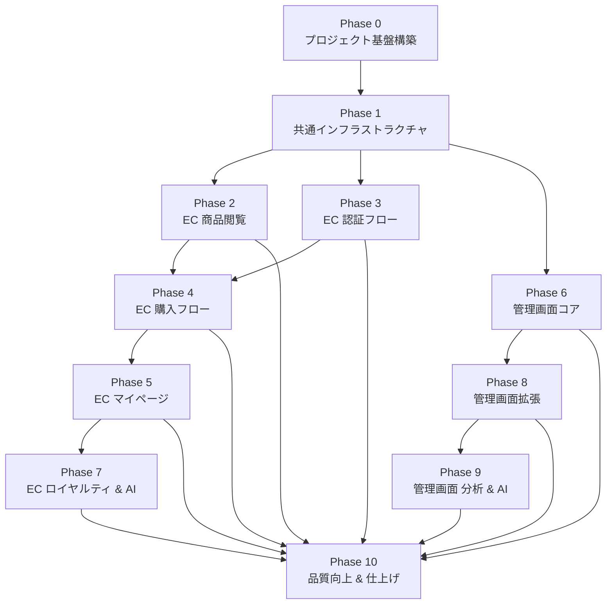

# Azure SkiShop フロントエンド実装計画書

## 文書情報

| 項目 | 値 |
|------|------|
| **作成日** | 2026-03-19 |
| **対象ドキュメント** | front-end-need.md（フロントエンド要件定義書） |
| **技術スタック** | front-end-framework.md / front-end-need.md §1.5 |
| **デザインリファレンス** | design-docs/ski-shop.png |
| **MoSCoW 方針** | front-end-need.md §9 に準拠 |

---

## 実装計画の全体方針

### 段階的実装の理由

front-end-need.md は **EC サイト 19 画面 + 管理画面 15 画面 + 共通コンポーネント群 + 非機能要件** を含む大規模要件であり、一度に実装すると以下のリスクが生じる:

1. **依存関係の未解決**: 共通基盤（認証・エラーハンドリング・レイアウト）が未整備のまま画面実装に着手すると手戻りが発生
2. **品質低下**: 検証対象が多すぎるとテスト漏れ・仕様抜けが発生
3. **デバッグ困難**: 問題発生時に原因特定が困難

そのため、**10 フェーズ**に分割し、各フェーズ終了時に修了条件チェックリストで品質を担保する。

### フェーズ構成と MoSCoW マッピング

```
Phase 0: プロジェクト基盤構築                      ← 全フェーズの前提
Phase 1: 共通インフラストラクチャ                    ← 全フェーズの前提
Phase 2: EC サイト — 商品閲覧（公開画面）           ← Must Have (MVP)
Phase 3: EC サイト — 認証フロー                     ← Must Have (MVP)
Phase 4: EC サイト — 購入フロー                     ← Must Have (MVP)
Phase 5: EC サイト — マイページ                     ← Must Have (MVP)
Phase 6: 管理画面 — コア機能                       ← Must Have (MVP)
Phase 7: EC サイト — ロイヤルティ & AI              ← Should Have (Phase 2)
Phase 8: 管理画面 — 拡張機能                       ← Should Have (Phase 2)
Phase 9: 管理画面 — 分析 & AI                      ← Could Have (Phase 3)
Phase 10: 品質向上 & 仕上げ                        ← Could Have (Phase 3)
```

### デザインコンセプト（ski-shop.png 準拠）

ski-shop.png に示された Azure SkiShop のデザインに基づき、2026 年のモダン EC サイトとして以下のデザイン方針を適用する:

| 要素 | 方針 |
|------|------|
| **カラーパレット** | プライマリ: Azure Blue（`#4285F4` / `#5B9BD5`）、セカンダリ: 白基調、アクセント: グラデーション（ライトブルー→白） |
| **タイポグラフィ** | 日本語: Noto Sans JP / 欧文: Inter。ヒーローバナーは大型太字、本文は 16px 基準 |
| **レイアウト** | ヘッダー固定（ロゴ + ナビ + 検索バー + カート + ユーザーメニュー）。ヒーローバナー + カテゴリカード 4 列グリッド |
| **コンポーネント** | shadcn/ui ベースのカード、ボタン（filled / outlined）、バッジ。角丸 `rounded-xl`、シャドウ `shadow-lg` |
| **インタラクション** | ホバーエフェクト（カード拡大 `scale-105`）、スムーススクロール、スケルトンローディング |
| **レスポンシブ** | モバイルファースト: 1 列 → タブレット: 2 列 → デスクトップ: 4 列グリッド |
| **ダークモード** | 管理画面で対応（Phase 9）。EC サイトはライトモード固定 |

---

## Phase 0: プロジェクト基盤構築

### 目的

Next.js プロジェクトを初期化し、全フェーズで使用する開発環境・ツールチェーン・ディレクトリ構成を確立する。

### 前提条件

- Node.js 22.x LTS がインストール済み
- npm または pnpm が利用可能
- Git リポジトリが構成済み

### 実装タスク

#### P0-1: Next.js プロジェクト初期化

```bash
npx create-next-app@latest frontend --typescript --tailwind --eslint --app --src-dir
```

- Next.js 16.2.0 + React 19.2.4 + TypeScript 5.9.3
- App Router モード
- `src/` ディレクトリ構成

#### P0-2: パッケージインストール

front-end-need.md §1.5 に定義された全ライブラリを `package.json` に追加:

**本番依存**:

| パッケージ | バージョン |
|-----------|-----------|
| `@tanstack/react-query` | 5.91.2 |
| `zod` | 4.3.6 |
| `zustand` | 5.0.12 |
| `react-hook-form` | 7.71.2 |
| `@hookform/resolvers` | 5.2.2 |
| `next-auth` | 4.24.13 |
| `@sentry/nextjs` | 10.45.0 |
| `@opentelemetry/api` | 1.9.0 |
| `@opentelemetry/sdk-node` | 0.213.0 |
| `web-vitals` | 5.1.0 |

**開発依存**:

| パッケージ | バージョン |
|-----------|-----------|
| `orval` | 8.5.3 |
| `playwright` | 1.58.2 |
| `vitest` | 4.1.0 |
| `@testing-library/react` | 16.3.2 |
| `msw` | 2.12.13 |
| `prettier` | 3.8.1 |

#### P0-3: shadcn/ui 初期化

```bash
npx shadcn@4.0.8 init
```

- Tailwind CSS 4.2.2 との統合確認
- テーマカラーを Azure Blue ベースにカスタマイズ
- 基本コンポーネント追加: `button`, `card`, `input`, `dialog`, `toast`, `badge`, `skeleton`, `dropdown-menu`, `sheet`, `tabs`, `table`, `form`, `select`, `separator`, `avatar`, `popover`, `command`, `navigation-menu`

#### P0-4: ディレクトリ構成

```
frontend/
├── src/
│   ├── app/                          # Next.js App Router
│   │   ├── (ec)/                     # EC サイト Route Group
│   │   │   ├── layout.tsx            # EC レイアウト（Header + Footer）
│   │   │   ├── page.tsx              # EC-HOME (/)
│   │   │   ├── products/
│   │   │   ├── category/
│   │   │   ├── search/
│   │   │   ├── cart/
│   │   │   ├── checkout/
│   │   │   ├── login/
│   │   │   ├── register/
│   │   │   ├── verify-email/
│   │   │   ├── password/
│   │   │   ├── chat/
│   │   │   └── mypage/
│   │   ├── (admin)/                  # 管理画面 Route Group
│   │   │   ├── layout.tsx            # Admin レイアウト（Sidebar）
│   │   │   └── admin/
│   │   ├── api/                      # BFF Route Handlers
│   │   │   ├── auth/
│   │   │   ├── products/
│   │   │   ├── cart/
│   │   │   ├── orders/
│   │   │   ├── payments/
│   │   │   ├── users/
│   │   │   ├── points/
│   │   │   ├── coupons/
│   │   │   ├── campaigns/
│   │   │   ├── chat/
│   │   │   ├── recommendations/
│   │   │   ├── search/
│   │   │   ├── analytics/
│   │   │   ├── inventory/
│   │   │   ├── shipments/
│   │   │   ├── returns/
│   │   │   ├── mail/
│   │   │   └── models/
│   │   ├── layout.tsx                # ルートレイアウト
│   │   ├── not-found.tsx
│   │   └── error.tsx
│   ├── bff/                          # BFF ロジック
│   │   ├── clients/                  # Orval 生成物 or ラッパ
│   │   ├── services/                 # マイクロサービス別呼び出し
│   │   ├── mappers/                  # UI DTO 変換
│   │   ├── auth/                     # セッション/トークン管理
│   │   └── observability/            # ロガー / トレーシング
│   ├── components/                   # 共通コンポーネント
│   │   ├── ui/                       # shadcn/ui コンポーネント
│   │   ├── layout/                   # Header, Footer, Sidebar, Breadcrumb
│   │   ├── common/                   # ErrorPlaceholder, Loading, Pagination
│   │   ├── ec/                       # EC 専用コンポーネント
│   │   └── admin/                    # Admin 専用コンポーネント
│   ├── hooks/                        # カスタム hooks
│   ├── stores/                       # zustand ストア
│   ├── lib/                          # ユーティリティ
│   │   ├── env.ts                    # 環境変数 型付け/検証
│   │   ├── http.ts                   # fetch ラッパ
│   │   ├── api-client.ts             # BFF API クライアント
│   │   ├── auth.ts                   # 認証ヘルパー
│   │   ├── error-handler.ts          # エラーハンドリング
│   │   ├── format.ts                 # 日付・通貨フォーマット
│   │   └── validators.ts             # zod スキーマ
│   ├── types/                        # TypeScript 型定義
│   │   ├── api/                      # API レスポンス型
│   │   └── ui/                       # UI 固有型
│   └── locales/                      # i18n 翻訳ファイル
│       ├── ja.json
│       └── en.json
├── public/                           # 静的アセット
│   ├── images/
│   └── icons/
├── tests/                            # テスト
│   ├── unit/
│   ├── integration/
│   └── e2e/
├── .env.local                        # 環境変数（ローカル）
├── .env.example                      # 環境変数テンプレート
├── orval.config.ts                   # Orval 設定
├── vitest.config.ts                  # Vitest 設定
├── playwright.config.ts              # Playwright 設定
└── next.config.ts                    # Next.js 設定
```

#### P0-5: 環境変数設定

`.env.example` を作成:

```env
# API（BFF → バックエンド）
API_BASE_URL=http://localhost:8090
API_VERSION=v1

# 認証
NEXTAUTH_URL=http://localhost:3000
NEXTAUTH_SECRET=<generate-with-openssl>

# 観測可能性
SENTRY_DSN=
OTEL_EXPORTER_OTLP_ENDPOINT=

# 公開環境変数（ブラウザ）
NEXT_PUBLIC_APP_URL=http://localhost:3000
```

- API ベース URL をハードコードしない（front-end-need.md §1.4 準拠）
- `lib/env.ts` で zod による型付き環境変数バリデーションを実装

#### P0-6: ESLint + Prettier 設定

- ESLint 10.0.3: Next.js 推奨ルールセット + import ソート
- Prettier 3.8.1: タブ幅 2、セミコロンあり、シングルクォート
- Husky + lint-staged（コミット時自動チェック）

#### P0-7: Vitest + MSW 設定

- `vitest.config.ts`: React Testing Library 統合、パスエイリアス
- MSW ハンドラーの初期設定（`tests/mocks/handlers.ts`）
- テストヘルパー（`tests/utils/render.tsx`）: Provider ラッパ

#### P0-8: Orval 設定

- `orval.config.ts`: 全 9 サービスの OpenAPI spec URL を設定
- 生成先: `src/bff/clients/`
- zod スキーマ生成を有効化

#### P0-9: Next.js 設定

- `next.config.ts`: 画像ドメイン許可、セキュリティヘッダー（CSP 等）
- Sentry 統合設定（`@sentry/nextjs`）
- OpenTelemetry 初期化

### Phase 0 修了条件チェックリスト

- [ ] `npm run dev` でエラーなく起動し、`http://localhost:3000` にアクセス可能
- [ ] TypeScript の `strict` モードが有効で、`npm run build` がエラーなし
- [ ] Tailwind CSS が適用され、`className="bg-primary text-white"` が表示されることを確認
- [ ] shadcn/ui の `<Button>` コンポーネントがレンダリングされることを確認
- [ ] `npm run lint` が警告 0 件で通過
- [ ] `npm run format:check` が全ファイル通過
- [ ] `npm run test` でサンプルテスト 1 件が通過
- [ ] `.env.example` が存在し、全必要変数が記載されている
- [ ] `lib/env.ts` がバリデーション付きで環境変数を export
- [ ] ディレクトリ構成が P0-4 の通りに作成されている（空ディレクトリ含む）
- [ ] `orval.config.ts` が存在し、`npx orval --config orval.config.ts` が正常実行可能（バックエンド起動時）
- [ ] Git に `.env.local` が含まれない（`.gitignore` 設定確認）

---

## Phase 1: 共通インフラストラクチャ

### 目的

全画面で使用される共通基盤（BFF API クライアント、認証、レイアウト、エラーハンドリング、i18n、状態管理、観測可能性）を構築する。この Phase が完了していないと、後続の全 Phase で手戻りが発生するため、最も重要な Phase である。

### 前提条件

- Phase 0 修了条件を全て満たしていること

### 実装タスク

#### P1-1: BFF API クライアント基盤

**対応要件**: front-end-need.md §1.4, §4.2.1, §5.1

1. **`src/lib/http.ts`** — fetch ラッパ
   - タイムアウト設定（デフォルト 10 秒）
   - `X-Request-Id` ヘッダー自動付与（`crypto.randomUUID()`）
   - レスポンスの `X-Correlation-Id` / `X-Response-Time` キャプチャ
   - 開発環境: レスポンスタイムのコンソール出力

2. **`src/lib/api-client.ts`** — BFF クライアント
   - `API_BASE_URL` + `/api/v1` を baseURL に設定
   - リクエスト interceptor: Authorization ヘッダー付与
   - レスポンス interceptor: エラーハンドリング分岐
   - 429 リトライ（Phase 2 拡張ポイントのみ）

3. **`src/bff/services/`** — サービス別 BFF SDK
   - 各マイクロサービスへの fetch 呼び出しラッパ
   - zod によるレスポンスバリデーション
   - エラー時のサニタイズ（内部エラー詳細をブラウザに漏らさない）

#### P1-2: TypeScript 型定義

**対応要件**: front-end-need.md §6.1

`src/types/api/` に全 API レスポンス型を定義:

- `auth.ts` — `LoginRequest`, `RegisterRequest`, `AuthResponse`（§6.1.1）
- `user.ts` — `UserResponse`（§6.1.2）
- `product.ts` — `ProductResponse`, `CategoryResponse`（§6.1.3）
- `order.ts` — `CreateOrderRequest`, `OrderItemRequest`, `OrderResponse`, `OrderItemResponse`（§6.1.4）
- `cart.ts` — `CartResponse`, `CartItemResponse`, `CreatePaymentIntentRequest`, `PaymentResponse`（§6.1.5）
- `point.ts` — `UserTierResponse`, `PointTransactionResponse`（§6.1.6）
- `coupon.ts` — `CampaignResponse`, `CouponResponse`（§6.1.7）
- `ai.ts` — `ChatMessageResponse`, `RecommendationResponse`, `ProductRecommendation`, `SearchResponse`, `SearchResult`（§6.1.8）
- `common.ts` — `PaginatedResponse<T>`（§4.2.2）、`ProblemDetail`（§4.2.1）

#### P1-3: 認証インフラ

**対応要件**: front-end-need.md §4.3, §4.3.1

1. **next-auth 設定**（`src/app/api/auth/[...nextauth]/route.ts`）
   - Credentials Provider: Spring Boot auth サービスとの JWT 連携
   - BFF Cookie セッション管理（httpOnly, Secure, SameSite=Strict）

2. **`src/bff/auth/`** — トークン管理
   - ログインフロー: `POST /api/v1/auth/login` → Cookie セッション発行
   - トークンリフレッシュ: `expiresAt` の 5 分前に自動実行
   - 401 受信時のリフレッシュ → リトライ → 失敗時ログアウト
   - リフレッシュ中の他リクエストキューイング
   - ページリロード時: Cookie の Refresh Token でセッション復元

3. **`src/stores/auth-store.ts`** — 認証状態ストア（zustand）
   - userId, email, firstName, lastName, role をインメモリ保持
   - `isAuthenticated`, `isAdmin`, `isManager` の computed getter

4. **`src/hooks/use-auth.ts`** — 認証フック
   - login / logout / getCurrentUser
   - 未認証リダイレクト（`?redirect=` パラメータ保持）

5. **BFF Route Handlers**
   - `src/app/api/auth/login/route.ts`
   - `src/app/api/auth/logout/route.ts`
   - `src/app/api/auth/refresh/route.ts`
   - `src/app/api/auth/me/route.ts`

#### P1-4: エラーハンドリングフレームワーク

**対応要件**: front-end-need.md §4.2.1

1. **`src/lib/error-handler.ts`** — RFC 7807 エラーパーサー
   - `ProblemDetail` 型でパース
   - HTTP ステータス別分岐ロジック（400/401/403/404/422/429/500/503）
   - バリデーションエラー（`errors` 配列）のフォーム連携
   - `errorCode` 別の詳細分岐

2. **`src/components/common/error-placeholder.tsx`** — エラー表示コンポーネント
   - 必須 API 障害時: ⚠️ アイコン + メッセージ + リトライボタン
   - `X-Correlation-Id` の表示（コピー可能 + カスタマーサポート案内）

3. **`src/components/common/toast-provider.tsx`** — トースト通知
   - shadcn/ui の Toast を利用
   - エラー種別に応じた表示（error / warning / success / info）

4. **`src/app/error.tsx`** — グローバルエラーバウンダリ
5. **`src/app/not-found.tsx`** — 404 ページ

#### P1-5: 共通レイアウトコンポーネント

**対応要件**: front-end-need.md §4.1

1. **EC サイトレイアウト**（`src/app/(ec)/layout.tsx`）
   - **EC ヘッダー**（`src/components/layout/ec-header.tsx`）
     - ロゴ（Azure SkiShop + スキーアイコン）
     - ナビゲーション: ホーム / 商品カテゴリ（ドロップダウン）/ 全商品 / AI 相談
     - 検索バー（オートコンプリート対応 — Phase 2 で接続）
     - カートアイコン（バッジ付き — Phase 4 で接続）
     - ユーザーメニュー（ログイン/登録 or マイページ/ログアウト）
     - スティッキーヘッダー（スクロール時固定）
     - レスポンシブ: モバイルはハンバーガーメニュー + Sheet
   - **EC フッター**（`src/components/layout/ec-footer.tsx`）
     - 会社情報、利用規約、プライバシーポリシー、お問い合わせ、SNS リンク

2. **管理画面レイアウト**（`src/app/(admin)/layout.tsx`）
   - **Admin サイドバー**（`src/components/layout/admin-sidebar.tsx`）
     - 折りたたみ式ナビゲーション
     - セクション: ダッシュボード / 商品 / 在庫 / 注文 / ユーザー / ポイント / キャンペーン / クーポン / メール / 分析 / AI モデル
     - アクティブ状態のハイライト
     - ロール別表示制御（ADMIN/MANAGER）

3. **パンくずリスト**（`src/components/layout/breadcrumb.tsx`）

#### P1-6: 共通 UI パターン

**対応要件**: front-end-need.md §4.2

1. **スケルトンローディング**（`src/components/common/skeleton-card.tsx`, `skeleton-table.tsx`）
2. **ページネーション**（`src/components/common/pagination.tsx`）
   - Spring Data `PagedModel` レスポンス対応（§4.2.2）
   - EC: 無限スクロール（Intersection Observer）
   - Admin: テーブルページネーション（件数表示 + ページサイズ切替）
3. **確認ダイアログ**（`src/components/common/confirm-dialog.tsx`）
   - 破壊的操作前の表示
4. **縮退 UI コンポーネント**（`src/components/common/degraded-section.tsx`）
   - §4.2.3: セクション非表示（任意 API 障害時）
   - バックグラウンドリトライ + 自動再表示

#### P1-7: 状態管理基盤

**対応要件**: front-end-need.md §4.5

1. **React Query Provider**（`src/app/providers.tsx`）
   - `QueryClient` 設定: staleTime, gcTime, retry ポリシー
   - API キャッシュ戦略（§4.5）:
     - Stale-While-Revalidate（5 分）: 商品一覧, カテゴリ, おすすめ
     - フェッチ都度: カート, ポイント残高
     - ミューテーション連動: カート変更後の再取得

2. **カート状態**（`src/hooks/use-cart.ts`）
   - React Query でサーバーステート管理
   - 楽観的更新: 数量変更・アイテム削除（§4.5）
   - ヘッダーバッジ用のグローバルキャッシュ

#### P1-8: i18n-ready 基盤

**対応要件**: front-end-need.md §4.6

1. **翻訳ヘルパー**（`src/lib/i18n.ts`）
   - 翻訳キー方式: `t('ecHome.hero.title')` → `locales/ja.json` から取得
   - Phase 1 では日本語のみ
2. **`src/locales/ja.json`** — 初期翻訳ファイル（共通部分）
3. **フォーマットヘルパー**（`src/lib/format.ts`）
   - 通貨: `Intl.NumberFormat('ja-JP', { style: 'currency', currency: 'JPY' })`
   - 日付: `Intl.DateTimeFormat('ja-JP')`

#### P1-9: 観測可能性基盤

**対応要件**: front-end-need.md §5.1

1. **Sentry 初期化**（`sentry.client.config.ts`, `sentry.server.config.ts`）
2. **OpenTelemetry 設定**（`src/bff/observability/tracing.ts`）
   - BFF → Spring Boot 間の `traceparent` ヘッダー伝播
3. **Web Vitals 収集**（`src/lib/web-vitals.ts`）
   - LCP, FID, CLS, TTFB, INP を `web-vitals` ライブラリで収集
   - バッチ送信（30 秒間隔またはページアンロード時）

#### P1-10: ミドルウェア

1. **`src/middleware.ts`** — Next.js ミドルウェア
   - 認証が必要なパスの保護（`/cart`, `/checkout`, `/mypage/*`, `/admin/*`）
   - 未認証時は `/login?redirect={originalPath}` にリダイレクト
   - 管理画面は ADMIN/MANAGER ロールチェック

### Phase 1 修了条件チェックリスト

- [ ] **BFF API クライアント**: `src/lib/http.ts` がタイムアウト・X-Request-Id 付与を実装済み
- [ ] **BFF API クライアント**: `src/lib/api-client.ts` が環境変数ベースの baseURL を使用
- [ ] **型定義**: front-end-need.md §6.1 の全 DTO 型が `src/types/api/` に定義済み
- [ ] **認証**: ログイン → Cookie セッション発行 → API 呼び出し → ログアウトの一連フローが動作
- [ ] **認証**: 未認証で `/cart` にアクセスすると `/login?redirect=/cart` にリダイレクト
- [ ] **認証**: トークンリフレッシュが `expiresAt` の 5 分前にバックグラウンドで実行される
- [ ] **認証**: ページリロード後に Cookie からセッションが復元される
- [ ] **エラーハンドリング**: RFC 7807 形式のエラーレスポンスが正しくパースされ、トースト通知が表示される
- [ ] **エラーハンドリング**: 400 バリデーションエラーの `errors` 配列がフォームフィールドに表示される
- [ ] **エラーハンドリング**: `X-Correlation-Id` がエラー画面にコピー可能な形式で表示される
- [ ] **EC レイアウト**: ヘッダー（ロゴ + ナビ + 検索バー + カート + ユーザーメニュー）が ski-shop.png に準拠
- [ ] **EC レイアウト**: ヘッダーがスクロール時に固定される
- [ ] **EC レイアウト**: モバイル表示でハンバーガーメニューが動作
- [ ] **EC レイアウト**: フッターが表示される
- [ ] **Admin レイアウト**: サイドバーが全ナビゲーション項目を含み、折りたたみが動作
- [ ] **Admin レイアウト**: MANAGER ロールで ADMIN 専用メニューが非表示
- [ ] **パンくずリスト**: カテゴリ階層が正しく表示される
- [ ] **ローディング**: スケルトンスクリーンが API 呼び出し中に表示される
- [ ] **ページネーション**: `PagedModel` 形式のレスポンスを正しく処理
- [ ] **確認ダイアログ**: 表示 → 確定/キャンセルの操作が正常動作
- [ ] **縮退 UI**: 任意 API 障害時にセクションが非表示になり、レイアウト崩れなし
- [ ] **React Query**: Provider がルートレイアウトに設定済み
- [ ] **i18n**: `t()` ヘルパーで `locales/ja.json` の値が取得可能
- [ ] **フォーマット**: 通貨フォーマットが `¥1,234` 形式で表示
- [ ] **観測可能性**: Sentry にテストエラーが送信されることを確認
- [ ] **観測可能性**: API レスポンスに `X-Correlation-Id` が含まれることを確認
- [ ] **ミドルウェア**: 保護パスへの未認証アクセスがリダイレクトされる
- [ ] **テスト**: 全共通コンポーネントの単体テストが通過（カバレッジ 80% 以上）

---

## Phase 2: EC サイト — 商品閲覧（公開画面）

### 目的

未認証ユーザーを含む全ユーザーがアクセス可能な商品閲覧画面を実装する。ファーストインプレッションを決定する最重要画面群。

### 前提条件

- Phase 1 修了条件を全て満たしていること
- バックエンドの `inventory-management-service`, `ai-support-service`, `coupon-service` が起動可能

### 実装タスク

#### P2-1: EC-HOME（ホームページ）

**対応要件**: front-end-need.md §2.2 EC-HOME（FR-HOME-01 〜 FR-HOME-08）

**BFF Route Handlers**:
- `GET /api/dashboard/home` — 複数サービスを `Promise.allSettled` で並列取得（§4.2.4）して集約:
  - `GET /api/v1/categories`
  - `GET /api/v1/recommendations/trending`
  - `GET /api/v1/campaigns/active`
  - `GET /api/v1/recommendations/:userId`（ログイン時のみ）

**UI コンポーネント**:
1. ヒーローバナー（グラデーション背景 + CTA ボタン「商品を見る」「AI相談を始める」）
   - シーズン切替: 10月〜3月 ウィンター / 4月〜9月 オフシーズン（FR-HOME-07）
2. 人気カテゴリセクション（4 列カードグリッド — ski-shop.png 準拠）
3. トレンド商品セクション（商品カード最大 10 件）
4. パーソナライズドレコメンドセクション（ログイン済み時のみ）
5. オフシーズン訴求セクション（4月〜9月のみ）（FR-HOME-08）

**縮退対応**: §4.2.3 EC-HOME 行 — 全 API が任意。`Promise.allSettled` で個別障害時はセクション非表示。

#### P2-2: EC-CATALOG（商品一覧）

**対応要件**: front-end-need.md §2.2 EC-CATALOG（FR-CAT-01 〜 FR-CAT-05）

**BFF Route Handlers**:
- `GET /api/products` — `GET /api/v1/products?page=&size=&sort=` をプロキシ

**UI コンポーネント**:
1. 商品カードグリッド（画像 + 名前 + 価格 + 在庫状況バッジ）
2. カテゴリフィルター（サイドバー or ドロップダウン）
3. ソート切替（価格昇順/降順, 新着順, 人気順）
4. 無限スクロール（Intersection Observer + §4.2.2 ページネーション）
5. 在庫切れ商品: 「在庫切れ」ラベル + カート追加不可
6. URL パラメータ連動（ブックマーク/共有対応）

#### P2-3: EC-CATEGORY（カテゴリ別商品）

**対応要件**: front-end-need.md §2.1 #3

**BFF Route Handlers**:
- `GET /api/categories/:id/products` — `GET /api/v1/categories/:id/products` をプロキシ

**UI**: EC-CATALOG と同一レイアウト。パンくずリストでカテゴリ階層を表示。

#### P2-4: EC-DETAIL（商品詳細）

**対応要件**: front-end-need.md §2.2 EC-DETAIL（FR-DET-01 〜 FR-DET-06）

**BFF Route Handlers**:
- `GET /api/products/:id` — 並列取得（§4.2.4）:
  - `GET /api/v1/products/:id`（必須）
  - `GET /api/v1/recommendations/similar/:id`（任意）

**UI コンポーネント**:
1. 商品画像ギャラリー（複数画像 + ズーム機能）
2. 商品情報（名前, SKU, ブランド, 価格, 説明, スペック, カテゴリ）
3. セール価格: `salePrice` が存在する場合、通常価格に取消線 + セール価格を強調
4. 在庫状況リアルタイム表示（在庫あり / 残りわずか ≤5 / 在庫切れ =0）
5. 数量選択 + 「カートに追加」ボタン（未ログイン時はログインへリダイレクト）
6. 類似商品レコメンドセクション（4 件以上表示）
7. パンくずリスト（カテゴリ → 商品名）

**縮退対応**: 商品情報は必須。類似商品は任意（障害時セクション非表示）。

#### P2-5: EC-SEARCH（検索結果）

**対応要件**: front-end-need.md §2.2 EC-SEARCH（FR-SRCH-01 〜 FR-SRCH-05）

**BFF Route Handlers**:
- `GET /api/search` — `GET /api/v1/search?query=&category=&page=&size=`
- `GET /api/search/autocomplete` — `GET /api/v1/search/autocomplete?query=`

**UI コンポーネント**:
1. 検索結果カードグリッド（EC-CATALOG と同一形式）
2. カテゴリ別フィルター
3. ヘッダー検索バーのオートコンプリート接続（debounce 300ms）
4. 検索フィードバック（「この結果は役に立ちましたか？」）
5. 0 件時: トレンド商品を代替表示

**パフォーマンス要件**: 検索結果 2 秒以内、オートコンプリート 500ms 以内。

#### P2-6: 共通商品コンポーネント

1. **商品カード**（`src/components/ec/product-card.tsx`）
   - 画像 + 名前 + 価格（セール価格対応）+ 在庫バッジ
   - ホバーエフェクト（scale-105）
   - クリックで商品詳細へ遷移
2. **検索バー**（`src/components/ec/search-bar.tsx`）
   - オートコンプリートドロップダウン
   - debounce 300ms
3. **カテゴリカード**（`src/components/ec/category-card.tsx`）
   - 画像 + カテゴリ名 + 説明 + CTA ボタン

### Phase 2 修了条件チェックリスト

- [ ] **EC-HOME**: ヒーローバナーが ski-shop.png のデザインに準拠して表示される
- [ ] **EC-HOME**: API `GET /categories` の結果から 4 件以上のカテゴリカードが動的に表示される
- [ ] **EC-HOME**: API `GET /recommendations/trending` の結果からトレンド商品が最大 10 件表示される
- [ ] **EC-HOME**: ログイン済みユーザーにパーソナライズドレコメンドが表示される
- [ ] **EC-HOME**: 検索バーに 2 文字以上入力するとオートコンプリートが 500ms 以内に表示される
- [ ] **EC-HOME**: 10月〜3月はウィンターバナー、4月〜9月はオフシーズンバナーが表示される
- [ ] **EC-HOME**: いずれかの API が障害の場合、該当セクションのみ非表示で他は正常表示
- [ ] **EC-CATALOG**: 商品が 20 件ずつカードグリッドで表示される
- [ ] **EC-CATALOG**: カテゴリフィルター切替時に URL パラメータが更新され、ブックマーク可能
- [ ] **EC-CATALOG**: ソート（価格昇順/降順/新着順/人気順）が正常動作
- [ ] **EC-CATALOG**: 無限スクロールで次ページが自動ロードされる
- [ ] **EC-CATALOG**: 在庫切れ商品に「在庫切れ」ラベルが表示される
- [ ] **EC-CATEGORY**: カテゴリ別商品が表示され、パンくずリストにカテゴリ階層が表示される
- [ ] **EC-DETAIL**: 商品の全情報（名前, SKU, 価格, 説明, スペック, 在庫）が表示される
- [ ] **EC-DETAIL**: 在庫 ≤5 で「残りわずか」、=0 で「在庫切れ」が表示される
- [ ] **EC-DETAIL**: カート追加ボタンが在庫超過数量を選択不可にする
- [ ] **EC-DETAIL**: 未ログインでカート追加 → ログイン画面にリダイレクト
- [ ] **EC-DETAIL**: 類似商品が 4 件以上表示される（データがある場合）
- [ ] **EC-SEARCH**: 検索結果が 2 秒以内に表示される
- [ ] **EC-SEARCH**: 0 件時にトレンド商品が代替表示される
- [ ] **EC-SEARCH**: 検索フィードバックが送信可能
- [ ] **レスポンシブ**: 全画面がモバイル（375px）/ タブレット（768px）/ デスクトップ（1280px）で適切に表示される
- [ ] **テスト**: 全画面コンポーネントの単体テストが通過

---

## Phase 3: EC サイト — 認証フロー

### 目的

ユーザー登録・ログイン・パスワードリセット・メール認証の一連の認証フローを実装する。

### 前提条件

- Phase 1 修了条件を全て満たしていること（認証インフラ構築済み）
- バックエンドの `authentication-service`, `user-management-service` が起動可能

### 実装タスク

#### P3-1: EC-LOGIN（ログイン画面）

**対応要件**: front-end-need.md §2.2 EC-AUTH（FR-AUTH-01）

1. ログインフォーム（メール + パスワード）
   - react-hook-form + zod バリデーション
   - リアルタイムバリデーション（メール形式、パスワード必須）
   - BFF `POST /api/auth/login` を呼び出し
2. ログイン成功 → `?redirect` パラメータの遷移先 or ホームへリダイレクト
3. ログイン失敗 → RFC 7807 エラーメッセージ表示
4. 「新規登録」「パスワードをお忘れですか？」リンク

#### P3-2: EC-REGISTER（新規登録画面）

**対応要件**: FR-AUTH-02

1. 登録フォーム（メール, パスワード, 名, 姓）
   - パスワード: 8〜128 文字、大文字・小文字・数字必須
   - パスワード強度インジケーター
   - リアルタイムバリデーション
2. BFF `POST /api/auth/register` を呼び出し
3. 成功 → 「認証メールを送信しました」メッセージ表示（EC-VERIFY 誘導）
4. `EMAIL_ALREADY_EXISTS` エラー時の専用メッセージ

#### P3-3: EC-VERIFY（メール認証画面）

**対応要件**: FR-AUTH-05, §4.4 FR-MAIL-01

1. URL クエリパラメータ `?token=` を取得
2. BFF `POST /api/auth/verify-email` を `{ "token": "{token}" }` で呼び出し
3. 成功: 「メール認証が完了しました。ログインしてください」+ ログインリンク
4. 失敗（期限切れ/無効トークン）: エラーメッセージ表示

#### P3-4: EC-PW-RESET（パスワードリセット画面）

**対応要件**: FR-AUTH-03, FR-AUTH-04, §4.4 FR-MAIL-02

1. **リセット要求画面**（`/password/reset`）
   - メールアドレス入力 + 送信
   - BFF `POST /api/auth/password/reset`
   - 成功: 「リセットメールを送信しました」メッセージ

2. **新パスワード設定画面**（`/password/reset?token=xxx`）
   - URL の `token` パラメータ検出で自動切替
   - 新パスワード + 確認入力
   - BFF `POST /api/auth/password/confirm` を `{ "token", "newPassword" }` で呼び出し
   - 成功 → ログイン画面にリダイレクト

#### P3-5: ログアウト機能

**対応要件**: FR-AUTH-07

1. ユーザーメニュー「ログアウト」クリック
2. BFF `POST /api/auth/logout`
3. Cookie セッション削除、ストアクリア
4. ホームにリダイレクト

### Phase 3 修了条件チェックリスト

- [ ] **EC-LOGIN**: メール + パスワードでログインが成功し、ホーム画面にリダイレクトされる
- [ ] **EC-LOGIN**: `?redirect=/cart` 付きでアクセスした場合、ログイン後に `/cart` にリダイレクト
- [ ] **EC-LOGIN**: 不正な認証情報でログインすると、エラーメッセージが表示される
- [ ] **EC-LOGIN**: 入力バリデーションがリアルタイムで表示される（メール形式、パスワード必須）
- [ ] **EC-REGISTER**: 全フィールド入力後に登録が成功し、認証メール送信メッセージが表示される
- [ ] **EC-REGISTER**: パスワード強度インジケーターが動作する
- [ ] **EC-REGISTER**: 登録済みメールで登録すると `EMAIL_ALREADY_EXISTS` エラーが表示される
- [ ] **EC-REGISTER**: バリデーションエラー（400）時に各フィールドにインラインエラーが表示される
- [ ] **EC-VERIFY**: 有効な `?token=` でアクセスすると認証完了メッセージが表示される
- [ ] **EC-VERIFY**: 無効/期限切れトークンでアクセスするとエラーメッセージが表示される
- [ ] **EC-PW-RESET**: メールアドレス入力 → リセットメール送信メッセージが表示される
- [ ] **EC-PW-RESET**: `?token=` 付きで新パスワード設定 → 成功後にログイン画面にリダイレクト
- [ ] **ログアウト**: ログアウト後にセッションがクリアされ、保護ページにアクセスできないことを確認
- [ ] **テスト**: 全認証フローの単体テストが通過（正常系・異常系）
- [ ] **セキュリティ**: トークンが localStorage/sessionStorage に保存されていないことを確認

---

## Phase 4: EC サイト — 購入フロー

### 目的

カート → チェックアウト → 決済 → 注文完了の購入完結フローを実装する。**ビジネス価値の中核であり、セキュリティと信頼性が最も重要なフェーズ**。

### 前提条件

- Phase 3 修了条件を全て満たしていること（認証済みユーザーで操作可能）
- バックエンドの `payment-cart-service`, `sales-management-service`, `point-service`, `coupon-service` が起動可能

### 実装タスク

#### P4-1: EC-CART（カート画面）

**対応要件**: front-end-need.md §2.2 EC-CART（FR-CART-01 〜 FR-CART-08）

**BFF Route Handlers**:
- `GET /api/cart` — 並列取得（§4.2.4 EC-CART）:
  - `GET /api/v1/cart?userId=`（必須）
  - `GET /api/v1/points/balance/:userId`（任意）
  - `GET /api/v1/coupons/user/available?userId=`（任意）
- `PUT /api/cart/items/:itemId` — 数量変更
- `DELETE /api/cart/items/:itemId` — 商品削除
- `DELETE /api/cart` — カートクリア
- `POST /api/coupons/validate` — クーポン適用

**UI コンポーネント**:
1. カート内商品テーブル（画像, 名前, 単価, 数量セレクタ, 小計, 削除ボタン）
2. 楽観的更新: 数量変更・アイテム削除は即座に UI 反映 → API エラー時にロールバック
3. クーポンコード入力 + 適用ボタン（バリデーション結果を待ってから反映）
4. ポイント残高表示（point-service 障害時: 「取得中...」表示）
5. 合計金額（小計 + 税 + 送料 − 割引 = 合計）
6. 「お買い物を続ける」「購入手続きへ」ボタン
7. 空カート時: 「カートが空です」+ 商品一覧への導線

**ヘッダーカートバッジ**: カート内アイテム数をヘッダーのカートアイコンバッジに反映。

#### P4-2: EC-CHECKOUT（チェックアウト画面）

**対応要件**: front-end-need.md §2.2 EC-CHECKOUT（FR-CHK-01 〜 FR-CHK-10）

**BFF Route Handlers**:
- `POST /api/payments/intent` — 決済インテント作成（`Idempotency-Key` 付与）
- `POST /api/payments/:id/process` — 決済処理（`Idempotency-Key` 付与）
- `POST /api/orders` — 注文作成（`Idempotency-Key` 付与）
- `POST /api/points/redeem` — ポイント利用

**UI コンポーネント**:
1. 注文内容サマリー（商品一覧, クーポン割引, ポイント利用, 最終金額）
2. 配送先住所入力フォーム
3. 決済手段選択
4. 「注文確定」ボタン

**冪等性・二重送信防止（FR-CHK-09）**:
1. 「注文確定」ボタン押下 → 即座に `disabled` + ローディングスピナー
2. `crypto.randomUUID()` で各 API ごとに独立した `Idempotency-Key` 生成
3. 処理中は `beforeunload` イベントで画面離脱を警告
4. ネットワークエラー時: 同一 `Idempotency-Key` でリトライ（最大 2 回、3 秒間隔）

**決済フロー（§4.2.4 EC-CHECKOUT — ステップ直列実行）**:
1. Step 1: カート + ポイント残高表示（並列）
2. Step 2: クーポン適用（ユーザー操作）
3. Step 3: `POST /payments/intent`（決済インテント）
4. Step 4: `POST /payments/:id/process`（決済処理）
5. Step 5: `POST /orders`（注文作成）
6. Step 6: `POST /points/redeem`（ポイント利用 — 任意）

**決済タイムアウト・リカバリ（FR-CHK-10）**:
- フロントエンド表示タイムアウト: 30 秒
- タイムアウト時: 「決済処理中です。画面を閉じないでください」表示
- ポーリング: `GET /orders?userId=&sort=createdAt,desc&size=1`（3 秒間隔 × 最大 10 回）
- 最終フォールバック: 「注文が完了した可能性があります」+ 注文履歴リンク

#### P4-3: EC-PAY-RESULT（決済結果 / 注文完了画面）

**対応要件**: FR-CHK-08, §4.4 FR-MAIL-04

**UI コンポーネント**:
1. 注文完了メッセージ（注文番号, 配送予定, 獲得ポイント）
2. 「確認メールを送信しました」メッセージ（FR-MAIL-04）
3. 「注文履歴を見る」「買い物を続ける」ボタン
4. `history.replaceState()` でチェックアウト画面の履歴エントリを置換（ブラウザバック防止）

#### P4-4: カート追加機能の接続

- EC-DETAIL のカート追加ボタンを BFF `POST /api/cart/items` に接続
- 追加成功 → トースト通知 + ヘッダーカートバッジ更新（React Query キャッシュ無効化）

### Phase 4 修了条件チェックリスト

- [ ] **EC-CART**: カート内商品が正しく表示される（画像, 名前, 価格, 数量, 小計）
- [ ] **EC-CART**: 数量変更時に合計金額がリアルタイム再計算される
- [ ] **EC-CART**: 楽観的更新が動作し、API エラー時にロールバック + トースト通知
- [ ] **EC-CART**: 在庫超過数量入力時にバリデーションエラーが表示される
- [ ] **EC-CART**: クーポンコード適用成功時に割引が反映、無効時に具体的エラーメッセージ表示
- [ ] **EC-CART**: ポイント残高が表示される（point-service 障害時は「取得中...」表示）
- [ ] **EC-CART**: ヘッダーのカートアイコンにバッジ（アイテム数）が正しく表示される
- [ ] **EC-CHECKOUT**: 注文内容サマリーが正しく表示される
- [ ] **EC-CHECKOUT**: 「注文確定」ボタン押下で即座に disabled + ローディング表示
- [ ] **EC-CHECKOUT**: 全決済 API リクエストに `Idempotency-Key` ヘッダーが付与される
- [ ] **EC-CHECKOUT**: 決済処理中に `beforeunload` で画面離脱警告が表示される
- [ ] **EC-CHECKOUT**: ネットワークエラー時に同一 Idempotency-Key で自動リトライされる
- [ ] **EC-CHECKOUT**: Gateway 503 時に「処理中」UI に切り替わり、ポーリングで結果を確認
- [ ] **EC-CHECKOUT**: ポーリングで注文確認後に完了画面に遷移する
- [ ] **EC-CHECKOUT**: フォールバック: 結果不明時に注文履歴リンクが表示される
- [ ] **EC-PAY-RESULT**: 注文完了画面に注文番号が表示される
- [ ] **EC-PAY-RESULT**: 「確認メールを送信しました」メッセージが表示される
- [ ] **EC-PAY-RESULT**: ブラウザバックでチェックアウト画面に戻らない（`history.replaceState` 確認）
- [ ] **カート追加**: EC-DETAIL からカート追加 → 成功トースト + バッジ更新
- [ ] **セキュリティ**: userId が JWT の sub claim から取得され、他ユーザーのカートにアクセスできない
- [ ] **テスト**: 購入フロー全体の統合テストが通過（正常系 + 異常系 + タイムアウト系）

---

## Phase 5: EC サイト — マイページ

### 目的

認証済みユーザーのマイページ機能（注文履歴、注文詳細、プロフィール管理）を実装する。

### 前提条件

- Phase 4 修了条件を全て満たしていること
- バックエンドの `sales-management-service`, `user-management-service` が起動可能

### 実装タスク

#### P5-1: EC-ORDERS（注文履歴画面）

**対応要件**: front-end-need.md §2.2 EC-ORDERS（FR-ORD-01 〜 FR-ORD-04）

**BFF Route Handlers**:
- `GET /api/orders` — `GET /api/v1/orders/customer/:customerId?page=&size=`
- `GET /api/orders/search` — `GET /api/v1/orders/number/:orderNumber`

**UI コンポーネント**:
1. 注文一覧テーブル/カード（注文番号, 日時, 合計金額, ステータスバッジ）
2. ステータスバッジ色分け（PENDING: 黄, CONFIRMED: 青, SHIPPED: 紫, DELIVERED: 緑, CANCELLED: 赤）
3. 注文番号検索
4. ページネーション UI（前へ / 次へ + ページ番号）
5. 新しい順にソート

#### P5-2: EC-ORDER-DETAIL（注文詳細画面）

**対応要件**: front-end-need.md §2.2 EC-ORDER-DETAIL（FR-ORDD-01 〜 FR-ORDD-05）

**BFF Route Handlers**:
- `GET /api/orders/:id` — 並列取得（§4.2.4）:
  - `GET /api/v1/orders/:orderId`（必須）
  - `GET /api/v1/shipments/order/:orderId`（任意）
- `PUT /api/orders/:id/cancel` — 注文キャンセル
- `POST /api/returns` — 返品申請

**UI コンポーネント**:
1. 注文情報ヘッダー（注文番号, 日時, ステータスバッジ, 合計金額）
2. 注文アイテム一覧テーブル（商品名, 数量, 単価, 小計）
3. 配送情報（追跡番号, 配送業者, ステータス）
4. キャンセルボタン（ステータス PENDING/CONFIRMED のみ表示 + 確認ダイアログ）
5. 返品申請ボタン（DELIVERED ステータス時のみ + 返品フォーム）

#### P5-3: EC-PROFILE（プロフィール管理画面）

**対応要件**: front-end-need.md §2.2 EC-PROFILE（FR-PROF-01 〜 FR-PROF-05）

**BFF Route Handlers**:
- `GET /api/users/me` — `GET /api/v1/users/:id`
- `PUT /api/users/me` — `PUT /api/v1/users/:id`
- `PUT /api/users/me/password` — `PUT /api/v1/users/:id/password`
- `GET/PUT /api/users/me/preferences/:key`
- `DELETE /api/users/me` — アカウント削除

**UI コンポーネント**:
1. プロフィール表示・編集フォーム（名前, メール, 電話, 住所）
2. パスワード変更フォーム（現在のパスワード + 新しいパスワード）
3. ユーザー設定（通知, 言語, 通貨プリファレンス）
4. アカウント削除ボタン（確認ダイアログ + 最終確認の再入力）
5. レコメンド履歴セクション（Phase 7 で接続）— プレースホルダのみ配置

### Phase 5 修了条件チェックリスト

- [ ] **EC-ORDERS**: 注文が新しい順にソートされて表示される
- [ ] **EC-ORDERS**: 各注文のステータスが色分けバッジで直感的に判別可能
- [ ] **EC-ORDERS**: 注文番号での検索が動作する
- [ ] **EC-ORDERS**: ページネーション（前へ/次へ + ページ番号ボタン）が正常動作
- [ ] **EC-ORDER-DETAIL**: 注文情報（番号, 日時, ステータス, 金額, 配送先, アイテム一覧）が表示される
- [ ] **EC-ORDER-DETAIL**: 配送情報（追跡番号, 配送業者）が表示される（未発送時は空）
- [ ] **EC-ORDER-DETAIL**: 未発送の注文のみキャンセルボタンが表示される
- [ ] **EC-ORDER-DETAIL**: キャンセル実行前に確認ダイアログが表示される
- [ ] **EC-ORDER-DETAIL**: メール内リンク（`/mypage/orders/{orderId}`）からの遷移が正常動作（§4.4）
- [ ] **EC-PROFILE**: ユーザー情報が正しく表示・編集できる
- [ ] **EC-PROFILE**: パスワード変更が成功し、`INVALID_PASSWORD` エラーが正しく表示される
- [ ] **EC-PROFILE**: アカウント削除前に確認ダイアログが表示される
- [ ] **EC-PROFILE**: ユーザー設定の保存/取得が動作する
- [ ] **画面遷移**: ヘッダーユーザーメニューから各マイページ画面へ直接遷移可能
- [ ] **メールリンク**: 未認証でメール内リンクにアクセス → ログイン後に元のページにリダイレクト（§4.4 FR-MAIL-03）
- [ ] **テスト**: 全マイページ画面の単体テストが通過

---

## Phase 6: 管理画面 — コア機能

### 目的

管理者（ADMIN/MANAGER）向けのコア管理機能を実装する。MVP として商品・注文・ユーザーの管理機能を提供する。

### 前提条件

- Phase 1 修了条件を全て満たしていること（Admin レイアウト構築済み）
- ADMIN ロールのテストユーザーが利用可能

### 実装タスク

#### P6-1: ADM-DASH（管理ダッシュボード）

**対応要件**: front-end-need.md §3.2 ADM-DASH（FR-ADASH-01 〜 FR-ADASH-06）

**BFF Route Handlers**:
- `GET /api/admin/dashboard` — `Promise.allSettled` で並列取得（§4.2.4）:
  - `GET /api/v1/admin/orders?page=0&size=5`
  - `GET /api/v1/admin/users?page=0&size=5`
  - `GET /api/v1/inventory/low-stock?threshold=10`
  - `GET /api/v1/analytics/dashboard?dashboardType=overview`
  - `GET /api/v1/mail/logs?page=0&size=5`

**UI コンポーネント**:
1. KPI カード行（本日の売上, 注文数, 新規会員数, アクティブユーザー数）
2. 売上推移グラフ（日次/週次/月次切替）
3. 在庫アラート（低在庫商品リスト）
4. 最新注文一覧（直近 5 件）
5. 顧客セグメント概要

**縮退対応**: 各カードが独立。障害サービスのカードのみ「データ取得不可」バッジ表示。

#### P6-2: ADM-PRODUCTS / ADM-PROD-EDIT（商品管理）

**対応要件**: front-end-need.md §3.2 ADM-PRODUCTS（FR-APRD-01 〜 FR-APRD-06）

**BFF Route Handlers**:
- `GET /api/admin/products` — `GET /api/v1/products?page=&size=`
- `POST /api/admin/products` — `POST /api/v1/products`
- `PUT /api/admin/products/:id` — `PUT /api/v1/products/:id`
- `PUT /api/admin/prices/:productId` — `PUT /api/v1/prices/:productId`

**UI コンポーネント**:
1. 商品一覧テーブル（SKU, 名前, カテゴリ, 価格, 在庫数, ステータス）
2. テーブルページネーション（件数表示 + ページサイズ切替 20/50/100）
3. 検索/フィルター（カテゴリ, 在庫状況, 価格帯）
4. 商品新規登録フォーム（モーダルまたは別ページ）
5. 商品編集フォーム（名前, 説明, 価格, 画像URL, カテゴリ, スペック, セール価格）

#### P6-3: ADM-CATEGORIES（カテゴリ管理）

**対応要件**: front-end-need.md §3.2 の暗黙要件（GET/POST/PUT/DELETE /categories）

**UI コンポーネント**:
1. カテゴリ一覧テーブル（ID, 名前, 説明, 親カテゴリ, 表示順, アクティブ状態）
2. カテゴリ作成/編集フォーム
3. 削除ボタン（`CAT_HAS_CHILDREN` エラー対応）

#### P6-4: ADM-ORDERS / ADM-ORDER-DETAIL（注文管理）

**対応要件**: front-end-need.md §3.2 ADM-ORDERS（FR-AORD-01 〜 FR-AORD-06）

**BFF Route Handlers**:
- `GET /api/admin/orders` — `GET /api/v1/admin/orders?page=&size=&sort=createdAt,desc`
- `PUT /api/admin/orders/:id/status`
- `POST /api/admin/shipments`
- `PUT /api/admin/shipments/:id/status`
- `PUT /api/admin/returns/:id/status`
- `POST /api/admin/payments/:id/refund`
- `GET /api/admin/payments/history`

**UI コンポーネント**:
1. 注文一覧テーブル（全顧客、ステータスフィルター、ページネーション）
2. 注文詳細画面（注文情報 + アイテム + 配送 + 決済履歴）
3. ステータス更新ドロップダウン（確認ダイアログ付き）
4. 配送作成フォーム + ステータス更新
5. 返品ステータス更新
6. 返金処理（確認ダイアログ付き）

#### P6-5: ADM-USERS（ユーザー管理）

**対応要件**: front-end-need.md §3.2 ADM-USERS（FR-AUSR-01 〜 FR-AUSR-04）

**BFF Route Handlers**:
- `GET /api/admin/users` — `GET /api/v1/admin/users?page=&size=`
- `PUT /api/admin/users/:id/status`
- `POST /api/admin/users/:id/roles`

**UI コンポーネント**:
1. ユーザー一覧テーブル（ID, メール, 名前, ステータス, ロール, 登録日）
2. 検索機能
3. ステータス変更（有効/無効/凍結 — 確認ダイアログ付き）
4. ロール付与（ADMIN/MANAGER/CUSTOMER — 確認ダイアログ付き）
5. ユーザー詳細モーダル（プロフィール + 注文履歴 + ポイント残高 + ティア情報）

### Phase 6 修了条件チェックリスト

- [ ] **ADM-DASH**: KPI カードが表示され、各数値が API から取得される
- [ ] **ADM-DASH**: 売上推移グラフが日次/週次/月次で切替可能
- [ ] **ADM-DASH**: 在庫アラートに低在庫商品が表示される
- [ ] **ADM-DASH**: 一部サービス障害時に該当カードのみ「データ取得不可」表示
- [ ] **ADM-PRODUCTS**: 商品一覧がテーブル形式で表示され、ページネーションが動作
- [ ] **ADM-PRODUCTS**: 商品の新規登録・編集・削除が正常動作
- [ ] **ADM-PRODUCTS**: 価格更新（通常価格 + セール価格）が動作
- [ ] **ADM-CATEGORIES**: カテゴリの CRUD が正常動作
- [ ] **ADM-CATEGORIES**: 子カテゴリを持つカテゴリの削除で `CAT_HAS_CHILDREN` エラーが表示
- [ ] **ADM-ORDERS**: 全顧客の注文が一覧表示され、ステータスフィルターが動作
- [ ] **ADM-ORDERS**: 注文ステータス更新が確認ダイアログ後に実行される
- [ ] **ADM-ORDERS**: 配送作成・ステータス更新が動作
- [ ] **ADM-ORDERS**: 返金処理が確認ダイアログ後に実行される
- [ ] **ADM-USERS**: ユーザー一覧が表示され、検索が動作
- [ ] **ADM-USERS**: ステータス変更・ロール付与が確認ダイアログ後に実行される
- [ ] **ロール制御**: MANAGER ロールで ADMIN 専用機能（ユーザーステータス変更等）が非表示
- [ ] **管理画面共通**: テーブルページネーション（件数表示 + ページサイズ切替）が全テーブルで動作
- [ ] **管理画面共通**: 破壊的操作（削除, キャンセル, 返金）の前に必ず確認ダイアログが表示される
- [ ] **テスト**: 全管理画面の単体テストが通過

---

## Phase 7: EC サイト — ロイヤルティ & AI（Should Have）

### 目的

ポイント・クーポン・返品・AI チャットなど、顧客ロイヤルティと差別化を実現する機能を追加する。

### 前提条件

- Phase 5 修了条件を全て満たしていること
- バックエンドの `point-service`, `coupon-service`, `ai-support-service` が起動可能

### 実装タスク

#### P7-1: EC-POINTS（ポイント管理画面）

**対応要件**: front-end-need.md §2.2 EC-POINTS（FR-PNT-01 〜 FR-PNT-06）

**BFF Route Handlers**:
- `GET /api/points/dashboard` — 並列取得（§4.2.4）:
  - `GET /api/v1/points/balance/:userId`
  - `GET /api/v1/tiers/user/:userId`
  - `GET /api/v1/points/history/:userId?page=0`
  - `GET /api/v1/points/expiring/:userId`
- `POST /api/points/transfer`
- `GET /api/points/history/range` — 期間指定フィルター

**UI コンポーネント**:
1. ポイント残高ヘッダー（合計残高, 利用可能残高）
2. ティアプログレスバー（現在ティア → 次ティアまでの進捗）
3. 失効予定ポイント警告バナー（30 日以内に失効するポイントがある場合）
4. ポイント履歴テーブル（獲得/利用/失効の時系列）
5. 期間指定フィルター（日付ピッカー）
6. ポイント移行フォーム（宛先ユーザー指定 + 金額）

#### P7-2: EC-COUPONS（クーポン管理画面）

**対応要件**: front-end-need.md §2.2 EC-COUPONS（FR-CPN-01 〜 FR-CPN-03）

**BFF Route Handlers**:
- `GET /api/coupons/available`
- `GET /api/coupons/:code`
- `POST /api/coupons/validate`

**UI コンポーネント**:
1. 利用可能クーポン一覧（カード形式: 割引額/率, 有効期限, 最低購入金額）
2. クーポン詳細モーダル（使用条件, 対象商品, 残り回数）
3. クーポンコード入力バリデーション

#### P7-3: EC-RETURNS（返品申請画面）

**対応要件**: front-end-need.md §2.2 EC-RETURNS（FR-RET-01 〜 FR-RET-03）

**BFF Route Handlers**:
- `POST /api/returns`
- `GET /api/returns`

**UI コンポーネント**:
1. 返品申請フォーム（対象注文選択, 返品理由ドロップダウン, 詳細説明テキストエリア）
2. 返品履歴一覧（テーブル: 注文番号, 申請日, ステータスバッジ）

#### P7-4: EC-AI-CHAT（AI チャット画面）

**対応要件**: front-end-need.md §2.2 EC-AI-CHAT（FR-CHAT-01 〜 FR-CHAT-07）

**BFF Route Handlers**:
- `POST /api/chat/session`
- `POST /api/chat/message`
- `GET /api/chat/sessions/:userId`
- `GET /api/chat/history/:sessionId`
- `POST /api/chat/feedback`
- `POST /api/chat/escalate`
- `GET /api/chat/intents`

**UI コンポーネント**:
1. フローティングチャットウィジェット（全画面から起動可能）
2. チャット UI（メッセージバブル: ユーザー / AI）
3. インテント選択（「何についてお尋ねですか？」クイック選択ボタン）
4. AI レスポンス内の商品名 → 商品詳細ページへのリンク自動生成
5. フィードバック送信（満足度評価ボタン）
6. 有人エスカレーションボタン
7. 過去セッション一覧 + セッション内メッセージ履歴

**縮退対応**: ai-support-service 障害時: 「AI チャットは現在ご利用いただけません」+ お問い合わせフォームリンク。

#### P7-5: パーソナライズドレコメンド接続

- EC-HOME のパーソナライズドレコメンドセクション接続確認
- EC-DETAIL の類似商品レコメンド接続確認
- EC-PROFILE のレコメンド履歴セクション接続（`GET /api/v1/recommendations/history/:userId`）
- AI セマンティック検索の EC-SEARCH への統合（`POST /api/v1/search/semantic`）

### Phase 7 修了条件チェックリスト

- [ ] **EC-POINTS**: ポイント残高（合計 + 利用可能）が正しく表示される
- [ ] **EC-POINTS**: ティアプログレスバーが次ティアまでの進捗を視覚化している
- [ ] **EC-POINTS**: 失効予定ポイント 30 日以内で警告バナーが表示される
- [ ] **EC-POINTS**: ポイント履歴が時系列で表示され、期間フィルターが動作する
- [ ] **EC-POINTS**: ポイント移行が実行可能（`PNT-4224` 自己送金エラー対応含む）
- [ ] **EC-COUPONS**: 利用可能クーポンが一覧表示される
- [ ] **EC-COUPONS**: クーポン詳細（割引額/率, 有効期限, 使用条件）が表示される
- [ ] **EC-RETURNS**: 返品申請フォームの送信が成功する
- [ ] **EC-RETURNS**: 返品履歴一覧にステータスバッジが表示される
- [ ] **EC-AI-CHAT**: チャットウィジェットが全画面からフローティングで起動可能
- [ ] **EC-AI-CHAT**: メッセージ送信から AI 応答まで 5 秒以内
- [ ] **EC-AI-CHAT**: AI 応答内の商品名から商品詳細ページへのリンクが生成される
- [ ] **EC-AI-CHAT**: 有人エスカレーションが動作する
- [ ] **EC-AI-CHAT**: ai-support-service 障害時にフォールバック UI が表示される
- [ ] **AI 検索**: セマンティック検索がフォールバック（通常検索）と統合動作
- [ ] **EC-PROFILE**: レコメンド履歴セクションが表示される
- [ ] **テスト**: 全画面の単体テストが通過

---

## Phase 8: 管理画面 — 拡張機能（Should Have）

### 目的

在庫管理、ポイント管理、キャンペーン/クーポン管理、メール送信履歴を追加し、運営業務を網羅する。

### 前提条件

- Phase 6 修了条件を全て満たしていること

### 実装タスク

#### P8-1: ADM-INVENTORY（在庫管理）

**対応要件**: front-end-need.md §3.2 ADM-INVENTORY（FR-AINV-01 〜 FR-AINV-09）

**UI コンポーネント**:
1. 在庫一覧テーブル（商品名, 在庫数, 予約数, 利用可能数）
2. 入庫/出庫フォーム（確認ダイアログ必須）
3. 在庫予約/解放ボタン
4. 低在庫アラート一覧（閾値設定可能）
5. 売上予測に基づく発注推奨表示
6. バッチ在庫取得（複数商品一括確認）
7. 価格一括更新（セール価格の設定/解除）

#### P8-2: ADM-POINTS（ポイント管理）

**対応要件**: front-end-need.md §3.2 ADM-POINTS（FR-APNT-01 〜 FR-APNT-04）

**UI コンポーネント**:
1. ポイント手動付与フォーム（ユーザー指定 + ポイント数 + 理由）
2. 期限切れポイント一括処理ボタン（確認ダイアログ）
3. ティア定義一覧テーブル
4. ユーザー別ポイント詳細検索

#### P8-3: ADM-CAMPAIGNS（キャンペーン管理）

**対応要件**: front-end-need.md §3.2 ADM-CAMPAIGNS（FR-ACMP-01 〜 FR-ACMP-05）

**UI コンポーネント**:
1. キャンペーン一覧テーブル（ステータスフィルター付き）
2. キャンペーン作成/編集フォーム（名前, 説明, タイプ, 期間, ルール）
3. キャンペーン有効化ボタン
4. キャンペーンエラー対応（`CMP-4221` 期間不整合, `CMP-4222` アクティブ削除不可）

#### P8-4: ADM-COUPONS（クーポン管理）

**対応要件**: front-end-need.md §3.2 ADM-COUPONS（FR-ACPN-01 〜 FR-ACPN-04）

**UI コンポーネント**:
1. クーポン作成フォーム（コード, タイプ, 割引値, 利用条件）
2. クーポン一括生成フォーム（件数指定）
3. 利用状況確認（使用回数, 残り回数）
4. キャンペーン別クーポン一覧

#### P8-5: ADM-MAIL-LOGS（メール送信履歴）

**対応要件**: front-end-need.md §3.2 ADM-MAIL-LOGS（FR-AMAIL-01 〜 FR-AMAIL-05）

**UI コンポーネント**:
1. メール送信履歴テーブル（日時, 宛先, 種別, ステータスバッジ, リトライ回数）
2. ステータスフィルター（SENT / FAILED / PENDING / SKIPPED）
3. 失敗メールの手動リトライボタン（赤バッジ + 確認ダイアログ）
4. メール送信統計（日別送信数, 成功率グラフ — 過去 7 日間）
5. テストメール送信フォーム

### Phase 8 修了条件チェックリスト

- [ ] **ADM-INVENTORY**: 在庫一覧が表示され、入庫/出庫操作が確認ダイアログ後に実行される
- [ ] **ADM-INVENTORY**: 在庫数 10 以下で自動アラート表示
- [ ] **ADM-INVENTORY**: 売上予測に基づく発注推奨が表示される
- [ ] **ADM-INVENTORY**: セール価格の一括更新が動作する
- [ ] **ADM-POINTS**: ポイント手動付与が成功する
- [ ] **ADM-POINTS**: 期限切れポイント一括処理が確認ダイアログ後に実行される
- [ ] **ADM-CAMPAIGNS**: キャンペーンの CRUD が正常動作
- [ ] **ADM-CAMPAIGNS**: `CMP-4221`（期間不整合）エラーが適切に表示される
- [ ] **ADM-COUPONS**: クーポン作成・一括生成が動作する
- [ ] **ADM-COUPONS**: 利用状況が正しく表示される
- [ ] **ADM-MAIL-LOGS**: メール履歴がテーブル表示され、ステータスフィルターが動作する
- [ ] **ADM-MAIL-LOGS**: 失敗メールに赤バッジが表示され、リトライボタンが有効
- [ ] **ADM-MAIL-LOGS**: リトライ前に確認ダイアログが表示される
- [ ] **ADM-MAIL-LOGS**: 統計ダッシュボードに過去 7 日間の成功率グラフが表示される
- [ ] **全管理画面**: 全テーブルページネーションが §4.2.2 に準拠
- [ ] **テスト**: 全画面の単体テストが通過

---

## Phase 9: 管理画面 — 分析 & AI（Could Have）

### 目的

データドリブンな意思決定を支援する分析ダッシュボードと AI モデル管理を実装する。

### 前提条件

- Phase 8 修了条件を全て満たしていること

### 実装タスク

#### P9-1: ADM-ANALYTICS（分析ダッシュボード）

**対応要件**: front-end-need.md §3.2 ADM-ANALYTICS（FR-AANA-01 〜 FR-AANA-07）

**UI コンポーネント**:
1. ユーザー行動分析（訪問数, セッション時間, コンバージョン率）
2. 売上予測グラフ（日次/週次/月次 + トレンドライン）
3. 商品パフォーマンス分析（売上ランキング, カテゴリ別構成比）
4. トレンド分析（カテゴリ別, 期間別の売上推移）
5. 顧客セグメンテーション（新規/リピーター/休眠の分布）
6. カスタムレポート生成フォーム
7. 検索分析（人気検索ワード, ヒット率, ゼロヒット率）

#### P9-2: ADM-AI-MODELS（AI モデル管理）

**対応要件**: front-end-need.md §3.2 ADM-AI-MODELS（FR-AMDL-01 〜 FR-AMDL-05）

**UI コンポーネント**:
1. モデルバージョン一覧テーブル
2. トレーニング実行ボタン + 進捗モニタリング
3. モデルデプロイボタン（確認ダイアログ）
4. パフォーマンス評価ダッシュボード

#### P9-3: ADM-SEARCH-ANALYTICS（検索分析）

**対応要件**: front-end-need.md §3.2 の検索分析

**UI コンポーネント**:
1. 人気検索ワードランキング
2. ヒット率/ゼロヒット率のグラフ
3. 検索クエリ別コンバージョン率

### Phase 9 修了条件チェックリスト

- [ ] **ADM-ANALYTICS**: 全分析画面（ユーザー行動, 売上予測, 商品パフォーマンス, トレンド, セグメント）が表示される
- [ ] **ADM-ANALYTICS**: カスタムレポート生成が動作する
- [ ] **ADM-AI-MODELS**: モデル一覧が表示され、トレーニング実行・進捗モニタリングが動作する
- [ ] **ADM-AI-MODELS**: モデルデプロイが確認ダイアログ後に実行される
- [ ] **ADM-SEARCH-ANALYTICS**: 検索統計（人気ワード, ヒット率）が表示される
- [ ] **ADMIN 権限**: 全分析/AI 画面が ADMIN/MANAGER ロールでのみアクセス可能
- [ ] **テスト**: 全画面の単体テストが通過

---

## Phase 10: 品質向上 & 仕上げ

### 目的

非機能要件の達成、アクセシビリティ、パフォーマンス最適化、E2E テスト、ダークモードなど、プロダクション品質に仕上げる。

### 前提条件

- Phase 1〜9 のうち、対象とする画面の修了条件が全て満たされていること

### 実装タスク

#### P10-1: ダークモード（管理画面）

**対応要件**: front-end-need.md §4.2「ダークモード」

1. Tailwind CSS のダークモード設定（`class` 戦略）
2. テーマ切替トグル（Admin ヘッダー）
3. ユーザープリファレンスとして localStorage に保存
4. 全管理画面コンポーネントの dark: プレフィックス対応

#### P10-2: パフォーマンス最適化

**対応要件**: front-end-need.md §5（非機能要件）

1. **LCP ≤ 2.5 秒**:
   - EC-HOME のヒーローバナー + カテゴリカードの LCP 最適化
   - 画像の `next/image` + 適切な `sizes` / `priority` 設定
   - フォントのプリロード
2. **CLS ≤ 0.1**:
   - 画像・カードのアスペクト比固定（スケルトンで領域確保）
3. **INP ≤ 200ms**:
   - 重い処理の `useTransition` / `useDeferredValue` 活用
4. **バンドルサイズ最適化**:
   - Dynamic Import（`next/dynamic`）によるコード分割
   - 管理画面の遅延ロード
5. **画像最適化**:
   - WebP / AVIF フォーマット
   - レスポンシブ画像（srcSet）

#### P10-3: アクセシビリティ（WCAG 2.1 Level AA）

**対応要件**: front-end-need.md §5「アクセシビリティ」

1. キーボード操作: 全インタラクティブ要素がキーボードでアクセス可能
2. スクリーンリーダー: 適切な `aria-label`, `aria-describedby`, `role` 属性
3. コントラスト比: テキストとバックグラウンドのコントラスト比 4.5:1 以上
4. フォーカス表示: フォーカスリングの可視化
5. フォームラベル: 全入力フィールドに関連付けられたラベル
6. エラーメッセージ: `aria-live` 領域でのエラー通知

#### P10-4: SEO 最適化

**対応要件**: front-end-need.md §5「SEO」

1. SSR/Streaming: EC 公開画面（HOME, CATALOG, DETAIL）の SSR
2. メタデータ: `generateMetadata` で動的タイトル・description 生成
3. 構造化データ: JSON-LD（Product, BreadcrumbList, Organization）
4. OGP タグ: 商品詳細ページのソーシャル共有対応
5. `sitemap.xml` / `robots.txt` 生成

#### P10-5: レート制限対応（429）

**対応要件**: front-end-need.md §5.2

1. API クライアントの interceptor に 429 ハンドリング実装
2. `Retry-After` ヘッダー尊重 + 指数バックオフ
3. 決済 API は 429 時にリトライせず、エラー表示
4. トースト通知:「リクエストが集中しています。しばらくお待ちください」

#### P10-6: E2E テスト（Playwright）

1. **購入フロー E2E**: ホーム → 商品詳細 → カート追加 → チェックアウト → 注文完了
2. **認証フロー E2E**: 登録 → メール認証 → ログイン → ログアウト
3. **マイページ E2E**: 注文履歴 → 注文詳細 → プロフィール編集
4. **管理画面 E2E**: ログイン → 商品登録 → 注文管理 → ユーザー管理
5. **レスポンシブ E2E**: モバイル / タブレット / デスクトップの主要フロー

#### P10-7: 多言語対応の最終準備

**対応要件**: front-end-need.md §4.6

1. 全画面の UI テキストが翻訳キー方式であることの最終確認
2. ハードコード文字列が残っていないことの grep 検証
3. `locales/en.json` の初期翻訳ファイル作成（Phase 3 の実装に備える）

### Phase 10 修了条件チェックリスト

- [ ] **ダークモード**: 管理画面のダークモード切替が全画面で正常表示される
- [ ] **パフォーマンス**: EC-HOME の Lighthouse スコア Performance ≥ 90
- [ ] **パフォーマンス**: LCP ≤ 2.5 秒（EC-HOME, EC-CATALOG, EC-DETAIL で測定）
- [ ] **パフォーマンス**: CLS ≤ 0.1（全 EC 画面で測定）
- [ ] **パフォーマンス**: INP ≤ 200ms（カート操作, 検索入力で測定）
- [ ] **アクセシビリティ**: Lighthouse Accessibility スコア ≥ 90
- [ ] **アクセシビリティ**: キーボードのみで購入フロー完結が可能
- [ ] **アクセシビリティ**: 全フォームフィールドにラベルが関連付けられている
- [ ] **SEO**: EC 公開画面が SSR で配信されている
- [ ] **SEO**: 商品詳細ページに JSON-LD（Product スキーマ）が含まれている
- [ ] **SEO**: `sitemap.xml` と `robots.txt` が存在する
- [ ] **レート制限**: 429 受信時にトースト通知 + 指数バックオフリトライが動作
- [ ] **E2E テスト**: 購入フローの E2E テストが通過
- [ ] **E2E テスト**: 認証フローの E2E テストが通過
- [ ] **E2E テスト**: 管理画面の E2E テストが通過
- [ ] **E2E テスト**: モバイル / デスクトップの E2E テストが通過
- [ ] **i18n**: grep による全画面のハードコード文字列チェックが 0 件
- [ ] **i18n**: `locales/ja.json` と `locales/en.json` が存在する
- [ ] **ブラウザ対応**: Chrome, Firefox, Safari, Edge の最新 2 バージョンで動作確認済み
- [ ] **Web Vitals**: LCP, FID, CLS, TTFB, INP が収集され、分析に送信されている

---

## 全体完了条件チェックリスト（全フェーズ統合）

全 Phase の修了条件を満たした後、以下の最終チェックを実施する。

### 機能網羅性

- [ ] front-end-need.md §2.1 の EC サイト全 19 画面が実装済み
- [ ] front-end-need.md §3.1 の管理画面全 15 画面が実装済み
- [ ] front-end-need.md §6 の API エンドポイントマトリクスの全 EC/Admin 列にチェックがある API が接続済み
- [ ] front-end-need.md §7 の画面遷移図（購入フロー, AI 活用フロー, マイページフロー）の全遷移が動作

### 共通要件

- [ ] front-end-need.md §4.1 の全レイアウト要件（ヘッダー, フッター, サイドバー, パンくず）が実装済み
- [ ] front-end-need.md §4.2 の全 UI パターン（ローディング, エラー, ページネーション, バリデーション, 確認ダイアログ, レスポンシブ）が実装済み
- [ ] front-end-need.md §4.2.1 RFC 7807 エラーハンドリングの全 HTTP ステータス対応が動作
- [ ] front-end-need.md §4.2.2 ページネーション対応 API 一覧の全 API でページネーションが動作
- [ ] front-end-need.md §4.2.3 縮退マトリクスの全行が実装済み（任意 API 障害時の非表示, 必須 API 障害時のエラー表示）
- [ ] front-end-need.md §4.2.4 画面ロード時 API 呼び出し戦略の全画面で並列/直列が設計通り
- [ ] front-end-need.md §4.3 認証・セッション管理の全要件が実装済み
- [ ] front-end-need.md §4.4 トランザクションメールの全メール種別のフロントエンド対応が実装済み
- [ ] front-end-need.md §4.5 状態管理方針の全カテゴリ（認証, カート, UI, 検索, チェックアウト）が実装済み
- [ ] front-end-need.md §4.6 i18n-ready 設計の全ルール（ハードコード禁止, 翻訳キー方式, Intl API 使用）が遵守

### 非機能要件

- [ ] front-end-need.md §5 の全非機能要件（性能, 可用性, アクセシビリティ, SEO, セキュリティ, 観測可能性）が達成
- [ ] front-end-need.md §5.1 の観測可能性（X-Request-Id, X-Correlation-Id, Web Vitals）が動作
- [ ] front-end-need.md §5.2 の 429 レート制限対応が実装済み

### セキュリティ

- [ ] トークンが localStorage / sessionStorage に保存されていない
- [ ] アクセストークンがインメモリ変数のみで管理されている
- [ ] Refresh Token が httpOnly + Secure + SameSite=Strict Cookie に保存されている
- [ ] CSP ヘッダーが設定されている
- [ ] 全入力フォームにバリデーション（フロントエンド + サーバーサイド連携）が実装されている
- [ ] 管理画面が ADMIN/MANAGER ロールでのみアクセス可能

### テスト

- [ ] 全コンポーネントの単体テストが通過
- [ ] E2E テスト（購入フロー, 認証フロー, 管理画面）が通過
- [ ] レスポンシブテスト（375px, 768px, 1280px）が通過

---

## 付録 A: フェーズ間の依存関係図



**並列実行可能なフェーズ**:
- Phase 2（EC 商品閲覧）と Phase 3（EC 認証）は、Phase 1 完了後に並列実行可能
- Phase 6（管理画面コア）は、Phase 1 完了後に Phase 2〜5 と並列実行可能
- Phase 7（EC ロイヤルティ & AI）と Phase 8（管理画面拡張）は並列実行可能

---

## 付録 B: 対応要件トレーサビリティマトリクス

全要件 ID が実装フェーズにマッピングされていることを確認する。

| 要件 ID 範囲 | 画面 | 実装フェーズ |
|-------------|------|------------|
| FR-HOME-01 〜 FR-HOME-08 | EC-HOME | Phase 2 |
| FR-CAT-01 〜 FR-CAT-05 | EC-CATALOG | Phase 2 |
| FR-DET-01 〜 FR-DET-06 | EC-DETAIL | Phase 2 |
| FR-SRCH-01 〜 FR-SRCH-05 | EC-SEARCH | Phase 2 |
| FR-AUTH-01 〜 FR-AUTH-07 | EC-AUTH | Phase 3 |
| FR-CART-01 〜 FR-CART-08 | EC-CART | Phase 4 |
| FR-CHK-01 〜 FR-CHK-10 | EC-CHECKOUT | Phase 4 |
| FR-ORD-01 〜 FR-ORD-04 | EC-ORDERS | Phase 5 |
| FR-ORDD-01 〜 FR-ORDD-05 | EC-ORDER-DETAIL | Phase 5 |
| FR-PROF-01 〜 FR-PROF-05 | EC-PROFILE | Phase 5 |
| FR-PNT-01 〜 FR-PNT-06 | EC-POINTS | Phase 7 |
| FR-CPN-01 〜 FR-CPN-03 | EC-COUPONS | Phase 7 |
| FR-RET-01 〜 FR-RET-03 | EC-RETURNS | Phase 7 |
| FR-CHAT-01 〜 FR-CHAT-07 | EC-AI-CHAT | Phase 7 |
| FR-MAIL-01 〜 FR-MAIL-04 | トランザクションメール | Phase 3 + Phase 5 |
| FR-ADASH-01 〜 FR-ADASH-06 | ADM-DASH | Phase 6 |
| FR-APRD-01 〜 FR-APRD-06 | ADM-PRODUCTS | Phase 6 |
| FR-AINV-01 〜 FR-AINV-09 | ADM-INVENTORY | Phase 8 |
| FR-AORD-01 〜 FR-AORD-06 | ADM-ORDERS | Phase 6 |
| FR-AUSR-01 〜 FR-AUSR-04 | ADM-USERS | Phase 6 |
| FR-APNT-01 〜 FR-APNT-04 | ADM-POINTS | Phase 8 |
| FR-ACMP-01 〜 FR-ACMP-05 | ADM-CAMPAIGNS | Phase 8 |
| FR-ACPN-01 〜 FR-ACPN-04 | ADM-COUPONS | Phase 8 |
| FR-AANA-01 〜 FR-AANA-07 | ADM-ANALYTICS | Phase 9 |
| FR-AMDL-01 〜 FR-AMDL-05 | ADM-AI-MODELS | Phase 9 |
| FR-AMAIL-01 〜 FR-AMAIL-05 | ADM-MAIL-LOGS | Phase 8 |
| AC-HOME-01 〜 AC-HOME-06 | EC-HOME 受入基準 | Phase 2 |
| AC-CAT-01 〜 AC-CAT-03 | EC-CATALOG 受入基準 | Phase 2 |
| AC-DET-01 〜 AC-DET-04 | EC-DETAIL 受入基準 | Phase 2 |
| AC-SRCH-01 〜 AC-SRCH-03 | EC-SEARCH 受入基準 | Phase 2 |
| AC-CART-01 〜 AC-CART-04 | EC-CART 受入基準 | Phase 4 |
| AC-CHK-01 〜 AC-CHK-06 | EC-CHECKOUT 受入基準 | Phase 4 |
| AC-ORD-01 〜 AC-ORD-02 | EC-ORDERS 受入基準 | Phase 5 |
| AC-AUTH-01 〜 AC-AUTH-03 | EC-AUTH 受入基準 | Phase 3 |
| AC-CHAT-01 〜 AC-CHAT-03 | EC-AI-CHAT 受入基準 | Phase 7 |
| AC-PNT-01 〜 AC-PNT-02 | EC-POINTS 受入基準 | Phase 7 |
| AC-AINV-01 〜 AC-AINV-02 | ADM-INVENTORY 受入基準 | Phase 8 |
| AC-AMAIL-01 〜 AC-AMAIL-03 | ADM-MAIL-LOGS 受入基準 | Phase 8 |
| AC-MAIL-01 〜 AC-MAIL-05 | メール関連受入基準 | Phase 3 + Phase 5 |
| §4.2.1 | RFC 7807 エラーハンドリング | Phase 1 |
| §4.2.2 | ページネーション契約 | Phase 1 |
| §4.2.3 | 縮退 UI | Phase 1 + 各画面 |
| §4.2.4 | API 呼び出し戦略 | 各画面 |
| §4.3 / §4.3.1 | 認証・JWT 管理 | Phase 1 + Phase 3 |
| §4.4 | トランザクションメール | Phase 3 + Phase 5 |
| §4.5 | 状態管理方針 | Phase 1 |
| §4.6 | i18n アーキテクチャ | Phase 1 + Phase 10 |
| §5 | 非機能要件 | Phase 1 + Phase 10 |
| §5.1 | 観測可能性 | Phase 1 |
| §5.2 | レート制限対応 | Phase 10 |
