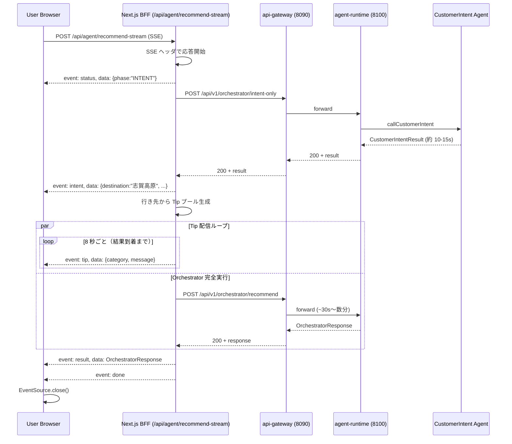
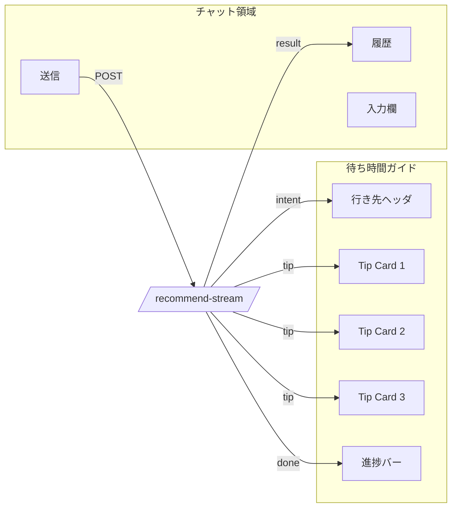

# 待ち時間お役立ち情報ストリーミング機能 設計書 (`add-info-2-customer-spec.md`)

> 対象ページ: `http://localhost:3001/agent` (Multi-Agent Orchestrator チャット画面)
> 作成日: 2026-04-18
> 対象リポジトリ: [Spring-Boot-Ski-Shop-with-Multi-Agent-Skills](../README.md)

---

## 1. 背景と目的

### 1.1 現状の課題

`/agent` ページでは Multi-Agent Orchestrator (CustomerIntent → Weather → Equipment → Pricing → Inventory → Coupon の 6 エージェント連携) が動作する。
gpt-5.4-nano に切り替え済みでも **応答に 30 秒〜 数分** かかるケースがある。
この間、画面は「エージェントが推論中…」のスピナーと固定文言だけが表示されており、ユーザーは:

- 「フリーズしているのでは」と不安になる
- 何の進展もないので**離脱してしまう**
- 戻ってきても結果が消えていることがある

### 1.2 目的

待機時間を **「学びと発見の時間」** に変える。
ユーザーが入力した行き先（例: 「志賀高原」「白馬」）に紐づく **耳寄り情報を画面右側のサイドパネルに次々表示** し、

- 待ち時間の体感を短くする
- スキー旅行への期待感を高める
- 商品購入につながる「気付き」を与える（ワックス/レイヤリング/装備）
- **離脱率を下げる**

### 1.3 スコープ

| 項目 | 含む | 含まない |
|---|---|---|
| 対象ページ | `/agent`（顧客向けチャット） | `/admin/agents/**`（管理者向け） |
| 対象デバイス | デスクトップ（>= 1024px）/ モバイル | 印刷ビュー |
| 言語 | 日本語のみ（v1） | 英語化は v2 で対応 |
| データソース | 静的辞書 + 既存 Weather Agent | リアルタイム DB（v2） |
| ストリーミング方式 | Server-Sent Events (SSE) | WebSocket / Long Polling |

---

## 2. 用語

| 用語 | 説明 |
|---|---|
| **Tip カード** | 待機中に右パネルに表示される 1 件の情報カード |
| **Tip テンプレート** | カテゴリ × 文言のテンプレート群（後述） |
| **Tip プール** | 行き先・季節・曜日に応じて選別された Tip 候補集合 |
| **CustomerIntent** | 既存エージェント。ユーザー文言から行き先・人数等を抽出 |
| **Orchestrator** | 既存エージェント。6 つの Worker を統合 |

---

## 3. 提供する Tip カテゴリ（10 ジャンル）

ユーザー指定の 10 ジャンルを採用する。ジャンルごとに 3〜6 件のテンプレートを用意し、計 **40〜50 テンプレート**を初期投入する。

| # | ジャンル | アイコン | 例（語りかけ口調） |
|---|---|---|---|
| 1 | 雪質・ゲレンデコンディション | ❄️ | 「{{resort}}は今シーズン {{snowDepth}}cm の積雪。週末はパウダー狙いの方も多いみたいですよ」 |
| 2 | リフト運行・コース開放 | 🚡 | 「朝一番の {{liftName}} は{{waitMin}}分待ち程度。風の強い日は山頂リフトが止まることも」 |
| 3 | アクセス・積雪路面 | 🚗 | 「{{resort}}までの最終 IC からは約 {{km}}km。チェーン規制の出る区間なので冬タイヤ + チェーン携行が安心です」 |
| 4 | レンタル・チューンナップ | 🛠️ | 「現地でのレンタル板は身長 -10cm が基準。ブーツは事前予約しておくと当日スムーズですよ」 |
| 5 | スクール・レッスン | 🎓 | 「{{resort}}のスクールは{{lessonType}}が人気。インストラクターは前日までの予約がおすすめです」 |
| 6 | 宿泊（乾燥室・温泉） | 🏨 | 「乾燥室付きの宿だと、翌朝ブーツが温かくて快適です。露天風呂のある宿も多いですよ」 |
| 7 | ゲレンデ内飲食・混雑 | 🍜 | 「お昼の {{restaurantName}} は 12:30 を過ぎると混雑しがち。11:30 か 13:30 をねらうと快適です」 |
| 8 | 安全・パトロール | 🚨 | 「視界の悪い日はコース外への進入は避け、ヘルメット着用がおすすめです。万一の時は {{patrolPhone}} へ」 |
| 9 | ギア・装備の最適化 | 🎿 | 「気温 -10℃ 以下の朝は、滑走面に低温用ワックスを薄く塗ると走りが変わりますよ」 |
| 10 | イベント・ナイター | 🎉 | 「{{resort}}では今月{{eventName}}が開催中。ナイター営業は {{nightHours}} まで楽しめます」 |

---

## 4. 全体アーキテクチャ



### 4.1 設計の核

1. **「素早い Intent」と「重い完全推論」を分離**
   - 行き先抽出だけなら CustomerIntent 1 回で済むので 10〜15 秒で取れる。
   - 行き先が判明した瞬間から、その行き先専用の Tip を出し始める。
2. **2 つのバックエンド呼び出しを並列**
   - Intent と完全 Orchestrator を別 HTTP リクエストで並走させる（CustomerIntent はオーケストレータ内でも実行されるが、結果が外に出てこないため別途呼ぶ）。
3. **SSE で 1 本の HTTP 応答**
   - クライアントは 1 つの `EventSource` を購読するだけ。
   - 結果到着で `event: done` を送り EventSource を閉じる。

---

## 5. バックエンド設計

### 5.1 新規エンドポイント: 軽量 Intent 抽出

#### 5.1.1 仕様

| 項目 | 値 |
|---|---|
| URL | `POST /api/v1/orchestrator/intent-only` |
| 認可 | `hasAnyRole('USER','ADMIN','MANAGER')`（既存 recommend と同じ） |
| 用途 | 行き先・スキルレベル等を素早く返す |
| 平均応答 | 8〜15 秒（CustomerIntent 1 回のみ） |
| Body | `{ "userId": "...", "userMessage": "...", "sessionId": "..." }` |
| Response | `CustomerIntentResult`（既存 DTO） |

#### 5.1.2 実装ポイント

- `OrchestratorAgentService` に `extractIntentOnly(...)` メソッドを追加し、内部の Intent 呼び出し部分だけを公開する。
- **重要**: 現状の `OrchestratorAgentService` のコンストラクタは `ChatClient` と `UserManagementClient` のみを受け取り、`WorkerAgentInvoker` は **`OrchestratorWorkerTools` 経由でしか参照されていない**（LLM がツールとして呼ぶ）。
  従って `extractIntentOnly` を直接呼び出すには **`WorkerAgentInvoker` を Service にも明示的に注入する必要がある**。これは既存ロジックに副作用を与えないシンプルな追加変更。
- `agent-impl-plan.md P12` の「`/api/v1/agents/**` を直接公開しない」原則を維持するため、Orchestrator 内部の薄いラッパーとして提供する。
- 既存の `/recommend` 同様、`@ConditionalOnProperty("agents.web.enabled")` を継承する（同コントローラ内のため自動適用）。

#### 5.1.3 Java スケルトン（修正版）

```java
// orchestrator-agent/src/main/java/.../controller/OrchestratorController.java
@PostMapping("/intent-only")
@PreAuthorize("hasAnyRole('USER','ADMIN','MANAGER')")
public ResponseEntity<CustomerIntentResult> intentOnly(
        @Valid @RequestBody OrchestratorRequest request,
        HttpServletRequest httpRequest) {
    // jwt は Worker 側で必要なら extractBearerToken(httpRequest) を渡す。
    // CustomerIntent Worker 自体は内部 API キー認証を使うため不要だが、
    // 監査ログの相関 ID 用に取得しておく。
    return ResponseEntity.ok(service.extractIntentOnly(request));
}
```

```java
// orchestrator-agent/src/main/java/.../service/OrchestratorAgentService.java
//
// 既存コンストラクタを以下のように拡張する（WorkerAgentInvoker を追加）:
//
//   public OrchestratorAgentService(
//           @Qualifier("orchestratorChatClient") ChatClient orchestratorChatClient,
//           UserManagementClient userManagementClient,
//           WorkerAgentInvoker workerInvoker) { ... }
//
private final WorkerAgentInvoker workerInvoker;

public CustomerIntentResult extractIntentOnly(OrchestratorRequest req) {
    log.info("intentOnly start: userId={}", req.userId());
    var sessionId = req.sessionId() == null ? UUID.randomUUID().toString() : req.sessionId();
    var result = workerInvoker.invokeCustomerIntent(req.userId(), req.message(), sessionId);
    log.info("intentOnly done: destination={}",
            result.constraints() != null ? result.constraints().destination() : null);
    return result;
}
```

> **注**: `WorkerAgentInvoker` Bean は `agents.deployment.mode` に応じてモノリス時は `LocalWorkerAgentInvoker`、分散時は `RemoteWorkerAgentInvoker` が登録されているため、追加の Bean 登録は不要。

### 5.2 ゲートウェイ設定

`api-gateway-service/src/main/java/.../config/RouteConfig.java` 内 `orchestrator-service` ルート（`.path("/api/v1/orchestrator/**")` で受ける既存ルート）が **そのまま `/intent-only` も透過的に通す**ため、ゲートウェイ側は **設定変更不要**。  
ただし以下のサーキットブレーカ・タイムアウト設定は新エンドポイントにも適用されることを確認:

- `orchestratorCircuitBreaker`: 50% 失敗で OPEN（既存）
- `responseTimeout`: 既存値が `intent-only` の想定 15s より十分長いことを確認する。短すぎる場合は別ルートとして分離も検討。

---

## 6. BFF 設計（Next.js Route Handler）

### 6.1 新規ルート: SSE 統合エンドポイント

| 項目 | 値 |
|---|---|
| パス | `frontend/src/app/api/agent/recommend-stream/route.ts` |
| メソッド | `POST` |
| Content-Type | `text/event-stream` |
| Runtime | `nodejs`（`edge` だと長時間 fetch が制約される） |
| タイムアウト | 20 分 |

### 6.2 SSE イベント仕様

| event | data (JSON) | タイミング | 用途 |
|---|---|---|---|
| `status` | `{ "phase": "INTENT" \| "ORCHESTRATING" \| "COMPLETED" }` | 各フェーズ遷移時 | UI のフェーズ表示 |
| `intent` | `CustomerIntentResult` | Intent 完了直後（10-15s） | 行き先・スキルレベル取得 |
| `tip` | `{ "id": "uuid", "category": "SNOW", "icon": "❄️", "title": "...", "message": "...", "source": "static" \| "weather" }` | Intent 完了後 8 秒間隔（最大 60 件まで） | 右パネルへ追加 |
| `result` | `OrchestratorResponse` | Orchestrator 完了時 | 結果表示 |
| `error` | `{ "code": "...", "message": "..." }` | 各種エラー時 | エラー表示 |
| `done` | `{}` | ストリーム終了時 | EventSource を閉じる |

### 6.3 BFF 擬似コード（改訂版・運用考慮を反映）

```typescript
// frontend/src/app/api/agent/recommend-stream/route.ts
import { NextRequest } from 'next/server';
import { getServerSession } from 'next-auth';
import { authOptions } from '@/lib/auth-options';
import { safeFetch } from '@/lib/safe-fetch';
import { buildTipPool, createTipPicker } from '@/lib/tips';

export const runtime = 'nodejs';
export const dynamic = 'force-dynamic'; // SSE は常に動的
export const maxDuration = 1200; // 20 min（プラットフォーム上限に注意）

const GW = process.env.API_GATEWAY_URL ?? 'http://127.0.0.1:8090';
const TIP_INTERVAL_MS = 8_000;
const HEARTBEAT_INTERVAL_MS = 15_000;
const MAX_TIPS_PER_STREAM = 60;
const ORCH_TIMEOUT_MS = 1_200_000;
const INTENT_TIMEOUT_MS = 60_000;

export async function POST(req: NextRequest) {
  const session = await getServerSession(authOptions);
  if (!session?.accessToken) {
    return new Response(
      JSON.stringify({ error: 'AUTH_REQUIRED', message: 'ログインが必要です' }),
      { status: 401, headers: { 'Content-Type': 'application/json' } },
    );
  }

  const body = await req.json();
  if (!body.userId && session.user?.id) body.userId = session.user.id;

  const requestId = crypto.randomUUID();
  const headers: Record<string, string> = {
    'Content-Type': 'application/json',
    'X-Request-Id': requestId,
    Authorization: `Bearer ${session.accessToken}`,
  };

  // 親 AbortController: クライアント切断 / 全体タイムアウトで全ての子を中断する
  const abortAll = new AbortController();
  const wholeTimeoutTimer = setTimeout(() => abortAll.abort('whole-timeout'), ORCH_TIMEOUT_MS + 30_000);

  const stream = new ReadableStream<Uint8Array>({
    async start(controller) {
      const encoder = new TextEncoder();
      const send = (event: string, data: unknown) => {
        try {
          controller.enqueue(
            encoder.encode(`event: ${event}\ndata: ${JSON.stringify(data)}\n\n`),
          );
        } catch {
          // 既に閉じている → 何もしない
        }
      };
      // SSE コメント (`:` で始まる行) は keep-alive 用のハートビート
      const sendHeartbeat = () => {
        try { controller.enqueue(encoder.encode(`: ping ${Date.now()}\n\n`)); } catch { /* closed */ }
      };

      // ハートビート（プロキシによる idle 切断の防止: 多くは 30〜60s）
      const heartbeatTimer = setInterval(sendHeartbeat, HEARTBEAT_INTERVAL_MS);

      let tipsSent = 0;
      let stopped = false;
      let tipTimer: ReturnType<typeof setInterval> | null = null;

      const cleanup = () => {
        stopped = true;
        clearInterval(heartbeatTimer);
        if (tipTimer) clearInterval(tipTimer);
        clearTimeout(wholeTimeoutTimer);
      };

      try {
        // ===== Phase 1: Intent =====
        send('status', { phase: 'INTENT', requestId });
        const intentCtrl = new AbortController();
        const intentTimer = setTimeout(() => intentCtrl.abort('intent-timeout'), INTENT_TIMEOUT_MS);
        // 親 abort も伝播
        abortAll.signal.addEventListener('abort', () => intentCtrl.abort('parent'), { once: true });

        let intent: CustomerIntentResult | null = null;
        try {
          const intentRes = await safeFetch(`${GW}/api/v1/orchestrator/intent-only`, {
            method: 'POST', headers, body: JSON.stringify(body), signal: intentCtrl.signal,
          });
          if (intentRes.ok) {
            intent = (await intentRes.json()) as CustomerIntentResult;
            send('intent', intent);
          } else {
            send('warn', { code: 'INTENT_FAILED', status: intentRes.status });
          }
        } catch (e) {
          send('warn', { code: 'INTENT_ERROR', message: String(e) });
        } finally {
          clearTimeout(intentTimer);
        }

        // ===== Phase 2: Tip ループ + Orchestrator 並列 =====
        const destination = intent?.constraints?.destination ?? null;
        const skillLevel = intent?.constraints?.skillLevel ?? null;
        const tipPool = buildTipPool({ destination, skillLevel, month: new Date().getMonth() + 1 });
        const pickTip = createTipPicker(tipPool);

        tipTimer = setInterval(() => {
          if (stopped) return;
          if (tipsSent >= MAX_TIPS_PER_STREAM) return; // 上限ガード
          const tip = pickTip();
          if (tip) {
            send('tip', { ...tip, deliveredAt: new Date().toISOString() });
            tipsSent++;
          }
        }, TIP_INTERVAL_MS);

        send('status', { phase: 'ORCHESTRATING', requestId });
        const orchCtrl = new AbortController();
        abortAll.signal.addEventListener('abort', () => orchCtrl.abort('parent'), { once: true });

        const orchRes = await safeFetch(`${GW}/api/v1/orchestrator/recommend`, {
          method: 'POST', headers, body: JSON.stringify(body), signal: orchCtrl.signal,
        });
        const text = await orchRes.text();
        if (!orchRes.ok) {
          send('error', { code: `HTTP_${orchRes.status}`, status: orchRes.status, detail: text });
        } else {
          const result = JSON.parse(text);
          send('result', result);
          send('status', { phase: 'COMPLETED', requestId });
        }
      } catch (err: unknown) {
        const reason = err instanceof Error ? err.message : String(err);
        send('error', { code: 'STREAM_ERROR', message: reason });
      } finally {
        cleanup();
        send('done', { requestId });
        try { controller.close(); } catch { /* already closed */ }
      }
    },
    // クライアントが切断したら全ての fetch を abort
    cancel(reason) {
      abortAll.abort(reason ?? 'client-cancel');
    },
  });

  return new Response(stream, {
    headers: {
      'Content-Type': 'text/event-stream; charset=utf-8',
      'Cache-Control': 'no-cache, no-transform',
      Connection: 'keep-alive',
      'X-Accel-Buffering': 'no',     // nginx の SSE バッファ抑止
      'X-Content-Type-Options': 'nosniff',
      'X-Request-Id': requestId,
    },
  });
}
```

#### 改訂のポイント

| # | 強化点 | 理由 |
|---|---|---|
| 1 | **`cancel()` ハンドラ** で `abortAll.abort()` | クライアントが画面遷移・タブクローズで EventSource を閉じた場合、上流の `/recommend` も中断しサーバー資源を解放 |
| 2 | **Heartbeat (`: ping` コメント)** を 15s ごとに送信 | nginx / Cloud Run 等の idle タイムアウト（多くは 30〜60s）を回避 |
| 3 | **MAX_TIPS_PER_STREAM ガード** | 万一 Orchestrator が 8 分以上滞留しても無限送信せず（60 件 = 約 8 分相当） |
| 4 | **Intent 失敗時もストリーム継続** | `warn` イベントを送り、ジェネリック Tip プールに切替 |
| 5 | **`safeFetch` 利用** | 既存 BFF と同じく URL・Host ヘッダ検証を経由 |
| 6 | **`X-Request-Id` 伝播** | 全イベントに `requestId` を付与し、ログとの突合を容易に |
| 7 | **`controller.enqueue` の二重防御** | 既に `close()` 済みのストリームに enqueue すると例外。try/catch で握る |

---

## 7. Tip 生成エンジン

### 7.1 配置

`frontend/src/lib/tips/` 配下に静的辞書として配置（**サーバ・クライアント両方からインポート可能な純粋 TS**）。

```
frontend/src/lib/tips/
├── index.ts              // 公開 API: buildTipPool / pickRandomTip
├── templates.ts          // Tip テンプレート定義
├── resort-dictionary.ts  // 行き先メタデータ
└── season.ts             // 月→シーズン判定
```

### 7.2 Tip テンプレート構造

```typescript
export interface TipTemplate {
  id: string;              // 安定 ID
  category: TipCategory;   // SNOW | LIFT | ACCESS | RENTAL | SCHOOL | LODGING | DINING | SAFETY | GEAR | EVENT
  icon: string;            // 絵文字
  title: string;           // 短い見出し
  /** 本文。{{placeholder}} を `formatTipMessage` で埋める */
  message: string;
  /** どの行き先で出すか。未指定なら全リゾートで適用 */
  resorts?: string[];
  /** どの季節（月）で出すか */
  months?: number[];
  /** 表示優先度。同一行き先で複数候補があるとき重み付け */
  priority?: number;
}
```

### 7.3 行き先辞書（抜粋）

> **正規化の指針**:  
> バックエンド `ai-agent-services/weather-agent/src/main/java/com/example/skishop/agent/weather/client/OpenMeteoClient.java` の `KNOWN_RESORTS` (約 25 リゾート) を **正規名称マスタ**として参照し、フロント辞書のキーを揃える。  
> 将来追加する際は、必ず `OpenMeteoClient.KNOWN_RESORTS` 側にも追記し、ジオ座標が引けることを保証する。

```typescript
// resort-dictionary.ts
export const RESORTS: Record<string, ResortMeta> = {
  '志賀高原': {
    canonicalName: '志賀高原',
    aliases: ['志賀', 'Shiga Kogen'],
    region: '長野県',
    elevationM: 2305,
    typicalSnowDepthCm: 250,
    nearestOnsen: '湯田中・渋温泉',
    accessIc: '信州中野IC',
    accessKmFromIc: 30,
    famousLifts: ['東館山高速ペアリフト', '横手山スカイライナー'],
    nightSki: false,
    courseCount: 49,
    skillFit: ['BEGINNER', 'INTERMEDIATE', 'ADVANCED'],
  },
  '苗場': { /* ... */ },
  '白馬八方': { /* ... */ },
  '蔵王': { /* ... */ },
  // ... 25 リゾート分（KNOWN_RESORTS と同じキーで揃える）
};

/** Intent から返る値を正規名に正規化する（aliases も解決） */
export function canonicalizeResort(input?: string | null): string | null {
  if (!input) return null;
  const trimmed = input.trim();
  if (RESORTS[trimmed]) return trimmed;
  for (const [key, meta] of Object.entries(RESORTS)) {
    if (meta.aliases.some((a) => a.toLowerCase() === trimmed.toLowerCase())) return key;
  }
  return null; // 未知ならジェネリック Tip にフォールバック
}
```

### 7.4 「優しく語りかける」文体ルール

- **語尾**: 「〜ですよ」「〜してみてください」「〜だと安心です」
- **二人称**: なし（「お客様」も避ける）
- **断定回避**: 「〜と言われています」「〜のようです」を多用
- **ポジティブ表現**: 「〜の心配があります」→「〜への備えがあると安心です」
- **長さ**: 1 Tip 60〜120 文字。スクロール不要で 1 視認できる量

### 7.5 重複回避 & ランダム化ロジック

```typescript
// pickRandomTip: 直近 N 件と重複しないよう履歴を持つ
export function createTipPicker(pool: TipTemplate[]) {
  const recent: string[] = [];
  return (): TipTemplate | null => {
    const candidates = pool.filter((t) => !recent.includes(t.id));
    const target = candidates.length > 0 ? candidates : pool;
    if (target.length === 0) return null;
    const next = weightedRandom(target);
    recent.push(next.id);
    if (recent.length > Math.min(10, pool.length - 1)) recent.shift();
    return next;
  };
}
```

### 7.6 行き先未取得時のフォールバック

Intent で行き先が抽出できない場合は **「ジェネリック・スキー Tip プール」** にフォールバックする。これは行き先依存しないテンプレート（雪質一般論、装備、レイヤリング等）約 15 件で構成する。

---

## 8. フロントエンド設計（チャット画面の右パネル）

### 8.1 レイアウト

#### デスクトップ (>=1024px)

```
┌────────────────────────────────────────────────┬──────────────────────┐
│  AI スキー装備アドバイザー                     │  🎿 待ち時間ガイド    │
│  ─────────────────────────                     │  ─────────────────   │
│  [チャット履歴]                                │  📍 志賀高原ガイド    │
│                                                 │                       │
│  User: 12月に志賀高原で...                     │  ┌─────────────────┐ │
│                                                 │  │ ❄️ 雪質情報      │ │
│  Bot: エージェントが推論中... (12:34 経過)     │  │ 志賀高原は今...  │ │
│                                                 │  └─────────────────┘ │
│  [Tip A] -> 表示直後                           │                       │
│                                                 │  ┌─────────────────┐ │
│  [入力欄]                                       │  │ 🚡 リフト情報    │ │
│  [メッセージ入力] [送信]                       │  │ 朝一番の...      │ │
│                                                 │  └─────────────────┘ │
│                                                 │                       │
│                                                 │  ───── 待機: 0:45 ── │
│                                                 │  3 件の情報をお届け  │
└────────────────────────────────────────────────┴──────────────────────┘
       (max-w-4xl, flex-1)                              (w-[360px])
```

#### モバイル (<1024px)

- 右パネルは画面下部から **ボトムドロワー** で展開（タップで開閉）
- デフォルトは閉じた状態でヘッダだけ表示: `🎿 志賀高原ガイド (3 件届いています ▲)`
- 開くと最新 3 件が表示、上にスワイプで全件閲覧

### 8.2 Tip カードのデザイン

```
┌──────────────────────────────────┐
│  ❄️  雪質コンディション      12秒前│  ← アイコン + カテゴリ + 経過時間
├──────────────────────────────────┤
│ 志賀高原は今シーズン約 250cm の   │
│ 積雪。週末はパウダー狙いの方も    │  ← 本文（120 文字以内）
│ 多いみたいですよ。                │
└──────────────────────────────────┘
   [背景: bg-card / 角丸 lg / 影 sm]
   [アイコン色はカテゴリ別]
```

#### 視覚的特徴

| 要素 | スタイル |
|---|---|
| **カード幅** | 100%（パネル内）, 最大 320px |
| **角丸** | `rounded-xl`（16px） |
| **背景** | カテゴリ別グラデーション。例: 雪質=`from-sky-50 to-blue-50` / 温泉=`from-rose-50 to-amber-50` |
| **左ボーダー** | 4px のアクセントカラー（カテゴリ別） |
| **アニメーション** | 出現時: `motion.div` で `opacity 0 → 1`, `y +12 → 0`（Framer Motion 不要なら CSS `@keyframes`）。古いカードは下方向にフェードアウト |
| **最大表示数** | 5 件まで。古いものから消える（メモリ・スクロール対策） |
| **クリック** | 何もしない（純粋な情報表示） |

### 8.3 ヘッダ部

```
🎿 志賀高原 待ち時間ガイド
───────────────────────────
お待ちいただいている間、{{resort}}にまつわる
お役立ち情報をお届けしますね。
```

- 行き先未取得時: 「行き先を読み取っています…」
- 完了時: パネル全体がフェードアウトして、結果表示エリアに席を譲る

### 8.4 進捗バー

カードの下部に経過時間とフェーズを表示:

```
[●●●●●●○○○○]  経過 0:45 / 想定 ~2:00  状態: エージェント推論中
```

- フェーズ: `INTENT` → `ORCHESTRATING` → `COMPLETED`
- 経過時間は `Date.now()` 差分を毎秒更新
- 想定時間は過去ログの 90 パーセンタイル値を表示

### 8.5 完了時の挙動

| イベント | UI 動作 |
|---|---|
| `intent` 受信 | ヘッダの「行き先を読み取っています…」を「{{resort}} 待ち時間ガイド」に更新 |
| 1 件目の `tip` 受信 | パネルがフェードイン、最初のカード表示 |
| `result` 受信 | パネル全体に `🎉 結果が届きました！` のオーバーレイを 1.2 秒表示後にスムーズ消滅 |
| `done` 受信 | `EventSource.close()`、タイマー停止、全 Tip カードを履歴として折りたたむ |
| `error` 受信 | 赤系の小バナーで「情報の取得に失敗しました」、再試行不要（裏で結果は届く） |

---

## 9. クライアント実装

### 9.1 React Hook: `useAgentStream`

```typescript
// frontend/src/hooks/use-agent-stream.ts
export function useAgentStream() {
  const [phase, setPhase] = useState<'IDLE' | 'INTENT' | 'ORCHESTRATING' | 'COMPLETED' | 'ERROR'>('IDLE');
  const [intent, setIntent] = useState<CustomerIntentResult | null>(null);
  const [tips, setTips] = useState<TipEvent[]>([]);
  const [result, setResult] = useState<OrchestratorResponse | null>(null);
  const [error, setError] = useState<string | null>(null);
  const abortRef = useRef<AbortController | null>(null);

  const start = useCallback(async (req: OrchestratorRequest) => {
    abortRef.current?.abort();
    const ctrl = new AbortController();
    abortRef.current = ctrl;
    setPhase('INTENT'); setIntent(null); setTips([]); setResult(null); setError(null);

    const res = await fetch('/api/agent/recommend-stream', {
      method: 'POST',
      headers: { 'Content-Type': 'application/json', Accept: 'text/event-stream' },
      body: JSON.stringify(req),
      signal: ctrl.signal,
    });
    if (!res.body) { setError('SSE 非対応'); setPhase('ERROR'); return; }

    const reader = res.body.getReader();
    const decoder = new TextDecoder();
    let buffer = '';
    while (true) {
      const { value, done } = await reader.read();
      if (done) break;
      buffer += decoder.decode(value, { stream: true });
      // event: name\ndata: ...\n\n のフレームをパース
      let idx;
      while ((idx = buffer.indexOf('\n\n')) >= 0) {
        const frame = buffer.slice(0, idx);
        buffer = buffer.slice(idx + 2);
        const ev = parseSseFrame(frame);
        handleEvent(ev);
      }
    }
  }, []);

  const stop = useCallback(() => abortRef.current?.abort(), []);

  return { start, stop, phase, intent, tips, result, error };
}
```

### 9.2 ページ統合

`frontend/src/app/(ec)/agent/page.tsx` を以下のように改修:

1. 既存の `recommendWithAgents` 直叩きを **`useAgentStream` フック** に置換
2. レイアウトを `flex` 2 カラム化（左: チャット、右: ガイド）
3. 右カラムに `<TipPanel tips={tips} intent={intent} phase={phase} />` を配置
4. 結果到着 (`result` 非 null) 時に既存の `RecommendationDetail` を表示

### 9.3 新規コンポーネント

| コンポーネント | パス | 役割 |
|---|---|---|
| `TipPanel` | `frontend/src/components/agent/tip-panel.tsx` | 右パネル全体のコンテナ |
| `TipCard` | `frontend/src/components/agent/tip-card.tsx` | 1 件の Tip カード |
| `WaitProgressBar` | `frontend/src/components/agent/wait-progress-bar.tsx` | 経過時間バー |
| `PhaseIndicator` | `frontend/src/components/agent/phase-indicator.tsx` | フェーズ表示 |

---

## 10. 失敗時の優しいメッセージ（フォールバック）

ユーザー要求の「**回答が帰ってこない場合は、人間が優しく紹介するような文章の言い回しで丁寧に語りかける**」を、以下の段階別に対応する。

| シナリオ | UI メッセージ |
|---|---|
| Intent も取れない | 「行き先がうまく読み取れなかったみたいです。スキー旅行を楽しむための定番情報をお届けしますね。」+ ジェネリック Tip 配信 |
| Intent は取れたが Orchestrator がタイムアウト | 「すみません、思ったより時間がかかっています。準備が整い次第お知らせしますので、{{resort}} のお役立ち情報をご覧になってお待ちください。」+ Tip 配信継続 |
| 完全失敗（5xx） | 「すみません、いま AI アドバイザーの調子が悪いようです。少し時間をおいてお試しいただけますか？お待ちの間、{{resort}} の情報をご紹介しますね。」+ Tip だけ表示し続ける |
| 完了 | 「お待たせしました！ご要望に合わせた装備一式をご用意しました。ぜひご確認ください。」 |

メッセージ文言は `frontend/src/lib/tips/messages.ts` で集中管理し、本文修正を容易にする。

---

## 11. Tip テンプレート初期セット（例）

`frontend/src/lib/tips/templates.ts` に投入する初期 50 テンプレートのうち、抜粋:

```typescript
export const TIP_TEMPLATES: TipTemplate[] = [
  {
    id: 'snow-001',
    category: 'SNOW',
    icon: '❄️',
    title: '雪質コンディション',
    message: '{{resort}}は今シーズン平均 {{snowDepth}}cm の積雪と言われています。週末はパウダー狙いの方も多いみたいですよ。',
    months: [12, 1, 2, 3],
  },
  {
    id: 'gear-warmup',
    category: 'GEAR',
    icon: '🧥',
    title: 'レイヤリング',
    message: '気温 -10℃ を下回る朝は、ベース＋ミドル＋シェルの 3 層が安心です。汗冷えを防ぐベースレイヤーが効果的ですよ。',
    months: [12, 1, 2],
  },
  {
    id: 'lodging-onsen-shiga',
    category: 'LODGING',
    icon: '♨️',
    title: '近場の温泉',
    message: '{{resort}}の麓には湯田中・渋温泉がありますね。滑り終えた後の温泉は最高のご褒美になりますよ。',
    resorts: ['志賀高原'],
  },
  // ... 残り 47 件
];
```

---

## 12. 既存コードへの影響

| ファイル | 変更内容 | 影響度 |
|---|---|---|
| `ai-agent-services/orchestrator-agent/.../OrchestratorController.java` | `intentOnly` エンドポイント追加 | 小 |
| `ai-agent-services/orchestrator-agent/.../OrchestratorAgentService.java` | `extractIntentOnly` メソッド追加 | 小 |
| `frontend/src/app/api/agent/recommend-stream/route.ts` | **新規** | 新規 |
| `frontend/src/app/(ec)/agent/page.tsx` | レイアウト 2 カラム化 + フック切替 | 中 |
| `frontend/src/hooks/use-agent-stream.ts` | **新規** | 新規 |
| `frontend/src/components/agent/*.tsx` | **新規** 4 ファイル | 新規 |
| `frontend/src/lib/tips/*.ts` | **新規** 4 ファイル | 新規 |
| `frontend/src/lib/orchestrator-client.ts` | 既存 `recommendWithAgents` は残置（互換） | なし |

---

## 13. テスト戦略

### 13.1 Backend ユニット

| クラス | テスト内容 |
|---|---|
| `OrchestratorAgentServiceTest` | `extractIntentOnly` が正しく Worker invoker を呼ぶこと、エラー時の挙動 |
| `OrchestratorControllerTest` | `/intent-only` が 200 / 401 / 403 を正しく返すこと |

### 13.2 Frontend ユニット (Vitest)

| 対象 | テスト |
|---|---|
| `tips/index.ts` | `buildTipPool`: 行き先別/月別フィルタ、フォールバック動作 |
| `tips/index.ts` | `pickRandomTip`: 直近 N 件と重複しない、空プールで `null` |
| `useAgentStream` | SSE フレームパース、各 event の state 更新、`stop()` で abort |
| `TipCard` | アクセシビリティ: `role="status"`, `aria-live="polite"`、絵文字に `aria-hidden` |

### 13.3 E2E (Playwright)

1. ログイン → `/agent` 遷移
2. 「12月に志賀高原で...」を送信
3. 5 秒後に「待ち時間ガイド」パネルが表示されることを assert
4. 30 秒以内に 3 枚以上の Tip カードが描画されることを assert
5. 結果 JSON が表示されたら Tip ストリームが停止していることを assert

### 13.4 アクセシビリティ

- `aria-live="polite"` で Tip カード追加をスクリーンリーダに通知
- カラーコントラスト WCAG AA 以上
- キーボード: Tip パネル全体に `role="region"` + `aria-label="待ち時間ガイド"`、フォーカスは Tip カードに当たらない（純情報表示）
- アニメーションは `prefers-reduced-motion` を尊重

---

## 14. 性能・運用考慮

### 14.1 パフォーマンス

- **Tip テンプレート**: 静的 JS で約 20 KB 想定。初回ロード時に code-split で遅延ロード可能
- **SSE 接続**: 1 ユーザー 1 接続。サーバー側のメモリは Promise + setInterval だけなので問題なし
- **同時接続数**: Next.js BFF は Node.js なのでデフォルト 1000 同時接続まで OK
- **タイマーリーク防止**: `controller.close()` 時に必ず `clearInterval(tipTimer)` を呼ぶ

### 14.2 セキュリティ

- BFF で必ず NextAuth セッションをチェック → 未ログインは 401
- Intent 抽出と完全 Orchestrator は **同じ Bearer トークン** を `Authorization` ヘッダに付与（既存と同じ JWT 経由）
- Tip 文言は静的辞書のみで動的入力（ユーザー文）を本文に直接埋め込まない → XSS リスクなし
- SSE レスポンスに `X-Content-Type-Options: nosniff` を付与
- BFF はユーザー文言（`message`）を **ログに出力しない**（既存の RequestLoggingFilter 設定踏襲）

### 14.3 セッション期限・認証切れ

- NextAuth セッションは 30 分の inactivity でも切れる可能性 → ストリーム中に accessToken の有効期限が切れた場合、Orchestrator から **401 が返る**
- **対応**:
  - SSE で `event: error, data: {code: "AUTH_EXPIRED"}` を送出
  - クライアントは EventSource を閉じ、ログイン画面へリダイレクト誘導するモーダルを出す
  - 結果が消えないように、それまでに受信した Tip と入力 message を `sessionStorage` に保存し、再ログイン後に復帰可能にする

### 14.4 同時実行・連投制御

- 同一ブラウザでユーザーが連続送信した場合、**前のストリームを必ず abort** する（`AbortController` 1 個をフックで保持）
- サーバー側は **同一 `userId` での同時 SSE 接続を 2 本まで許可**（IORedis ベースの簡易カウンタ。閾値超過は 429）
- レート制限: 1 ユーザー **1 分あたり 5 リクエスト**（既存 GlobalFilter があれば踏襲、無ければ Next.js の middleware で実装）

### 14.5 プロキシ・インフラ

| 層 | 設定/確認事項 |
|---|---|
| ブラウザ | `EventSource` は標準対応。fetch + ReadableStream で代替可（本案では fetch を使用） |
| Next.js (Standalone, Docker) | `runtime: 'nodejs'`, `dynamic: 'force-dynamic'` で動的応答を維持。standalone ビルドでも SSE は問題なく動作 |
| Docker / 内部通信 | docker-compose のネットワークでは中間プロキシが無いため Heartbeat 不要だが、本番 Azure Container Apps 等では **30〜240s の idle timeout** に注意 |
| nginx (将来導入時) | `proxy_buffering off; proxy_read_timeout 1300s; proxy_send_timeout 1300s; gzip off;` を SSE ロケーションに設定 |
| Azure App Gateway / Front Door | `requestTimeout >= 1300s`、HTTP/2 を有効化 |

### 14.6 監視メトリクス（追加）

| メトリクス | 集計方法 | 目的 |
|---|---|---|
| `agent_stream_open_total` | カウンタ | 開始数 |
| `agent_stream_complete_total` | カウンタ（label: phase=COMPLETED/ERROR/CLIENT_CANCEL/TIMEOUT） | 完了率・離脱率 |
| `agent_stream_duration_seconds` | ヒストグラム | 体感待ち時間の分布 |
| `agent_stream_tips_sent` | ヒストグラム | 1 ストリームの Tip 数（≒ 待機長）|
| `agent_intent_only_duration_seconds` | ヒストグラム | Intent 抽出の応答時間 |
| `agent_intent_destination_resolved_ratio` | Gauge | 行き先抽出成功率 |

実装は既存 `Micrometer` 設定（バックエンド）と Sentry/console（フロント）を流用。Next.js 側はカウンタを `console.info('METRIC ...')` で出力し、運用側のログ集約で集計。

### 14.7 既存ロガーへの影響

- 既存 `RequestLoggingFilter`（gateway / BFF）: `text/event-stream` レスポンスに対しては **応答ボディをログに残さない** よう確認済み（先のヘッダ事象への対応で `beforeCommit` 移行済み）
- BFF route handler: SSE Content-Type を確認し、ステータス・所要時間・requestId のみ INFO ログ出力

---

## 15. 実装順序（推奨マイルストーン）

| Phase | 期間目安 | 内容 |
|---|---|---|
| **Phase 1** | 0.5 日 | バックエンド `intent-only` エンドポイント追加 + テスト |
| **Phase 2** | 1 日 | Tip テンプレート 50 件作成 + 行き先辞書 + 純粋 TS ライブラリ + Vitest |
| **Phase 3** | 1 日 | BFF SSE エンドポイント実装 + Hook 実装 |
| **Phase 4** | 1.5 日 | UI コンポーネント実装（`TipPanel`, `TipCard`, etc.）+ ページ統合 |
| **Phase 5** | 0.5 日 | E2E テスト + アクセシビリティ確認 + Feature Flag |
| **合計** | **約 4.5 日** |  |

---

## 16. 将来拡張（v2 以降）

| 機能 | 概要 |
|---|---|
| 動的 Tip ソース | Weather Agent の結果が出た瞬間に「明日は降雪予報ですよ」を割り込ませる |
| 季節指数 | 月単位ではなく日単位で「年末年始のピーク混雑」等を反映 |
| 多言語対応 | テンプレートを i18n 化（en/zh）し、`locale` を Tip プールキーに含める |
| ユーザー履歴連動 | 過去の購入履歴から「お持ちの ATOMIC Redster なら、雪質 X に向いていますよ」を提示 |
| 動画 Tip | 30 秒程度のショート動画（HLS）を一定確率で挿入 |
| LLM 生成 Tip | テンプレートを種にして gpt-4o-mini で動的に文体生成（コスト管理に注意） |

---

## 17. デザインプレビュー（Mermaid 概念図）



---

## 18. まとめ

- **Intent だけ先に取って** 行き先を判定し、専用 Tip を `EventSource` で配信する設計。
- **静的 Tip テンプレート + 行き先辞書** により、毎回違う・優しい・有益な情報を提供。
- **失敗時** も「人間が語りかける」フォールバック文言で離脱を防止。
- **既存 Orchestrator** には小さな追加（`intent-only` エンドポイントのみ）で済む。
- **段階的ロールアウト** が可能（Feature Flag, A/B 比較）。
- **約 4.5 日** で本番投入可能な実装スコープ。

ユーザーは待ち時間を「学びと発見の時間」に変え、ショップは「**あ、これも欲しいかも**」という気付きを生んで購買に繋げる ── そんな **Win-Win の体験** を実現する。

---

## 19. 設計レビュー記録（2026-04-18）

本設計書は初版作成後、リポジトリ実コードと突合した詳細レビューを実施し、以下の修正を反映済み。

### 19.1 修正済み項目（v1 → v1.1）

| # | レビュー指摘 | 対応 |
|---|---|---|
| R-01 | `OrchestratorAgentService` のコンストラクタには `WorkerAgentInvoker` が**注入されていない**（LLM がツールとしてのみ呼ぶ）ため、初版の Java スケルトンは破綻していた | §5.1.3 を改訂し、コンストラクタへ `WorkerAgentInvoker` を追加注入する旨を明記 |
| R-02 | 行き先辞書の出処が agent-common と誤記。実際は `weather-agent` の `OpenMeteoClient.KNOWN_RESORTS` | §7.3 を修正。フロント辞書は KNOWN_RESORTS と**キーを揃える**運用ルールを明示 |
| R-03 | API Gateway の既存ルート `path("/api/v1/orchestrator/**")` で `/intent-only` も透過するか不明瞭 | §5.2 で `RouteConfig.java` の該当ルートが透過する旨を確認・記載 |
| R-04 | 初版 BFF サンプルは `cancel()` ハンドラなし → クライアント切断後も上流 fetch が継続しリソース浪費 | §6.3 を「改訂版」に差し替え、`cancel()` で `abortAll.abort()` を実装 |
| R-05 | SSE Heartbeat（`: ping` コメント）なし → プロキシ idle タイムアウトで切断される恐れ | §6.3 / §14.5 で 15s 間隔の Heartbeat を追加 |
| R-06 | `tipsSent` 上限なし → 万一の超長時間滞留で無限送信 | §6.3 で `MAX_TIPS_PER_STREAM = 60` を追加 |
| R-07 | Intent 失敗時の挙動が曖昧 | §6.3 で `event: warn` を送出し、ジェネリック Tip プールへフォールバックすることを明記 |
| R-08 | セッション期限切れ時の UX 未定義 | §14.3 を新設。`AUTH_EXPIRED` イベント・sessionStorage への一時保存・再ログイン後復帰を規定 |
| R-09 | 連投時の前ストリーム abort が未定義 | §14.4 を新設。AbortController での前ストリーム強制中断・サーバー側同時 2 接続上限・レート制限を規定 |
| R-10 | プロキシ層の SSE 設定（nginx, Azure App Gateway）が未記載 | §14.5 を新設。`proxy_buffering off`, `proxy_read_timeout` 等を明記 |
| R-11 | 監視メトリクスが未定義 | §14.6 を新設。`agent_stream_*` 系メトリクスの一覧を追加 |
| R-12 | `safeFetch` を使うべきだが初版サンプルは素 fetch | §6.3 の改訂版で `safeFetch` を使用 |
| R-13 | `requestId` の伝播がない → ログ突合困難 | §6.3 で全イベントに `requestId` を付与 |
| R-14 | Intent 個別タイムアウトなし → 全体タイムアウト前に長時間ハング | §6.3 で `INTENT_TIMEOUT_MS = 60_000` を分離 |
| R-15 | `controller.enqueue` が close 後例外で落ちる | §6.3 で try/catch ガードを追加 |
| R-16 | 行き先 alias 解決方法が未定義（CustomerIntent が "Naeba" を返す可能性） | §7.3 に `canonicalizeResort()` を追加 |

### 19.2 残課題（v2 で対応）

| # | 内容 | 優先度 |
|---|---|---|
| F-01 | Tip テンプレート 50 件の本文・口調レビュー（コピーライター監修） | 高 |
| F-02 | `OpenMeteoClient.KNOWN_RESORTS` を agent-common へ昇格し、Frontend ビルド時に JSON エクスポートする仕組み | 中 |
| F-03 | Weather Agent の中間結果（積雪・気温）をリアルタイムで Tip に注入する `event: weather-tip` の追加 | 中 |
| F-04 | Storybook ストーリー（`TipPanel`, `TipCard`, `WaitProgressBar`） | 低 |
| F-05 | i18n 対応（ja/en/zh） | 低 |
| F-06 | A/B テスト基盤（`NEXT_PUBLIC_ENABLE_TIP_STREAM` 単純フラグ → Split.io 等の本格 FF） | 低 |

### 19.3 セキュリティ・コンプライアンス検証結果

| 観点 | 評価 | 備考 |
|---|---|---|
| OWASP A01: アクセス制御 | ✅ | BFF で NextAuth セッション必須、Orchestrator で `@PreAuthorize` |
| OWASP A03: インジェクション | ✅ | Tip 本文は静的辞書のみ、動的ユーザー入力を本文に直接埋め込まない |
| OWASP A04: セキュアな設計 | ✅ | レート制限・連投制御を §14.4 で規定 |
| OWASP A05: セキュリティ設定ミス | ✅ | `X-Content-Type-Options: nosniff`, `Cache-Control: no-cache` を明示 |
| OWASP A09: ログ・監視 | ✅ | `requestId` 連携、メトリクス §14.6 |
| GDPR / 個人情報保護 | ✅ | ユーザー文言を BFF / フロント両方でログ出力しない方針を §14.2 / §14.7 に明記 |

### 19.4 設計書の網羅性チェックリスト

- [x] 機能要件・非機能要件
- [x] アーキテクチャ図（Mermaid sequence / flowchart）
- [x] バックエンド API 仕様（パス・認可・DTO・タイムアウト）
- [x] BFF SSE 仕様（イベント定義・Heartbeat・cancel）
- [x] フロントエンド画面デザイン（PC・モバイル両対応のレイアウト図）
- [x] コンポーネント構成・React Hook 設計
- [x] データ構造（TipTemplate / ResortMeta）
- [x] ランダム化・重複回避アルゴリズム
- [x] 文体・コピーライティングルール
- [x] 失敗時のフォールバック（ユーザーへの語りかけメッセージ）
- [x] テスト戦略（Unit / E2E / a11y）
- [x] 性能・スケーラビリティ
- [x] セキュリティ・OWASP 対応
- [x] セッション期限・連投制御
- [x] 監視メトリクス
- [x] プロキシ設定
- [x] 既存コードへの影響範囲
- [x] 実装フェーズ計画
- [x] 将来拡張
- [x] レビュー記録 / 残課題
