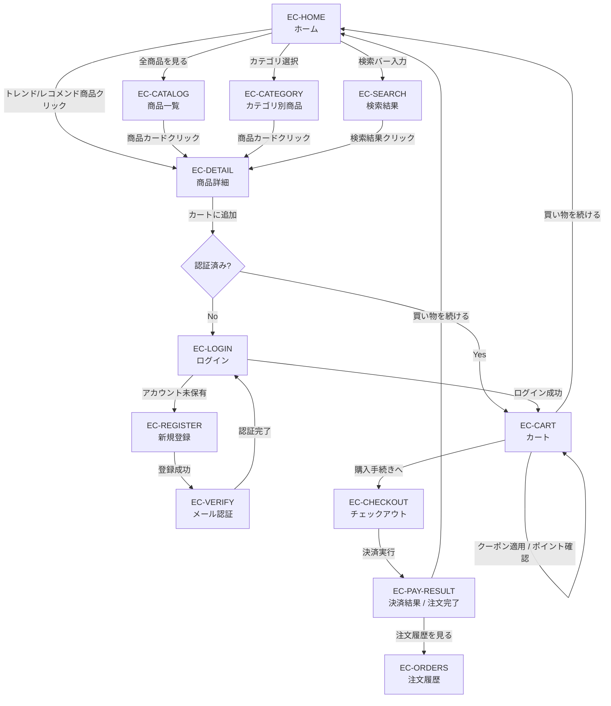
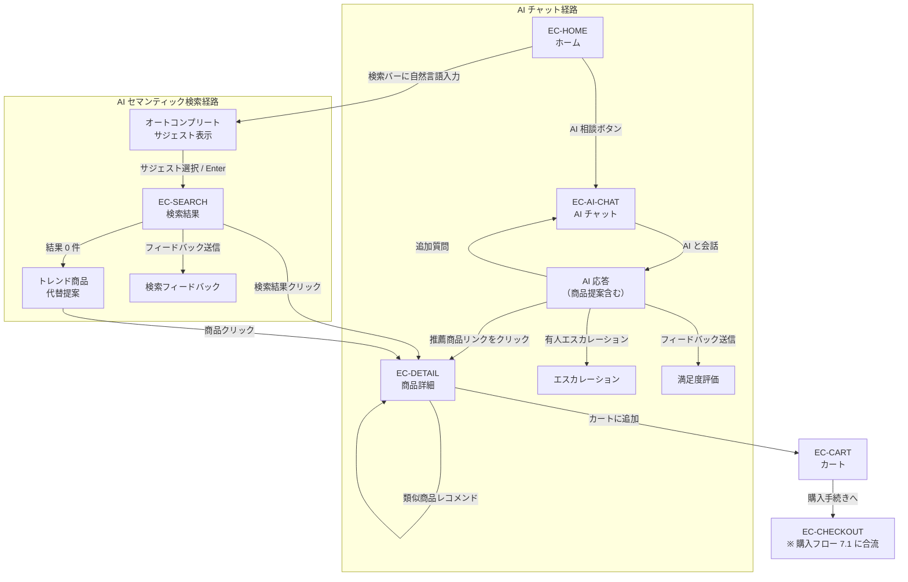
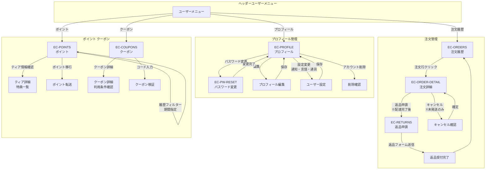

# Azure SkiShop フロントエンド要件定義書

## business-analyst レビューレポート

### サマリー

- 判定: ⚠️ Warning（フロントエンド未構築のため、本ドキュメントは新規要件定義）
- レビュー対象: バックエンド 9 サービス（70+ API エンドポイント）に対するフロントエンド要件
- レビュー日時: 2026-03-19
- レビュー深度: Gate 1（企画承認）

### 前提条件の確認

- [x] 要件ドキュメントの存在: OK（バックエンド API 実装済み、設計ドキュメント群あり）
- [x] ビジネス目標の把握可能性: OK（スキー用品特化 EC プラットフォーム）
- [x] 利用者像の明確さ: OK（一般消費者 + 管理者の 2 ペルソナ）

---

## 1. プロジェクト概要

### 1.1 ビジネス目標

初心者からプロフェッショナルまで幅広いスキーヤーを対象とした **Azure SkiShop** EC プラットフォームのフロントエンドを構築する。AI によるパーソナライズと充実したロイヤルティプログラムを差別化要素とし、**顧客生涯価値（LTV）の最大化** と **運用効率の向上** を両立する。

### 1.2 対象ユーザー（ペルソナ）

| ペルソナ | 説明 | 主な利用シーン |
|---------|------|-------------|
| **一般顧客（Guest）** | 未登録ユーザー。商品閲覧・検索のみ | 商品カタログ閲覧、AI 検索 |
| **会員顧客（User）** | 登録済みユーザー。購入・ポイント利用が可能 | 購入フロー、ポイント利用、AI チャット |
| **店舗管理者（Admin）** | 商品・注文・顧客・キャンペーンを管理する運営スタッフ | 全管理機能 |
| **マネージャー（Manager）** | 分析ダッシュボード閲覧・在庫管理が可能な上位スタッフ | 分析、在庫管理、レポート |

### 1.3 技術前提

- **バックエンド**: API Gateway（:8090）経由で全 API にアクセス
- **認証方式**: JWT（Access Token + Refresh Token）
- **API 仕様**: 全サービス Swagger (springdoc-openapi) 公開済み
- **通信**: REST + JSON、ページネーション対応（Spring Data Pageable）

### 1.4 API ベース URL とバージョニング方針

| 項目 | 値 |
|------|------|
| **API ベース URL** | 環境変数 `API_BASE_URL`（デフォルト: `http://localhost:8090`、本番: 外部 URL） |
| **現行バージョン** | `v1`（全 API 共通: `/api/v1/*`） |
| **バージョン管理** | URL パス方式（`/api/v{N}/`） |

**フロントエンド実装ルール**:

1. API ベース URL は環境変数で一元管理する。コード中に `http://localhost:8090` や `/api/v1/` をハードコードしない
2. API クライアント（axios インスタンス等）の `baseURL` に環境変数を設定し、個別の API 呼び出しでは相対パス（`/products/:id`）を使用
3. 将来 v2 移行時は `API_BASE_URL` または API クライアントのバージョンプレフィックスのみを変更すれば全画面に反映される

```
// 環境変数設定例
API_BASE_URL=http://localhost:8090  // 開発
API_BASE_URL=https://api.skishop.example.com  // 本番

// API クライアント設定例
const apiClient = createClient({
  baseURL: `${API_BASE_URL}/api/v1`,  // バージョンを一箇所で管理
  // ...
});

// 各 API 呼び出しでは相対パスのみ
apiClient.get('/products/:id');
apiClient.get('/admin/orders?page=0&size=10');
```

### 1.5 フロントエンド技術スタックと採用バージョン

本プロジェクトでは **React + Next.js（App Router）** を中心に、**BFF（Backend for Frontend）** パターンを採用する。ブラウザは Next.js の API Route（BFF）のみを呼び出し、CORS・認証・集約・エラーハンドリング・観測性を BFF に集約する。

以下に採用ライブラリとバージョンを示す。

#### コアフレームワーク

| ライブラリ | バージョン | 用途 |
|-----------|-----------|------|
| **Next.js** | 16.2.0 | フレームワーク（App Router / BFF / SSR） |
| **React** | 19.2.4 | UI ライブラリ |
| **React DOM** | 19.2.4 | React ブラウザレンダリング |
| **TypeScript** | 5.9.3 | 型安全な開発 |

#### 型・契約（OpenAPI）

| ライブラリ | バージョン | 用途 |
|-----------|-----------|------|
| **Orval** | 8.5.3 | OpenAPI から TypeScript クライアント + React Query hooks 生成 |
| **zod** | 4.3.6 | BFF 境界でのランタイムバリデーション |

#### データ取得・状態管理

| ライブラリ | バージョン | 用途 |
|-----------|-----------|------|
| **@tanstack/react-query** | 5.91.2 | クライアント側の非同期状態 / キャッシュ / リトライ |
| **zustand** | 5.0.12 | 最小限のグローバル状態管理（認証状態等） |

#### UI・スタイリング

| ライブラリ | バージョン | 用途 |
|-----------|-----------|------|
| **Tailwind CSS** | 4.2.2 | ユーティリティファースト CSS フレームワーク |
| **shadcn** | 4.0.8 | アクセシブルな UI コンポーネント基盤 |
| **@radix-ui/react-slot** | 1.2.4 | shadcn/ui の基盤 Radix UI プリミティブ |

#### フォーム

| ライブラリ | バージョン | 用途 |
|-----------|-----------|------|
| **react-hook-form** | 7.71.2 | 高性能フォーム管理 |
| **@hookform/resolvers** | 5.2.2 | zod スキーマとの統合バリデーション |

#### 認証

| ライブラリ | バージョン | 用途 |
|-----------|-----------|------|
| **next-auth** | 4.24.13 | OIDC/OAuth2 認証（BFF Cookie セッション管理）。Spring Boot 認証サービスとのトークン交換に活用 |

#### テスト

| ライブラリ | バージョン | 用途 |
|-----------|-----------|------|
| **Playwright** | 1.58.2 | E2E テスト |
| **Vitest** | 4.1.0 | ユニット / コンポーネントテスト |
| **@testing-library/react** | 16.3.2 | React コンポーネントテストユーティリティ |
| **MSW** | 2.12.13 | API モック（契約テスト / フロント開発の分離） |

#### 監視・観測性

| ライブラリ | バージョン | 用途 |
|-----------|-----------|------|
| **@sentry/nextjs** | 10.45.0 | 例外監視・エラートラッキング |
| **@opentelemetry/api** | 1.9.0 | 分散トレーシング API |
| **@opentelemetry/sdk-node** | 0.213.0 | OpenTelemetry SDK（BFF → Spring Boot 間の相関 ID 伝播） |
| **web-vitals** | 5.1.0 | Web Vitals（LCP, FID, CLS, TTFB, INP）メトリクス収集 |

#### 開発ツール

| ライブラリ | バージョン | 用途 |
|-----------|-----------|------|
| **ESLint** | 10.0.3 | 静的解析・リンティング |
| **Prettier** | 3.8.1 | コードフォーマッター |

> **バージョン確認日**: 2026-03-19（npm レジストリの最新安定版）
>
> **BFF アーキテクチャ方針**: ブラウザは Next.js の API Route（BFF）のみを呼び出す。BFF が認証・認可（セッション/トークン管理）、マイクロサービス呼び分け、複数サービスの集約と UI 向け DTO 変換、共通エラーハンドリング、リトライ/タイムアウト、監査ログを担当する。フロント（ブラウザ）には画面表示・ユーザー操作・画面遷移と最小限の UI 状態のみを残す。

---

## 2. EC サイト（顧客向け）— 画面構成と機能要件

### 2.1 画面一覧

| # | 画面 ID | 画面名 | パス（例） | 認証 | 対応 API |
|---|--------|--------|-----------|------|---------|
| 1 | EC-HOME | ホーム | `/` | 不要 | recommendations/trending, categories, products |
| 2 | EC-CATALOG | 商品一覧 | `/products` | 不要 | GET /api/v1/products, categories |
| 3 | EC-CATEGORY | カテゴリ別商品 | `/category/:id` | 不要 | GET /api/v1/categories/:id/products |
| 4 | EC-DETAIL | 商品詳細 | `/products/:id` | 不要 | GET /api/v1/products/:id, recommendations/similar |
| 5 | EC-SEARCH | 検索結果 | `/search?q=` | 不要 | GET /api/v1/search, /search/autocomplete |
| 6 | EC-CART | カート | `/cart` | 必要 | GET/POST/PUT/DELETE /api/v1/cart |
| 7 | EC-CHECKOUT | チェックアウト | `/checkout` | 必要 | POST /api/v1/payments/intent, coupons/validate, points/balance |
| 8 | EC-PAY-RESULT | 決済結果 | `/checkout/result` | 必要 | POST /api/v1/payments/:id/process, POST /api/v1/orders |
| 9 | EC-ORDERS | 注文履歴 | `/mypage/orders` | 必要 | GET /api/v1/orders/customer/:id |
| 10 | EC-ORDER-DETAIL | 注文詳細 | `/mypage/orders/:id` | 必要 | GET /api/v1/orders/:id, shipments/order/:id |
| 11 | EC-RETURNS | 返品申請 | `/mypage/returns` | 必要 | POST /api/v1/returns, GET returns |
| 12 | EC-PROFILE | プロフィール | `/mypage/profile` | 必要 | GET/PUT /api/v1/users/:id, preferences |
| 13 | EC-POINTS | ポイント | `/mypage/points` | 必要 | GET /api/v1/points/balance, history, expiring, tiers |
| 14 | EC-COUPONS | クーポン | `/mypage/coupons` | 必要 | GET /api/v1/coupons/user/available |
| 15 | EC-AI-CHAT | AI チャット | `/chat` | 必要 | POST /api/v1/chat/session, /chat/message |
| 16 | EC-LOGIN | ログイン | `/login` | 不要 | POST /api/v1/auth/login |
| 17 | EC-REGISTER | 新規登録 | `/register` | 不要 | POST /api/v1/auth/register |
| 18 | EC-PW-RESET | パスワードリセット | `/password/reset` | 不要 | POST /api/v1/auth/password/reset, /confirm |
| 19 | EC-VERIFY | メール認証 | `/verify-email` | 不要 | POST /api/v1/users/verify-email |

### 2.2 各画面の詳細要件

#### EC-HOME: ホームページ

**ビジネス価値**: ファーストビューで顧客の購買意欲を喚起し、AI レコメンドによりパーソナライズされた体験を提供する。

**機能要件**:

- FR-HOME-01: ヒーローバナー表示（キャンペーン・季節商品のプロモーション）
- FR-HOME-02: 人気カテゴリの表示（スキー、スノーボード、ウェア、アクセサリー等）。各カテゴリにイメージ画像と説明文を表示
  - API: `GET /api/v1/categories`
- FR-HOME-03: トレンド商品セクション（売れ筋・注目商品を動的に表示）
  - API: `GET /api/v1/recommendations/trending`
- FR-HOME-04: ログイン済みユーザーにはパーソナライズドレコメンド商品を表示
  - API: `GET /api/v1/recommendations/:userId`
- FR-HOME-05: 検索バー（ヘッダー固定、オートコンプリート機能付き）
  - API: `GET /api/v1/search/autocomplete?query=`
- FR-HOME-06: 「AI相談を始める」CTA ボタン（チャット画面への導線）
- FR-HOME-07: シーズン別ヒーローバナー自動切替（10 月〜3 月: ウィンターシーズン訴求、4 月〜9 月: オフシーズン訴求）
  - ウィンターシーズン: 新作スキー・スノーボード、シーズンセール、ゲレンデ情報
  - オフシーズン: 早期予約割引、メンテナンス用品、サマーキャンプ・トレーニング用品
  - 切替ロジック: サーバー日付ベースまたはキャンペーン API のアクティブキャンペーンで判定
  - API: `GET /api/v1/campaigns/active`
- FR-HOME-08: オフシーズン訴求セクション（4 月〜9 月表示）
  - 「来シーズンの早期予約で 10% OFF」CTA
  - メンテナンス・チューンナップ用品カテゴリへの導線
  - 過去シーズン商品のクリアランスセール訴求

**受入基準**:
- AC-HOME-01: 未ログイン時、トレンディング商品が最大 10 件表示される
- AC-HOME-02: ログイン時、パーソナライズドレコメンドがトレンディング商品より上位に表示される
- AC-HOME-03: カテゴリは API から動的に取得し、少なくとも 4 カテゴリが表示される
- AC-HOME-04: 検索バーに 2 文字以上入力すると、500ms 以内にオートコンプリートのサジェストが表示される
- AC-HOME-05: 10 月〜3 月はウィンターシーズン用ヒーローバナーが表示され、4 月〜9 月はオフシーズン用バナーに切り替わる
- AC-HOME-06: オフシーズン期間中、早期予約セクションがトレンド商品セクションの上位に表示される

#### EC-CATALOG: 商品一覧

**ビジネス価値**: 直感的な商品探索体験を提供し、購入検討商品へのアクセスを容易にする。

**機能要件**:

- FR-CAT-01: 商品一覧をカード形式で表示（画像、商品名、価格、在庫状況）
  - API: `GET /api/v1/products?page=&size=`
- FR-CAT-02: カテゴリフィルター（サイドバーまたはドロップダウン）
  - API: `GET /api/v1/products/category/:categoryId`
- FR-CAT-03: ソート機能（価格昇順/降順、新着順、人気順）
- FR-CAT-04: ページネーション（無限スクロールまたはページ送り）
- FR-CAT-05: AI セマンティック検索対応
  - API: `POST /api/v1/search/semantic`

**受入基準**:

- AC-CAT-01: 1 ページあたり最大 20 件の商品が表示される
- AC-CAT-02: カテゴリ切り替え時に URL パラメータが更新され、ブックマーク/共有が可能
- AC-CAT-03: 在庫切れ商品は「在庫切れ」ラベルが表示され、カートへの追加が不可

#### EC-DETAIL: 商品詳細

**ビジネス価値**: 購入判断に必要な情報を網羅的に提供し、関連商品レコメンドでクロスセルを促進する。

**機能要件**:

- FR-DET-01: 商品画像ギャラリー（複数画像対応、ズーム機能）
  - API: `GET /api/v1/products/:id`
- FR-DET-02: 商品情報表示（名前、SKU、価格、説明、スペック、カテゴリ）
- FR-DET-03: 在庫状況のリアルタイム表示（在庫あり / 残りわずか / 在庫切れ）
- FR-DET-04: 数量選択 + カート追加ボタン
  - API: `POST /api/v1/cart/items`
- FR-DET-05: 類似商品レコメンドセクション
  - API: `GET /api/v1/recommendations/similar/:productId`
- FR-DET-06: カテゴリ内パンくずリストナビゲーション

**受入基準**:

- AC-DET-01: 在庫数 5 以下の場合「残りわずか」、0 の場合「在庫切れ」と表示
- AC-DET-02: カート追加時、在庫数を超える数量は選択不可
- AC-DET-03: 類似商品が少なくとも 4 件表示される（データがある場合）
- AC-DET-04: 未ログイン状態でカート追加ボタンを押した場合、ログイン画面にリダイレクト

#### EC-SEARCH: 検索結果

**ビジネス価値**: AI ベースのセマンティック検索により、キーワード一致だけでなく意図に基づいた商品発見を実現する。

**機能要件**:

- FR-SRCH-01: キーワード検索 + AI セマンティック検索の統合
  - API: `GET /api/v1/search?query=&category=&page=&size=`
- FR-SRCH-02: 検索候補のオートコンプリート（リアルタイム）
  - API: `GET /api/v1/search/autocomplete`
- FR-SRCH-03: 検索結果のカテゴリ別フィルター
- FR-SRCH-04: 検索結果へのフィードバック（「この結果は役に立ちましたか？」）
  - API: `POST /api/v1/search/feedback`
- FR-SRCH-05: 検索結果が 0 件の場合の代替提案（トレンド商品表示）

**受入基準**:

- AC-SRCH-01: 検索結果は 2 秒以内に表示
- AC-SRCH-02: オートコンプリートは入力開始から 500ms 以内にサジェスト表示
- AC-SRCH-03: 「スキーブーツ 初心者 おすすめ」のような自然言語クエリでも関連商品がヒットする

#### EC-CART: カート

**ビジネス価値**: カート放棄率を最小化し、クーポン・ポイント適用によるアップセル・ロイヤルティ強化を実現する。

**機能要件**:

- FR-CART-01: カート内商品一覧（画像、名前、価格、数量、小計）
  - API: `GET /api/v1/cart?userId={userId}`
  - **ユーザー識別方式**: `userId` はフロントエンドの認証状態ストアに保持している JWT の `sub` claim 値（UUID）を使用する。バックエンドは `@PreAuthorize("#userId == authentication.principal or hasRole('ADMIN')")` で認可チェックを行うため、他ユーザーの `userId` を指定しても 403 Forbidden が返される（IDOR 防止済み）。全カート API（GET/POST/PUT/DELETE）で同一パターン
- FR-CART-02: 数量変更
  - API: `PUT /api/v1/cart/items/:itemId`
- FR-CART-03: 商品削除
  - API: `DELETE /api/v1/cart/items/:itemId`
- FR-CART-04: カートクリア
  - API: `DELETE /api/v1/cart`
- FR-CART-05: 合計金額・税込金額の表示
- FR-CART-06: クーポンコード入力・適用
  - API: `POST /api/v1/coupons/validate`
- FR-CART-07: 保有ポイント残高表示 + ポイント利用入力
  - API: `GET /api/v1/points/balance/:userId`
- FR-CART-08: 「お買い物を続ける」「購入手続きへ」ボタン

**受入基準**:

- AC-CART-01: カート内アイテム変更時、合計金額がリアルタイムで再計算
- AC-CART-02: 在庫超過数量設定時、バリデーションエラーが表示
- AC-CART-03: 無効なクーポンコード入力時、具体的なエラーメッセージが表示
- AC-CART-04: ヘッダーのカートアイコンにバッジ（アイテム数）が常時表示

#### EC-CHECKOUT: チェックアウト

**ビジネス価値**: シンプルで安心感のある決済フローによりコンバージョン率を最大化する。

**機能要件**:

- FR-CHK-01: 注文内容確認（商品一覧、クーポン割引、ポイント利用、最終金額）
- FR-CHK-02: 配送先住所入力/選択
- FR-CHK-03: 決済手段選択（クレジットカード等）
- FR-CHK-04: 決済インテント作成
  - API: `POST /api/v1/payments/intent`
  - リクエストヘッダー: `Idempotency-Key: {UUID v4}`（フロントエンドで生成）
- FR-CHK-05: 決済処理実行
  - API: `POST /api/v1/payments/:id/process`
  - リクエストヘッダー: `Idempotency-Key: {UUID v4}`（FR-CHK-04 と同一フロー内で再利用不可、新規生成）
- FR-CHK-06: 注文作成
  - API: `POST /api/v1/orders`
  - リクエストヘッダー: `Idempotency-Key: {UUID v4}`
- FR-CHK-07: ポイント利用（決済金額から差し引き）
  - API: `POST /api/v1/points/redeem`
- FR-CHK-08: 注文完了画面表示（注文番号、配送予定、獲得ポイント）

##### 冪等性・二重送信防止仕様（FR-CHK-09）

決済関連 API（`POST /payments/intent`, `POST /payments/:id/process`, `POST /orders`）は冪等性キーによる二重送信防止を必須とする。

| 項目 | 仕様 |
|------|------|
| **ヘッダー名** | `Idempotency-Key` |
| **値の形式** | UUID v4（フロントエンドで `crypto.randomUUID()` で生成） |
| **生成タイミング** | ユーザーが「注文確定」ボタンを押した時点で 1 回生成し、以降のリトライでは同一キーを再利用 |
| **スコープ** | 各 API エンドポイントごとに独立したキーを生成 |
| **バックエンド動作** | 同一 `Idempotency-Key` の重複リクエストに対して、初回と同一のレスポンスを返す（副作用は 1 回のみ） |

**UI 二重送信防止策**:

1. 「注文確定」ボタン押下 → 即座にボタンを `disabled` にし、ローディングスピナーを表示
2. 決済処理完了（成功/失敗）まで画面遷移を禁止（`beforeunload` イベントで警告）
3. 注文完了画面では `history.replaceState()` でチェックアウト画面の履歴エントリを置換し、ブラウザバックでの再送信を防止
4. ネットワークエラー時: 同一 `Idempotency-Key` でリトライ（最大 2 回、3 秒間隔）

##### 決済タイムアウト・リカバリ仕様（FR-CHK-10）

Gateway の決済サーキットブレーカーは `slow-call-duration-threshold=10s`, `timeout-duration=10s` だが、外部決済プロバイダの処理時間はこれを超える可能性がある。フロントエンドは独自にタイムアウトとリカバリ UI を提供する。

| 項目 | 仕様 |
|------|------|
| **フロントエンド表示タイムアウト** | 30 秒（Gateway タイムアウト 10s を超えるバッファを確保） |
| **タイムアウト時の UI** | 「決済処理中です。画面を閉じないでください」メッセージに切替 |
| **リカバリフロー** | ポーリングで注文ステータスを確認: `GET /api/v1/orders?userId={userId}&sort=createdAt,desc&size=1` |
| **ポーリング間隔** | 3 秒間隔、最大 10 回（30 秒間） |
| **最終フォールバック** | ポーリングでも結果不明の場合:「注文が完了した可能性があります。注文履歴をご確認ください」+ 注文履歴リンク |

```
■ 決済フロー タイムライン

[ユーザー操作]          [フロントエンド]                      [Gateway/Backend]
注文確定ボタン押下 ──→ ボタン disabled                  ──→ POST /payments/intent
                      ローディング表示                       (Idempotency-Key: xxx)
                      ↓
                      処理中... (0-10秒)                ←── 200 OK (paymentId)
                      ↓
                      POST /payments/:id/process        ──→ 外部決済プロバイダ
                      (Idempotency-Key: yyy)
                      ↓
     ┌─ 正常 (≤10s) ─┤
     │                └──→ POST /orders ──→ 完了画面
     │
     ├─ Gateway 503 ──→ 「処理中です」表示
     │                  ポーリング開始 (3秒×10回)
     │                  ├─ 注文あり → 完了画面
     │                  └─ 注文なし → フォールバック表示
     │
     └─ FE 30s超 ────→ 「処理中です」表示
                       ポーリング開始 (同上)
```

**受入基準**:

- AC-CHK-01: 決済処理中はローディング表示し、二重送信を防止。`Idempotency-Key` ヘッダーが全決済 API リクエストに付与される
- AC-CHK-02: 決済失敗時、具体的なエラーメッセージと再試行オプションを表示
- AC-CHK-03: 注文完了後、注文詳細画面へのリンクが表示
- AC-CHK-04: 注文完了画面でブラウザバックするとチェックアウト画面に戻らない（`history.replaceState` による履歴置換）
- AC-CHK-05: Gateway タイムアウト（503）時に「処理中」UI に切り替わり、ポーリングで結果を自動確認する
- AC-CHK-06: ネットワークエラー時に同一冪等性キーで自動リトライされる

#### EC-ORDERS: 注文履歴

**ビジネス価値**: 過去の購入体験を可視化し、リピート購入と信頼感を促進する。

**機能要件**:

- FR-ORD-01: 注文一覧表示（注文番号、日時、合計金額、ステータス）
  - API: `GET /api/v1/orders/customer/:customerId`
- FR-ORD-02: 注文ステータスバッジ表示（注文受付、発送済み、配達完了、キャンセル等）
- FR-ORD-03: 注文番号検索
  - API: `GET /api/v1/orders/number/:orderNumber`
- FR-ORD-04: ページネーション

**受入基準**:

- AC-ORD-01: 注文日が新しい順にソートされて表示
- AC-ORD-02: 各注文のステータスが色分けされたバッジで直感的に判別可能

#### EC-ORDER-DETAIL: 注文詳細

**機能要件**:

- FR-ORDD-01: 注文情報（注文番号、日時、ステータス、合計金額、配送先）
  - API: `GET /api/v1/orders/:orderId`
- FR-ORDD-02: 注文アイテム一覧（商品名、数量、単価、小計）
- FR-ORDD-03: 配送情報・追跡
  - API: `GET /api/v1/shipments/order/:orderId`
- FR-ORDD-04: キャンセルボタン（ステータスが未発送の場合のみ）
  - API: `PUT /api/v1/orders/:orderId/cancel`
- FR-ORDD-05: 返品申請ボタン（配達完了後、一定期間内のみ）
  - API: `POST /api/v1/returns`

#### EC-RETURNS: 返品管理

**機能要件**:

- FR-RET-01: 返品申請フォーム（対象注文選択、返品理由、詳細説明）
  - API: `POST /api/v1/returns`
- FR-RET-02: 返品履歴一覧
  - API: `GET /api/v1/returns`
- FR-RET-03: 返品ステータス表示

#### EC-PROFILE: プロフィール管理

**機能要件**:

- FR-PROF-01: ユーザー情報表示・編集（名前、メール、電話番号、住所）
  - API: `GET/PUT /api/v1/users/:id`
- FR-PROF-02: パスワード変更
  - API: `PUT /api/v1/users/:id/password`
- FR-PROF-03: ユーザー設定（通知設定、言語、通貨等のプリファレンス）
  - API: `GET/PUT /api/v1/users/:id/preferences/:key`
- FR-PROF-04: アカウント削除
  - API: `DELETE /api/v1/users/:id`
- FR-PROF-05: レコメンド・閲覧履歴セクション（過去にレコメンドされた商品の一覧表示）
  - API: `GET /api/v1/recommendations/history/:userId`（ページネーション対応）
  - 「過去に見た商品」「おすすめ商品の履歴」をタブ切替で表示
  - 各商品カードから商品詳細への導線を提供
  - ビジネス価値: 再訪問時のリピート購入促進。閲覧→未購入商品のリマインドにより CVR 向上

#### EC-POINTS: ポイント管理

**ビジネス価値**: ポイントの可視化と体験の透明性により、リピート購入とロイヤルティを強化する。

**機能要件**:

- FR-PNT-01: ポイント残高表示（合計残高、利用可能残高）
  - API: `GET /api/v1/points/balance/:userId`
- FR-PNT-02: ポイント履歴（獲得・利用・失効の時系列表示）
  - API: `GET /api/v1/points/history/:userId`
- FR-PNT-03: 失効予定ポイントのアラート表示
  - API: `GET /api/v1/points/expiring/:userId`
- FR-PNT-04: 会員ティア情報（現在のティア、次ティアまでの必要ポイント、特典一覧）
  - API: `GET /api/v1/tiers/user/:userId`, `GET /api/v1/tiers`
- FR-PNT-05: ポイント移行（他ユーザーへの転送）
  - API: `POST /api/v1/points/transfer`
- FR-PNT-06: 期間指定フィルター
  - API: `GET /api/v1/points/history/:userId/range`

**受入基準**:

- AC-PNT-01: 失効予定ポイントが 30 日以内にある場合、警告バナーが表示
- AC-PNT-02: ティアプログレスバーで次ティアまでの進捗が視覚化

#### EC-COUPONS: クーポン管理

**機能要件**:

- FR-CPN-01: 利用可能クーポン一覧
  - API: `GET /api/v1/coupons/user/available?userId=`
- FR-CPN-02: クーポン詳細（割引額/率、最低購入金額、有効期限、対象商品）
  - API: `GET /api/v1/coupons/:code`
- FR-CPN-03: クーポンコード入力・バリデーション
  - API: `POST /api/v1/coupons/validate`

#### EC-AI-CHAT: AI カスタマーサポート

**ビジネス価値**: 24 時間対応の AI チャットにより顧客満足度を向上させ、人的コストを削減する。商品提案によるアップセルも期待できる。

**機能要件**:

- FR-CHAT-01: チャットセッション作成
  - API: `POST /api/v1/chat/session`
- FR-CHAT-02: リアルタイムメッセージ送受信（チャット UI）
  - API: `POST /api/v1/chat/message`
- FR-CHAT-03: チャット履歴表示（過去のセッション一覧）
  - API: `GET /api/v1/chat/sessions/:userId`
- FR-CHAT-04: セッション内メッセージ履歴
  - API: `GET /api/v1/chat/history/:sessionId`
- FR-CHAT-05: フィードバック送信（満足度評価）
  - API: `POST /api/v1/chat/feedback`
- FR-CHAT-06: 有人エスカレーション（AI で解決不能な場合）
  - API: `POST /api/v1/chat/escalate`
- FR-CHAT-07: サポートインテント表示（「何についてお尋ねですか？」のクイック選択）
  - API: `GET /api/v1/chat/intents`

**受入基準**:

- AC-CHAT-01: メッセージ送信から AI レスポンス受信まで 5 秒以内
- AC-CHAT-02: チャット UI はフローティングウィジェットとして全画面から起動可能
- AC-CHAT-03: AI レスポンス内の商品名から商品詳細ページへのリンクが生成

#### EC-AUTH: 認証系画面（ログイン / 登録 / パスワードリセット）

**機能要件**:

- FR-AUTH-01: ログイン（メール + パスワード）
  - API: `POST /api/v1/auth/login`
- FR-AUTH-02: 新規登録（メール、パスワード、名前）
  - API: `POST /api/v1/auth/register`
- FR-AUTH-03: パスワードリセット要求
  - API: `POST /api/v1/auth/password/reset`
- FR-AUTH-04: パスワードリセット確認
  - API: `POST /api/v1/auth/password/confirm`
- FR-AUTH-05: メール認証
  - API: `POST /api/v1/users/verify-email`
- FR-AUTH-06: トークンリフレッシュ（自動、ユーザー操作なし）
  - API: `POST /api/v1/auth/refresh`
- FR-AUTH-07: ログアウト
  - API: `POST /api/v1/auth/logout`

**受入基準**:

- AC-AUTH-01: ログイン成功後、アクセストークンとリフレッシュトークンが安全に保存
- AC-AUTH-02: トークン期限の 5 分前に自動リフレッシュ
- AC-AUTH-03: 入力バリデーション（メール形式、パスワード強度）がリアルタイムで表示

---

## 3. 管理者画面（Admin Panel）— 画面構成と機能要件

### 3.1 画面一覧

| # | 画面 ID | 画面名 | パス（例） | 必要ロール | 対応 API |
|---|--------|--------|-----------|----------|---------|
| 1 | ADM-DASH | ダッシュボード | `/admin` | ADMIN, MANAGER | analytics/dashboard |
| 2 | ADM-PRODUCTS | 商品管理 | `/admin/products` | ADMIN, MANAGER | products CRUD, inventory |
| 3 | ADM-PROD-EDIT | 商品編集 | `/admin/products/:id` | ADMIN, MANAGER | products PUT |
| 4 | ADM-CATEGORIES | カテゴリ管理 | `/admin/categories` | ADMIN, MANAGER | categories CRUD |
| 5 | ADM-INVENTORY | 在庫管理 | `/admin/inventory` | ADMIN, MANAGER | inventory endpoints |
| 6 | ADM-ORDERS | 注文管理 | `/admin/orders` | ADMIN | orders, shipments, returns |
| 7 | ADM-ORDER-DETAIL | 注文詳細 | `/admin/orders/:id` | ADMIN | orders/:id, shipments, returns |
| 8 | ADM-USERS | ユーザー管理 | `/admin/users` | ADMIN | admin/users |
| 9 | ADM-POINTS | ポイント管理 | `/admin/points` | ADMIN | points/award, process-expired |
| 10 | ADM-CAMPAIGNS | キャンペーン管理 | `/admin/campaigns` | ADMIN | campaigns CRUD |
| 11 | ADM-COUPONS | クーポン管理 | `/admin/coupons` | ADMIN | coupons CRUD, bulk-generate |
| 12 | ADM-ANALYTICS | 分析ダッシュボード | `/admin/analytics` | ADMIN, MANAGER | analytics endpoints |
| 13 | ADM-AI-MODELS | AI モデル管理 | `/admin/ai-models` | ADMIN | models endpoints |
| 14 | ADM-SEARCH-ANALYTICS | 検索分析 | `/admin/search-analytics` | ADMIN, MANAGER | search/analytics |
| 15 | ADM-MAIL-LOGS | メール送信履歴 | `/admin/mail` | ADMIN | mail/logs, mail/stats |

### 3.2 各画面の詳細要件

#### ADM-DASH: 管理ダッシュボード

**ビジネス価値**: 運営状況を一目で把握し、迅速な意思決定を支援する。

**機能要件**:

- FR-ADASH-01: KPI カード（本日の売上、注文数、新規会員数、アクティブユーザー数）
  - API: `GET /api/v1/analytics/dashboard?dashboardType=overview`
- FR-ADASH-02: 売上推移グラフ（日次/週次/月次切替）
  - API: `GET /api/v1/analytics/trends`
- FR-ADASH-03: 在庫アラート（低在庫商品リスト）
  - API: `GET /api/v1/inventory/low-stock?threshold=10`
- FR-ADASH-04: 最新注文一覧（直近 10 件）
  - API: `GET /api/v1/admin/orders?sort=createdAt,desc&size=10`
- FR-ADASH-05: 顧客セグメント概要
  - API: `GET /api/v1/analytics/customer-segments`
- FR-ADASH-06: AI チャットエスカレーション未対応件数

#### ADM-PRODUCTS: 商品管理

**機能要件**:

- FR-APRD-01: 商品一覧テーブル（SKU、名前、カテゴリ、価格、在庫数、ステータス）
  - API: `GET /api/v1/products`
- FR-APRD-02: 商品検索・フィルター（カテゴリ、在庫状況、価格帯）
  - API: `GET /api/v1/products/search?q=`
- FR-APRD-03: 商品新規登録
  - API: `POST /api/v1/products`
- FR-APRD-04: 商品編集（名前、説明、価格、画像、カテゴリ、スペック）
  - API（基本情報）: `PUT /api/v1/products/:id`
  - API（価格更新）: `PUT /api/v1/prices/:productId`（通常価格 `regularPrice`、セール価格 `salePrice`、セール開始日 `saleStartDate`、セール終了日 `saleEndDate` を指定可能。シーズンセールの一括価格変更に活用）
- FR-APRD-05: 商品削除（論理削除）
- FR-APRD-06: バッチ商品取得（選択した複数商品の詳細表示）
  - API: `POST /api/v1/products/batch`

#### ADM-INVENTORY: 在庫管理

**ビジネス価値**: 欠品による機会損失と過剰在庫による資金固定化を防止する。

**機能要件**:

- FR-AINV-01: 在庫一覧（商品別在庫数、予約数、利用可能数）
  - API: `GET /api/v1/inventory/:productId`
- FR-AINV-02: 入庫処理
  - API: `POST /api/v1/inventory/stock-in`
- FR-AINV-03: 出庫処理
  - API: `POST /api/v1/inventory/stock-out`
- FR-AINV-04: 在庫予約
  - API: `POST /api/v1/inventory/reserve`
- FR-AINV-05: 予約解放
  - API: `POST /api/v1/inventory/release`
- FR-AINV-06: 低在庫アラート設定・表示
  - API: `GET /api/v1/inventory/low-stock?threshold=`（`threshold` パラメータでアラート閾値を指定、デフォルト 10）
- FR-AINV-07: 売上予測に基づく発注推奨
  - API: `GET /api/v1/analytics/sales-forecast`
- FR-AINV-08: バッチ在庫取得（選択した複数商品の在庫状況を一括確認）
  - API: `POST /api/v1/inventory/batch`（リクエストボディ: `{ "productIds": ["id1", "id2", ...] }`）
- FR-AINV-09: 商品価格一括更新（シーズンセール価格の設定・解除）
  - API: `PUT /api/v1/prices/:productId`（`regularPrice`, `salePrice`, `saleStartDate`, `saleEndDate` を設定。ADMIN/MANAGER ロール必須）
  - API: `GET /api/v1/analytics/sales-forecast`

**受入基準**:

- AC-AINV-01: 在庫変更操作はすべて確認ダイアログを表示後に実行
- AC-AINV-02: 在庫数 10 以下の商品は自動的にアラート表示

#### ADM-ORDERS: 注文管理

**機能要件**:

- FR-AORD-01: 注文一覧テーブル（全顧客の注文、ステータスフィルター付き）
  - API: `GET /api/v1/admin/orders`（ADMIN ロール必須、`createdAt` 降順、ページネーション対応 `?page=&size=&sort=`）
- FR-AORD-02: 注文ステータス更新
  - API: `PUT /api/v1/orders/:orderId/status`
- FR-AORD-03: 配送作成・管理
  - API: `POST /api/v1/shipments`, `PUT /api/v1/shipments/:id/status`
- FR-AORD-04: 返品処理
  - API: `PUT /api/v1/returns/:id/status`
- FR-AORD-05: 返金処理
  - API: `POST /api/v1/payments/:id/refund`
- FR-AORD-06: 決済履歴表示
  - API: `GET /api/v1/payments/history`

#### ADM-USERS: ユーザー管理

**機能要件**:

- FR-AUSR-01: ユーザー一覧（ページネーション・検索付き）
  - API: `GET /api/v1/admin/users`
- FR-AUSR-02: ユーザーステータス変更（有効/無効/凍結）
  - API: `PUT /api/v1/admin/users/:id/status`
- FR-AUSR-03: ロール付与
  - API: `POST /api/v1/admin/users/:id/roles`
- FR-AUSR-04: ユーザー詳細表示（プロフィール、注文履歴、ポイント残高、ティア情報）

#### ADM-POINTS: ポイント管理

**機能要件**:

- FR-APNT-01: ポイント手動付与（キャンペーン等の特別付与）
  - API: `POST /api/v1/points/award`
- FR-APNT-02: 期限切れポイントの一括処理
  - API: `POST /api/v1/points/process-expired`
- FR-APNT-03: ティア定義一覧
  - API: `GET /api/v1/tiers`
- FR-APNT-04: ユーザー別ポイント詳細検索

#### ADM-CAMPAIGNS: キャンペーン管理

**機能要件**:

- FR-ACMP-01: キャンペーン一覧（ステータスフィルター付き）
  - API: `GET /api/v1/campaigns`
- FR-ACMP-02: キャンペーン作成
  - API: `POST /api/v1/campaigns`
- FR-ACMP-03: キャンペーン編集
  - API: `PUT /api/v1/campaigns/:id`
- FR-ACMP-04: キャンペーン有効化
  - API: `POST /api/v1/campaigns/:id/activate`
- FR-ACMP-05: アクティブキャンペーン一覧
  - API: `GET /api/v1/campaigns/active`

#### ADM-COUPONS: クーポン管理

**機能要件**:

- FR-ACPN-01: クーポン作成
  - API: `POST /api/v1/coupons`
- FR-ACPN-02: クーポン一括生成
  - API: `POST /api/v1/coupons/bulk-generate`
- FR-ACPN-03: クーポン利用状況確認
  - API: `GET /api/v1/coupons/usage/:couponId`
- FR-ACPN-04: キャンペーン別クーポン一覧
  - API: `GET /api/v1/coupons?campaignId=`

#### ADM-ANALYTICS: 分析ダッシュボード

**ビジネス価値**: データドリブンな意思決定を支援し、売上拡大と運用最適化のインサイトを提供する。

**機能要件**:

- FR-AANA-01: ユーザー行動分析
  - API: `GET /api/v1/analytics/user-behavior`
- FR-AANA-02: 売上予測グラフ
  - API: `GET /api/v1/analytics/sales-forecast`
- FR-AANA-03: 商品パフォーマンス分析
  - API: `GET /api/v1/analytics/product-performance`
- FR-AANA-04: トレンド分析（カテゴリ別、期間別）
  - API: `GET /api/v1/analytics/trends`
- FR-AANA-05: 顧客セグメンテーション
  - API: `GET /api/v1/analytics/customer-segments`
- FR-AANA-06: カスタムレポート生成
  - API: `POST /api/v1/analytics/custom-report`
- FR-AANA-07: 検索分析（人気検索ワード、ヒット率、ゼロヒット率）
  - API: `GET /api/v1/search/analytics`

#### ADM-AI-MODELS: AI モデル管理

**機能要件**:

- FR-AMDL-01: モデルバージョン一覧
  - API: `GET /api/v1/models/versions`
- FR-AMDL-02: モデルトレーニング実行
  - API: `POST /api/v1/models/train`
- FR-AMDL-03: トレーニング状況モニタリング
  - API: `GET /api/v1/models/status/:trainingId`
- FR-AMDL-04: モデルデプロイ
  - API: `POST /api/v1/models/deploy`
- FR-AMDL-05: モデルパフォーマンス評価
  - API: `GET /api/v1/models/performance`

#### ADM-MAIL-LOGS: メール送信履歴

**ビジネス価値**: トランザクションメールの配信状況を監視し、配信失敗への迅速な対応を可能にする。

**機能要件**:

- FR-AMAIL-01: メール送信履歴テーブル（日時、宛先、メール種別、ステータス、リトライ回数）
  - API: `GET /api/v1/mail/logs?page=&size=`
- FR-AMAIL-02: ステータスフィルター（SENT / FAILED / PENDING / SKIPPED）
- FR-AMAIL-03: 失敗メールの手動リトライ
  - API: `POST /api/v1/mail/logs/:id/retry`
- FR-AMAIL-04: メール送信統計（日別送信数、成功率、テンプレート別集計）
  - API: `GET /api/v1/mail/stats`
- FR-AMAIL-05: テストメール送信（開発・検証用）
  - API: `POST /api/v1/mail/test`

**受入基準**:

- AC-AMAIL-01: 失敗メールが赤色バッジで表示され、リトライボタンが有効化される
- AC-AMAIL-02: リトライ実行前に確認ダイアログが表示される
- AC-AMAIL-03: 統計ダッシュボードで過去 7 日間の送信成功率がグラフ表示される

---

## 4. 共通コンポーネント要件

### 4.1 レイアウト・ナビゲーション

| コンポーネント | 要件 |
|-------------|------|
| **ヘッダー（EC）** | ロゴ、ナビゲーション（ホーム、商品カテゴリ、全商品、AI 相談）、検索バー（オートコンプリート付き）、カートアイコン（バッジ）、ユーザーメニュー |
| **フッター（EC）** | 会社情報、利用規約、プライバシーポリシー、お問い合わせ、SNS リンク |
| **サイドバー（Admin）** | 折りたたみ式ナビゲーション（ダッシュボード、商品、在庫、注文、ユーザー、ポイント、キャンペーン、クーポン、メール、分析、AI モデル） |
| **パンくずリスト** | 現在位置のコンテキスト表示（カテゴリ階層等） |

### 4.2 共通 UI パターン

| パターン | 要件 |
|---------|------|
| **ローディング** | API 呼出中はスケルトンスクリーンまたはスピナーを表示 |
| **エラーハンドリング** | API エラー時はトースト通知で具体的なメッセージを表示。ネットワークエラー時はリトライオプションを表示。詳細は後述「4.2.1 エラーレスポンス契約（RFC 7807）」を参照 |
| **ページネーション** | EC サイトは無限スクロールまたはページネーション。管理画面はテーブルページネーション。詳細は後述「4.2.2 ページネーションレスポンス契約」を参照 |
| **フォームバリデーション** | リアルタイムバリデーション（入力時チェック）+ サーバーサイドバリデーションエラー表示 |
| **確認ダイアログ** | 破壊的操作（削除、キャンセル、返金等）の前に確認ダイアログを表示 |
| **レスポンシブデザイン** | EC サイトはモバイルファースト。管理画面はデスクトップ優先 |
| **多言語対応** | Phase 1: i18n-ready 設計。ハードコード文字列禁止、翻訳キー方式を採用。Phase 3 で日本語/英語切替を実装 |
| **ダークモード** | 管理画面でダークモード切替対応 |

#### 4.2.1 エラーレスポンス契約（RFC 7807）

全バックエンド API は **RFC 7807 Problem Details**（`application/problem+json`）形式でエラーレスポンスを返す。フロントエンドはこの統一フォーマットに基づいてエラーハンドリングを実装すること。

##### 標準エラーレスポンス構造

```json
{
  "type": "https://skishop.example.com/errors/{error-type}",
  "title": "Human-Readable Error Title",
  "status": 404,
  "detail": "エラーの詳細メッセージ（ユーザー表示可）",
  "instance": "/api/v1/requested/path",
  "errorCode": "ERROR_CODE",
  "timestamp": "2026-03-19T12:00:00Z"
}
```

| フィールド | 型 | 必須 | 説明 |
|-----------|------|------|------|
| `type` | string (URI) | ✅ | エラー種別を示す URI。エラーカテゴリの識別に使用 |
| `title` | string | ✅ | エラー種別の短い説明（英語） |
| `status` | integer | ✅ | HTTP ステータスコード |
| `detail` | string | ✅ | エラーの詳細メッセージ。ユーザーへの表示に利用可能 |
| `instance` | string (URI) | ✅ | エラーが発生したリクエストパス |
| `errorCode` | string | ⚠️ | アプリケーション固有のエラーコード（後述一覧参照）。バリデーションエラー時は含まれない |
| `timestamp` | string (ISO 8601) | ✅ | エラー発生日時 |
| `errors` | array | ⚠️ | バリデーションエラー時のみ。フィールド別エラー詳細の配列 |

##### バリデーションエラーレスポンス（400）

フォーム送信や API リクエストのバリデーション失敗時は、`errors` 配列にフィールド単位のエラー情報が含まれる。

```json
{
  "type": "https://skishop.example.com/errors/validation-failed",
  "title": "Validation Failed",
  "status": 400,
  "detail": "入力内容に誤りがあります（2件）",
  "instance": "/api/v1/auth/register",
  "timestamp": "2026-03-19T12:00:00Z",
  "errors": [
    {
      "field": "email",
      "message": "有効なメールアドレスを入力してください",
      "rejectedValue": "invalid"
    },
    {
      "field": "name",
      "message": "名前は必須です",
      "rejectedValue": null
    }
  ]
}
```

| フィールド（errors 要素） | 型 | 説明 |
|--------------------------|------|------|
| `field` | string | バリデーション失敗したフィールド名 |
| `message` | string | ユーザー向けエラーメッセージ（日本語） |
| `rejectedValue` | any \| null | 送信された値（null の場合あり） |

##### Gateway サーキットブレーカーエラー（503）

バックエンドサービスが応答不能な場合、Gateway が RFC 7807 形式で 503 を返す。

```json
{
  "type": "https://skishop.example.com/errors/service-unavailable",
  "title": "Service Unavailable",
  "status": 503,
  "detail": "サービスが一時的に利用できません: payment",
  "instance": "/api/v1/payments/intent",
  "errorCode": "GW-5002",
  "timestamp": "2026-03-19T12:00:00Z"
}
```

##### type URI 一覧

| type URI | HTTP ステータス | 説明 |
|----------|---------------|------|
| `.../errors/not-found` | 404 | リソースが見つからない |
| `.../errors/validation-failed` | 400 | 入力バリデーション失敗 |
| `.../errors/business-rule-violation` | 422 | ビジネスルール違反 |
| `.../errors/authentication-failed` | 401 | 認証失敗（ログイン失敗、トークン無効等） |
| `.../errors/authorization-denied` | 403 | 認可拒否（権限不足） |
| `.../errors/external-service-error` | 503 | 外部サービス連携エラー |
| `.../errors/service-unavailable` | 503 | Gateway サーキットブレーカー発動 |
| `.../errors/internal-server-error` | 500 | 予期しないサーバーエラー |

##### errorCode 一覧（サービス別）

| errorCode | サービス | HTTP | 説明 |
|-----------|---------|------|------|
| **共通** | | | |
| `RESOURCE_NOT_FOUND` | 全サービス | 404 | 指定された ID のリソースが存在しない |
| `AUTHENTICATION_FAILED` | authentication | 401 | 認証失敗（メール/パスワード不正、トークン無効） |
| `AUTHORIZATION_DENIED` | 全サービス | 403 | 権限不足によるアクセス拒否 |
| `EXTERNAL_SERVICE_ERROR` | 全サービス | 503 | 外部サービスとの通信エラー |
| **Gateway** | | | |
| `GW-5002` | api-gateway | 503 | サーキットブレーカー発動（バックエンドサービス応答不能） |
| **認証（authentication-service）** | | | |
| `EMAIL_ALREADY_EXISTS` | authentication | 422 | 登録済みメールアドレスでの重複登録 |
| `INVALID_RESET_TOKEN` | authentication | 422 | 無効なパスワードリセットトークン |
| `EXPIRED_RESET_TOKEN` | authentication | 422 | 期限切れのパスワードリセットトークン |
| **ユーザー（user-management-service）** | | | |
| `EMAIL_ALREADY_EXISTS` | user-management | 422 | メールアドレス重複 |
| `INVALID_PASSWORD` | user-management | 422 | 現在のパスワードが不正（パスワード変更時） |
| `USER_ALREADY_DEACTIVATED` | user-management | 422 | 既に無効化されたユーザーの再無効化 |
| **在庫（inventory-management-service）** | | | |
| `SKU_ALREADY_EXISTS` | inventory | 422 | 重複する SKU での商品登録 |
| `PRODUCT_HAS_RESERVATIONS` | inventory | 422 | 予約がある商品の削除 |
| `INSUFFICIENT_STOCK` | inventory | 422 | 在庫不足 |
| `RELEASE_EXCEEDS_RESERVED` | inventory | 422 | 解放数量が予約数量を超過 |
| `INSUFFICIENT_STOCK_FOR_OUT` | inventory | 422 | 出庫に対する在庫不足 |
| `CAT_DUPLICATE` | inventory | 422 | カテゴリ名重複 |
| `CAT_HAS_CHILDREN` | inventory | 422 | 子カテゴリを持つカテゴリの削除 |
| **決済・カート（payment-cart-service）** | | | |
| `INVALID_PAYMENT_STATUS` | payment-cart | 422 | 不正な決済ステータス遷移 |
| `INVALID_REFUND_STATUS` | payment-cart | 422 | 不正な返金ステータス遷移 |
| **注文（sales-management-service）** | | | |
| `INVALID_CANCEL` | sales | 422 | キャンセル不可な注文のキャンセル |
| `INVALID_STATUS_TRANSITION` | sales | 422 | 不正な注文ステータス遷移 |
| **キャンペーン・クーポン（coupon-service）** | | | |
| `CMP-4221` | coupon | 422 | キャンペーン期間の不整合 |
| `CMP-4092` | coupon | 422 | キャンペーンのステータス変更不可 |
| `CMP-4004` | coupon | 422 | キャンペーンが見つからないか削除済み |
| `CMP-4222` | coupon | 422 | アクティブなキャンペーンの削除不可 |
| `CPN-4091` | coupon | 422 | クーポンコード重複 |
| `CPN-4002` | coupon | 422 | キャンペーンのクーポン発行上限到達 |
| `CPN-4221` | coupon | 422 | クーポンの使用条件不一致 |
| `CPN-4223` | coupon | 422 | クーポンが使用済み/期限切れ |
| **ポイント（point-service）** | | | |
| `PNT-4221` | point | 422 | ポイント残高不足 |
| `PNT-4223` | point | 422 | ポイント移転の残高不足 |
| `PNT-4224` | point | 422 | 自分自身へのポイント移転 |
| **AI チャット（ai-support-service）** | | | |
| `CHAT-4221` | ai-support | 422 | チャット利用制限超過 |

##### フロントエンド実装ガイドライン

エラーレスポンスの処理は以下の優先順位で行うこと：

1. **`status` で大分類を判定**: HTTP ステータスコードに基づき処理を分岐
2. **`errorCode` で詳細分岐**（存在する場合）: 特定のエラーに対して固有の UI を表示
3. **`detail` をユーザーに表示**: エラーメッセージはユーザー表示に適した日本語が含まれる
4. **バリデーションエラーは `errors` 配列を処理**: 各フィールドにインラインエラーを表示

```
HTTP ステータス別対応:
  400 → errors 配列がある場合: フォームのフィールドにインラインエラー表示
         errors 配列がない場合: トースト通知でメッセージ表示
  401 → トークンリフレッシュを試行 → 失敗時はログイン画面にリダイレクト
  403 → 「この操作を行う権限がありません」トースト表示
  404 → 「リソースが見つかりません」表示 + 一覧画面へのナビゲーション
  422 → detail メッセージをトースト通知で表示（ビジネスルールエラー）
  429 → 「リクエストが多すぎます。しばらくお待ちください」+ 指数バックオフリトライ
  500 → 「予期しないエラーが発生しました。時間を置いて再度お試しください」
  503 → サービス一時停止表示 + 自動リトライ（最大3回、指数バックオフ）
  ネットワークエラー → 「通信エラーが発生しました」+ リトライボタン
```

#### 4.2.2 ページネーションレスポンス契約

ページネーション対応の API は Spring Data の `PagedModel`（VIA_DTO モード）形式で統一されたレスポンスを返す。フロントエンドはこの構造に基づいてページネーション UI を実装すること。

##### レスポンス JSON 構造

```json
{
  "content": [
    { /* T型のオブジェクト（ProductResponse, OrderResponse 等） */ }
  ],
  "page": {
    "size": 20,
    "number": 0,
    "totalElements": 156,
    "totalPages": 8
  }
}
```

| フィールド | 型 | 説明 |
|-----------|------|------|
| `content` | Array&lt;T&gt; | 現在ページのデータ配列 |
| `page.size` | int | 1ページあたりの件数（デフォルト: 20） |
| `page.number` | int | 現在のページ番号（**0始まり**） |
| `page.totalElements` | long | 全データ件数 |
| `page.totalPages` | int | 全ページ数 |

##### リクエストパラメータ

ページネーション対応の API には以下のクエリパラメータを送信する。

| パラメータ | 型 | デフォルト | 説明 |
|-----------|------|-----------|------|
| `page` | int | `0` | ページ番号（**0始まり**） |
| `size` | int | `20` | 1ページあたりの件数 |
| `sort` | string | API 依存 | ソート指定（例: `sort=createdAt,desc`） |

**リクエスト例**: `GET /api/v1/products?page=0&size=20&sort=createdAt,desc`

##### ページネーション対応 API 一覧

| API エンドポイント | デフォルトソート | データ型 |
|-------------------|----------------|----------|
| `GET /api/v1/products` | — | `ProductResponse` |
| `GET /api/v1/products/search?q=` | — | `ProductResponse` |
| `GET /api/v1/products/category/:categoryId` | — | `ProductResponse` |
| `GET /api/v1/categories` | — | `CategoryResponse` |
| `GET /api/v1/categories/:id/products` | — | `ProductResponse` |
| `GET /api/v1/orders/customer/:customerId` | — | `OrderResponse` |
| `GET /api/v1/admin/orders` | `createdAt,desc` | `OrderResponse` |
| `GET /api/v1/returns` | — | `ReturnResponse` |
| `GET /api/v1/returns/order/:orderId` | — | `ReturnResponse` |
| `GET /api/v1/points/history/:userId` | — | `PointTransactionResponse` |
| `GET /api/v1/points/history/:userId/range` | — | `PointTransactionResponse` |
| `GET /api/v1/campaigns` | — | `CampaignResponse` |
| `GET /api/v1/admin/users` | — | `UserResponse` |
| `GET /api/v1/users/:id/activities` | — | `ActivityResponse` |
| `GET /api/v1/inventory/low-stock` | — | `ProductResponse` |
| `GET /api/v1/mail/logs` | — | `MailLogResponse` |

##### フロントエンド実装ガイドライン

```
EC サイト:
  ・商品一覧/検索結果 → 無限スクロール（page を自動インクリメント）
    - page.number + 1 < page.totalPages の間ロード継続
    - Intersection Observer API でスクロール検知
  ・注文履歴/ポイント履歴 → ページネーション UI
    - 「前へ / 次へ」+ ページ番号ボタン
    - page.number が 0 の時「前へ」を無効化
    - page.number + 1 >= page.totalPages の時「次へ」を無効化

管理画面:
  ・全一覧画面 → テーブルページネーション
    - 「全 {page.totalElements} 件中 {page.number * page.size + 1}〜{min((page.number+1) * page.size, page.totalElements)} 件表示」
    - ページサイズ切替（20 / 50 / 100）
    - ソート列クリックで sort パラメータ切替
```

#### 4.2.3 サービス障害時の縮退 UI（Graceful Degradation）

Gateway のサーキットブレーカーが発動し、バックエンドサービスが 503（`errorCode: GW-5002`）を返した場合、フロントエンドは画面全体をエラーにするのではなく、**障害サービスに依存するセクションのみを縮退表示**し、他の機能は正常に提供すること。

##### 基本原則

1. **並列 API 呼び出しは `Promise.allSettled` を使用**: 1 つの API が失敗しても他の API 結果は正常に表示
2. **必須 API と任意 API を区別**: 必須 API の失敗は画面全体エラー、任意 API の失敗はセクション非表示
3. **自動リトライ**: 503 は最大3回まで指数バックオフでリトライ。復旧後は自動的にセクションを再表示
4. **手動リトライ導線**: 自動リトライ失敗後は「再読み込み」ボタンを表示

##### EC サイトの縮退マトリクス

| 画面 | API | 依存サービス | 必須/任意 | 障害時の縮退動作 |
|------|-----|--------------|---------|---------------------|
| **EC-HOME** | `GET /recommendations/trending` | ai-support | 任意 | トレンディングセクション非表示。他セクション正常表示 |
| **EC-HOME** | `GET /recommendations/:userId` | ai-support | 任意 | パーソナライズドレコメンドセクション非表示 |
| **EC-HOME** | `GET /categories` | inventory | 任意 | カテゴリナビゲーション非表示。検索バーとトレンドは表示 |
| **EC-HOME** | `GET /campaigns/active` | coupon | 任意 | キャンペーンバナー非表示。他セクション正常表示 |
| **EC-CATALOG** | `GET /products` | inventory | **必須** | 「商品情報を取得できません」エラー表示 + リトライボタン |
| **EC-CATALOG** | `POST /search/semantic` | ai-support | 任意 | AI 検索無効化、通常キーワード検索にフォールバック |
| **EC-DETAIL** | `GET /products/:id` | inventory | **必須** | 「商品情報を取得できません」エラー表示 + 一覧への戻る導線 |
| **EC-DETAIL** | `GET /recommendations/similar/:id` | ai-support | 任意 | 類似商品セクション非表示 |
| **EC-CART** | `GET /cart` | payment-cart | **必須** | 「カート情報を取得できません」エラー + リトライボタン |
| **EC-CART** | `POST /coupons/validate` | coupon | 任意 | 「クーポン検証サービスが一時的に利用できません」。カート操作は継続可能 |
| **EC-CART** | `GET /points/balance/:userId` | point | 任意 | ポイント残高「取得中...」表示。カートの基本操作は可能 |
| **EC-CHECKOUT** | `POST /payments/intent` | payment-cart | **必須** | 「現在決済を処理できません」エラー + リトライ導線 |
| **EC-CHECKOUT** | `POST /payments/:id/process` | payment-cart | **必須** | 「決済処理に失敗しました」エラー + リトライボタン |
| **EC-CHECKOUT** | `POST /orders` | sales | **必須** | 「注文の作成に失敗しました」エラー + リトライ導線 |
| **EC-CHECKOUT** | `POST /points/redeem` | point | 任意 | 「ポイント利用を処理できません。ポイントなしで決済しますか？」確認ダイアログ |
| **EC-ORDERS** | `GET /orders/customer/:id` | sales | **必須** | 「注文履歴を取得できません」エラー + リトライボタン |
| **EC-POINTS** | `GET /points/balance/:userId` | point | **必須** | 「ポイント情報を取得できません」エラー + リトライボタン |
| **EC-POINTS** | `GET /tiers/user/:userId` | point | **必須** | 同上 |
| **EC-AI-CHAT** | `POST /chat` | ai-support | **必須** | 「AI チャットは現在ご利用いただけません」+ 問い合わせフォームへの導線 |
| **EC-PROFILE** | `GET /users/:id` | user-management | **必須** | 「プロフィール情報を取得できません」エラー + リトライボタン |
| **EC-PROFILE** | `GET /recommendations/history/:userId` | ai-support | 任意 | レコメンド履歴セクション非表示 |

##### 管理画面の縮退マトリクス

| 画面 | 障害サービス | 縮退動作 |
|------|--------------|----------|
| **ADMIN-ダッシュボード** | 各サービス | 障害サービスのカードに「データ取得不可」バッジ表示。他カードは正常表示 |
| **ADMIN-商品管理** | inventory | 「商品サービスに接続できません」エラー + リトライボタン |
| **ADMIN-注文管理** | sales | 「注文サービスに接続できません」エラー + リトライボタン |
| **ADMIN-ユーザー管理** | user-management | 「ユーザーサービスに接続できません」エラー + リトライボタン |
| **ADMIN-キャンペーン** | coupon | 「クーポンサービスに接続できません」エラー + リトライボタン |
| **ADMIN-メール** | mailsend | 「メールサービスに接続できません」エラー + リトライボタン |

##### 縮退 UI コンポーネント仕様

**セクション非表示**（任意 API 障害時）:
- セクション全体を非表示（`display: none`）とし、レイアウト崩れを防止
- ユーザーには非表示セクションの存在を意識させない（エラーメッセージ不要）
- バックグラウンドでリトライし、復旧時はセクションを自動再表示

**エラープレースホルダー**（必須 API 障害時）:
- コンテンツ領域に「データを取得できません」メッセージ + リトライボタンを表示
- アイコン: ⚠️ 警告アイコン
- ボタン: 「再読み込み」（クリックで該当 API のみリトライ）
- リトライ中はスピナー表示

**フォールバックコンテンツ**（特定画面向け）:
- EC-AI-CHAT 障害時: 「AI チャットは現在ご利用いただけません」+ 「お問い合わせフォームへ」リンク
- EC-CATALOG で AI 検索障害時: 「AI 検索は現在利用できません。キーワード検索で結果を表示しています」トースト通知
- EC-CHECKOUT で point-service 障害時: 「ポイント利用を処理できません。ポイントなしで決済しますか？」確認ダイアログ

##### EC-HOME の縮退実装例

```
EC-HOME ページロード:
  Promise.allSettled([
    fetch('/api/v1/categories'),              // 任意: 失敗 → カテゴリナビ非表示
    fetch('/api/v1/recommendations/trending'), // 任意: 失敗 → トレンドセクション非表示
    fetch('/api/v1/campaigns/active'),         // 任意: 失敗 → バナー非表示
    fetch('/api/v1/recommendations/:userId'),  // 任意: 失敗 → レコメンド非表示
  ])

  各結果を判定:
    status === 'fulfilled' → セクション正常表示
    status === 'rejected'  → セクション非表示 + バックグラウンドリトライ開始

  全 API が rejected の場合:
    「サービスが一時的に利用できません」フルページエラー + リトライボタン
```

#### 4.2.4 画面ロード時の API 呼び出し戦略（並列化・シーケンス）

主要画面の API 呼び出しは、LCP 2.5 秒以内の非機能要件を達成するため、**独立した API は並列実行**し、**依存関係がある API のみ直列実行**する。

##### EC-HOME（ホームページ）

全 API が独立しているため、全並列で呼び出す。

```
ページロード時（Promise.allSettled で全並列）:
  ├── GET /api/v1/categories              → カテゴリナビゲーション
  ├── GET /api/v1/recommendations/trending → トレンド商品セクション
  ├── GET /api/v1/campaigns/active         → シーズンバナー・キャンペーン
  └── GET /api/v1/recommendations/:userId  → パーソナライズドレコメンド ※ログイン済み時のみ

ユーザー操作時（個別実行）:
  └── GET /api/v1/search/autocomplete?query= → 検索バー入力時（debounce 300ms）
```

> 各 API が独立しているため `Promise.allSettled` を使用。失敗した API のセクションのみ非表示（4.2.3 縮退戦略参照）。

##### EC-CATALOG / EC-CATEGORY（商品一覧）

```
ページロード時（単一 API）:
  └── GET /api/v1/products?page=0&size=20             → 商品一覧
      または GET /api/v1/products/category/:id?page=0&size=20

ユーザー操作時（個別実行）:
  ├── GET /api/v1/products?page={n}&size=20&sort=...   → ページ切替・ソート変更
  └── POST /api/v1/search/semantic                     → AI セマンティック検索
```

##### EC-DETAIL（商品詳細）

```
ページロード時（並列）:
  ├── GET /api/v1/products/:id                   → 商品情報 ※必須
  └── GET /api/v1/recommendations/similar/:id    → 類似商品 ※任意（失敗時セクション非表示）

ユーザー操作時（個別実行）:
  └── POST /api/v1/cart/items                    → カート追加 ※認証必須
```

##### EC-CART（カート）

```
ページロード時（並列）:
  ├── GET /api/v1/cart?userId=             → カート内容 ※必須
  ├── GET /api/v1/points/balance/:userId   → ポイント残高 ※任意（失敗時「取得中...」表示）
  └── GET /api/v1/coupons/user/available   → 利用可能クーポン ※任意

ユーザー操作時（個別実行）:
  ├── PUT /api/v1/cart/items/:itemId       → 数量変更
  ├── DELETE /api/v1/cart/items/:itemId    → 商品削除
  └── POST /api/v1/coupons/validate        → クーポン適用
```

##### EC-CHECKOUT（チェックアウト）※ 最重要フロー

依存関係があるため、**ステップごとに直列実行**する。

```
Step 1 — 画面表示（並列）:
  ├── GET /api/v1/cart?userId=             → 注文内容サマリー表示
  └── GET /api/v1/points/balance/:userId   → 利用可能ポイント表示

Step 2 — クーポン適用（ユーザー操作、任意）:
  └── POST /api/v1/coupons/validate        → クーポン検証・割引額計算
      └── 成功 → 金額表示を更新

Step 3 — 決済開始（ユーザーが「注文確定」ボタン押下）:
  └── POST /api/v1/payments/intent         → 決済インテント作成
      ├── 成功 → Step 4 へ
      └── 失敗 → 「決済を処理できません」エラー + リトライ

Step 4 — 決済処理（Step 3 に依存）:
  └── POST /api/v1/payments/:id/process    → 決済実行
      ├── 成功 → Step 5 へ
      └── 失敗 → 「決済に失敗しました」エラー + リトライ

Step 5 — 注文作成（Step 4 の成功に依存）:
  └── POST /api/v1/orders                  → 注文レコード作成
      ├── 成功 → Step 6 へ（+ 注文完了画面表示）
      └── 失敗 → 「注文の作成に失敗しました」エラー
                 ※ 決済は完了済みのため、サポートへの問い合わせ導線を表示

Step 6 — ポイント利用（Step 5 と並列可）:
  └── POST /api/v1/points/redeem           → ポイント差し引き ※任意
      └── 失敗 → 注文自体は成功。「ポイント利用の反映に時間がかかる場合があります」通知
```

> **重要**: Step 3〜5 は必ず直列実行。ユーザーが「注文確定」ボタンを押した後は、ボタンを即座に無効化し、ローディングインジケーターを表示して二重送信を防止する。

##### EC-ORDERS / EC-ORDER-DETAIL（注文履歴・詳細）

```
EC-ORDERS ページロード時（単一 API）:
  └── GET /api/v1/orders/customer/:customerId?page=0&size=20

EC-ORDER-DETAIL ページロード時（並列）:
  ├── GET /api/v1/orders/:orderId              → 注文詳細 ※必須
  └── GET /api/v1/shipments/order/:orderId     → 配送情報 ※任意（未発送時は空）
```

##### EC-AI-CHAT（AI チャット）

```
ページロード時（単一 API）:
  └── POST /api/v1/chat { userId, message }    → 初回メッセージ送信 ※必須

ユーザー操作時（逐次実行）:
  └── POST /api/v1/chat { sessionId, message } → 会話継続（前の応答完了後に送信可能）
```

##### EC-POINTS（ポイント管理）

```
ページロード時（並列）:
  ├── GET /api/v1/points/balance/:userId        → ポイント残高 ※必須
  ├── GET /api/v1/tiers/user/:userId            → ティア情報 ※必須
  ├── GET /api/v1/points/history/:userId?page=0 → 取引履歴
  └── GET /api/v1/points/expiring/:userId       → 期限切れ予定ポイント
```

##### ADMIN-DASHBOARD（管理ダッシュボード）

```
ページロード時（Promise.allSettled で全並列）:
  ├── GET /api/v1/admin/orders?page=0&size=5          → 最新注文
  ├── GET /api/v1/admin/users?page=0&size=5            → 最新ユーザー
  ├── GET /api/v1/inventory/low-stock?threshold=10     → 在庫不足商品
  ├── GET /api/v1/analytics/dashboard                  → 分析サマリー
  └── GET /api/v1/mail/logs?page=0&size=5              → 最新メールログ

※ 各カードが独立しているため、一部サービス障害時は該当カードのみ「データ取得不可」表示
```

### 4.3 認証・セッション管理

| 要件 | 詳細 |
|------|------|
| **トークン保存方式** | Access Token: インメモリ変数（JavaScript クロージャまたは状態管理ストア）に保存。**localStorage / sessionStorage への保存禁止**（XSS 耐性のため）。Refresh Token: `httpOnly`, `Secure`, `SameSite=Strict` Cookie に保存 |
| **未認証リダイレクト** | 認証必要画面へのアクセス時、ログイン後に元の画面にリダイレクト（リダイレクト先 URL をクエリパラメータ `?redirect=` で保持） |
| **ロールベースアクセス** | ADMIN/MANAGER ロールに基づく管理画面のアクセス制御。UI レベルでの機能制限。JWT の `role` claim で判定 |
| **セッションタイムアウト** | Access Token 有効期限切れ + Refresh Token 有効期限切れ = セッション終了。ログイン画面にリダイレクト |

#### 4.3.1 JWT トークンライフサイクル仕様

##### トークン仕様

| 項目 | Access Token | Refresh Token |
|------|-------------|---------------|
| 有効期限 | 60分（サーバー設定可） | 7日間 |
| 保存先 | インメモリ変数 | httpOnly Cookie |
| 送信方法 | `Authorization: Bearer {token}` ヘッダー | Cookie 自動送信 |
| JWT Claims | `{ sub: userId(UUID), email, role, type: "access" }` | `{ sub: userId(UUID), email, role, type: "refresh" }` |
| XSS 耐性 | ✅ JavaScript からアクセス不可（メモリ内のみ） | ✅ httpOnly Cookie で JavaScript からアクセス不可 |

> **注意**: `AuthResponse` の `expiresAt` フィールド（ISO 8601 形式）は Access Token の有効期限を示す。フロントエンドは JWT をデコードせず、この値で有効期限を判定すること。

##### 認証フロー

```
■ ログイン
  1. POST /api/v1/auth/login { email, password }
  2. 成功 → AuthResponse を受信
     {
       userId, email, firstName, lastName, role,
       accessToken, refreshToken, expiresAt
     }
  3. accessToken → インメモリ変数に保存
  4. refreshToken → httpOnly Cookie に保存（Set-Cookie ヘッダー or フロントエンド設定）
  5. expiresAt → インメモリ変数に保存（リフレッシュタイマー計算用）
  6. ユーザー情報（userId, email, firstName, lastName, role）→ 状態管理ストアに保存

■ API リクエスト
  全 API リクエストに Authorization: Bearer {accessToken} ヘッダーを付与
  → API クライアント（axios interceptor 等）で一元管理

■ 自動リフレッシュ（バックグラウンド）
  1. expiresAt の 5分前にタイマーでリフレッシュを開始
  2. POST /api/v1/auth/refresh { refreshToken }
  3. 成功 → 新しい accessToken / refreshToken / expiresAt で上書き
  4. 失敗 → ログイン画面にリダイレクト
  ※ タイマー計算: setTimeout(refresh, expiresAt - now - 5分)

■ 401 受信時のリトライフロー
  1. API レスポンスが 401 を返す
  2. refreshToken で POST /api/v1/auth/refresh を実行
  3. リフレッシュ成功 → 新トークンで元の API リクエストをリトライ
  4. リフレッシュ失敗（401）→ ログイン画面にリダイレクト
  ※ 並行リクエスト対策: リフレッシュ中は他の API リクエストをキューイング
     リフレッシュ完了後に新トークンで一括リトライ

■ ログアウト
  1. POST /api/v1/auth/logout（サーバー側トークン無効化）
  2. インメモリの accessToken / expiresAt / ユーザー情報をクリア
  3. httpOnly Cookie の refreshToken を削除
  4. リフレッシュタイマーをキャンセル
  5. ログイン画面にリダイレクト

■ ページリロード / ブラウザ再起動時
  1. インメモリの accessToken は消失する（正常動作）
  2. httpOnly Cookie の refreshToken は残存
  3. アプリ初期化時に POST /api/v1/auth/refresh を実行
  4. 成功 → 新しい accessToken を取得しセッション復元
  5. 失敗 → 未認証状態として扱う（公開画面は表示可、認証画面はログインへ）
```

##### セキュリティ要件

| 要件 | 実装方針 |
|------|---------|
| **XSS 対策** | トークンを DOM / localStorage / sessionStorage に保存しない。インメモリ変数 + httpOnly Cookie の組み合わせ |
| **CSRF 対策** | Access Token は Authorization ヘッダーで送信（Cookie 不使用）のため CSRF リスクなし。Refresh Token の httpOnly Cookie は `SameSite=Strict` で保護 |
| **トークン漏洩対策** | Access Token の有効期限を短く（60分）設定。Refresh Token はサーバー側で無効化可能（ログアウト時） |
| **並行タブ対策** | 複数タブでのリフレッシュ競合を防ぐため、BroadcastChannel API またはlock API でリフレッシュを排他制御 |

### 4.4 トランザクションメール要件

バックエンド `mailsend-service`（Azure Communication Services Email 利用）がイベント駆動でトランザクションメールを自動配信する。フロントエンドはメール内リンクの遷移先画面を提供する責務を持つ。

#### メール種別と対応画面

| # | メール種別 | トリガー | メール内リンク先 | フロントエンド対応 |
|---|-----------|---------|----------------|------------------|
| 1 | メール認証 | ユーザー登録時 | `/verify-email?token={token}` | EC-VERIFY 画面でトークン検証 API を呼び出し、結果を表示 |
| 2 | ウェルカムメール | メール認証完了時 | `/` (トップページ) | リンクのみ。追加対応不要 |
| 3 | パスワードリセット | パスワードリセット要求時 | `/password/reset?token={token}` | EC-PW-RESET 画面でトークンを取得し、新パスワード入力フォームを表示 |
| 4 | 注文確認 | 注文作成時 | `/mypage/orders/{orderId}` | EC-ORDER-DETAIL 画面へ遷移 |
| 5 | 注文キャンセル確認 | 注文キャンセル時 | `/mypage/orders/{orderId}` | EC-ORDER-DETAIL 画面へ遷移 |
| 6 | 発送通知 | 発送時 | `/mypage/orders/{orderId}` | EC-ORDER-DETAIL 画面で追跡番号・配送業者情報を表示 |
| 7 | 配達完了通知 | 配達完了時 | `/mypage/orders/{orderId}` | EC-ORDER-DETAIL 画面へ遷移 |
| 8 | メールアドレス変更確認 | メールアドレス変更時 | `/verify-email?token={token}` | EC-VERIFY 画面で新メールアドレスのトークン検証 |

#### フロントエンド実装要件

| 要件 ID | 要件 | 詳細 |
|---------|------|------|
| FR-MAIL-01 | メール認証画面のトークン処理 | URL クエリパラメータ `token` を取得し `POST /api/v1/users/verify-email` を JSON ボディ `{ "token": "{token}" }` で呼び出す。成功時は認証完了メッセージ、期限切れ時は有効期限エラー、無効トークン時はエラーメッセージを表示 |
| FR-MAIL-02 | パスワードリセット画面のトークン処理 | URL クエリパラメータ `token` を取得し、新パスワード入力フォームを表示。送信時は `POST /api/v1/auth/password/confirm` を JSON ボディ `{ "token": "{token}", "newPassword": "{newPassword}" }` で呼び出す |
| FR-MAIL-03 | メール内リンクのディープリンク対応 | メール内のリンク（注文詳細等）からフロントエンドに遷移した場合、未認証であればログイン画面を経由後に元のページにリダイレクト |
| FR-MAIL-04 | メール送信状態の UI 表示 | 注文完了画面（EC-PAY-RESULT）で「確認メールを送信しました」のメッセージを表示。メール未着時の再送導線は Phase 2 で対応 |

> **バックエンド実装依存事項**: メール認証トークン（FR-MAIL-01）は現在スタブ実装（トークン=メールアドレス）。正式なトークンベース検証は mailsend-service と同時に authentication-service で実装予定。フロントエンド側の API 呼び出しインターフェースは変更なし。

#### 受入基準

- AC-MAIL-01: ユーザー登録完了後、登録メールアドレスにメール認証リンクが送信される
- AC-MAIL-02: パスワードリセット要求後、メール内リンクから新パスワードを設定できる
- AC-MAIL-03: 注文完了後、注文確認メールが送信され、メール内リンクから注文詳細画面に遷移できる
- AC-MAIL-04: 発送通知メールに追跡番号と配送業者情報が含まれる
- AC-MAIL-05: メール内リンクの有効期限切れ時に適切なエラーメッセージが表示される

### 4.5 フロントエンド状態管理方針

> **注記**: 本セクションは技術スタック非依存のアーキテクチャ方針を定義する。具体的なライブラリ選定（Redux / Zustand / Pinia 等）は技術スタック確定後に決定する。

#### 状態カテゴリと管理戦略

| カテゴリ | 状態例 | 管理方式 | 永続化 | 理由 |
|---------|--------|---------|--------|------|
| **認証状態** | accessToken, expiresAt, userInfo (userId, email, role) | グローバルストア（インメモリ） | なし（リロード時は Refresh Token で復元） | 全画面から参照。XSS 対策のため永続化禁止 |
| **カート状態** | カートアイテム一覧, 合計金額, アイテム数 | サーバーステート（API キャッシュ） | サーバー側（payment-cart-service） | サーバーが正（複数デバイス同期）。ヘッダーバッジ表示用にグローバルキャッシュ |
| **ユーザープロフィール** | 氏名, 住所, ポイント残高 | サーバーステート（API キャッシュ） | サーバー側 | 参照頻度は低い。マイページ遷移時にフェッチ |
| **UI 状態** | モーダル開閉, フォーム入力中, タブ選択 | コンポーネントローカル | なし | 画面遷移で破棄して問題ない一時的状態 |
| **検索・フィルター状態** | 検索キーワード, カテゴリ, 価格範囲, ソート順 | URL パラメータ（クエリストリング） | URL | ブラウザバック・ブックマーク・共有に対応 |
| **チェックアウト状態** | 配送先住所, 決済手段, クーポン適用, ステップ番号 | ページローカルストア | sessionStorage（タブ単位） | チェックアウト途中離脱→復帰を許容。タブ閉じで破棄 |

#### API キャッシュ戦略

| パターン | 対象 API | キャッシュ時間 | 再検証タイミング |
|---------|---------|-------------|----------------|
| **Stale-While-Revalidate** | 商品一覧, カテゴリ, おすすめ, キャンペーン | 5分 | バックグラウンドで自動再フェッチ |
| **フェッチ都度** | カート, ポイント残高, 注文ステータス | キャッシュなし | 画面表示時に毎回取得 |
| **ミューテーション連動** | カート変更後のカート一覧, 注文作成後の注文履歴 | — | ミューテーション成功時にキャッシュ無効化＋再取得 |
| **長期キャッシュ** | 商品詳細（個別） | 30分 | 手動リロードまたは画面再訪問時 |

#### 楽観的更新（Optimistic Update）

以下の操作は楽観的更新を適用し、UX を向上させる:

| 操作 | 楽観的更新内容 | ロールバック条件 |
|------|--------------|----------------|
| カート数量変更 | 即時に UI の数量と小計を更新 | API エラー時に元の数量に戻す + トースト通知 |
| カートアイテム削除 | 即時に UI からアイテムを除去 | API エラー時にアイテムを復元 + トースト通知 |
| クーポン適用 | — （楽観的更新しない） | バリデーション結果を待ってから反映 |
| 決済処理 | — （楽観的更新しない） | クリティカル操作のため必ずサーバー確認を待つ |

### 4.6 多言語（i18n）アーキテクチャ方針

> **対応時期**: 日本語/英語切替の実装は Phase 3（Could Have）だが、Phase 1 から i18n-ready な設計を採用してリファクタリングコストを回避する。

#### Phase 1: i18n-ready 設計ルール

| ルール | 詳細 |
|--------|------|
| **ハードコード文字列禁止** | UI に表示する全テキストを翻訳キー方式で管理する。コンポーネント内に直接日本語/英語文字列を書かない |
| **翻訳キー命名** | `{画面ID}.{コンポーネント}.{要素}` 形式（例: `ecHome.header.searchPlaceholder`, `admOrders.table.status`） |
| **翻訳ファイル構成** | `locales/ja.json`, `locales/en.json` にフラットまたはネストした JSON で管理 |
| **日付・数値フォーマット** | `Intl.DateTimeFormat`, `Intl.NumberFormat` を使用。ロケール依存のフォーマットをハードコードしない |
| **通貨表示** | `Intl.NumberFormat('ja-JP', { style: 'currency', currency: 'JPY' })` で統一。将来の多通貨対応に備える |
| **画像内テキスト** | バナー等の画像内テキストは避け、オーバーレイテキストで実装。翻訳可能にする |

#### Phase 3: 多言語切替実装（計画）

| 項目 | 方針（Phase 3 で確定） |
|------|----------------------|
| URL 戦略 | `/ja/products` vs `?lang=ja` — SEO 要件に基づいて Phase 3 で決定 |
| SEO 対応 | `<link rel="alternate" hreflang="ja">` タグの自動生成 |
| 翻訳管理 | 静的 JSON ファイル（Phase 3 初期）→ 外部翻訳管理サービスへの移行を検討 |
| コンテンツ翻訳 | 商品名・説明文等の動的コンテンツは Phase 3 スコープ外（バックエンド多言語対応が前提） |

---

## 5. 非機能要件

| カテゴリ | 要件 | 測定基準 |
|---------|------|---------|
| **性能** | 初回ロード | LCP（Largest Contentful Paint）2.5 秒以内 |
| **性能** | ページ遷移 | SPA 遷移 500ms 以内 |
| **性能** | API レスポンス表示 | データ表示まで 2 秒以内 |
| **可用性** | ブラウザ対応 | Chrome, Firefox, Safari, Edge の最新 2 バージョン |
| **可用性** | デバイス対応 | デスクトップ（1280px+）、タブレット（768px+）、モバイル（375px+） |
| **アクセシビリティ** | WCAG 2.1 Level AA 準拠 | キーボード操作、スクリーンリーダー対応、コントラスト比 4.5:1 以上 |
| **SEO** | EC サイト | SSR/SSG による検索エンジン最適化、構造化データ（JSON-LD） |
| **セキュリティ** | XSS 防止 | コンテンツのサニタイズ、CSP ヘッダー設定 |
| **セキュリティ** | CSRF 防止 | SameSite=Strict Cookie 属性（セクション 4.3.1 の方針に基づき CSRF トークン不要） |
| **セキュリティ** | API 通信 | HTTPS 必須、JWT トークンの安全な管理 |
| **耐障害性** | レート制限対応 (429) | Gateway の Redis レート制限有効化時にフロントエンドが 429 を受信。指数バックオフリトライ + ユーザー通知で対応（詳細は 5.2 参照） |
| **観測可能性** | リクエスト追跡 | 全 API リクエストに `X-Request-Id`（UUID v4）ヘッダーを付与。Gateway の `CorrelationIdFilter` が `X-Correlation-Id` を伝播 |
| **観測可能性** | エラー画面表示 | エラー画面に `Request ID: {X-Correlation-Id}` を表示。ユーザーがカスタマーサポートに伝達可能にする |
| **観測可能性** | Web Vitals | LCP, FID, CLS, TTFB, INP を収集し、分析サービスに送信。閾値: LCP ≤ 2.5s, FID ≤ 100ms, CLS ≤ 0.1 |
| **観測可能性** | API レスポンスタイム | `X-Response-Time` ヘッダー値（Gateway が付与）をフロントエンドで記録。P95 ≤ 2s を監視 |

### 5.1 フロントエンド観測可能性（Observability）実装要件

バックエンドの分散トレーシング基盤と連携し、エンドツーエンドのリクエスト追跡を可能にする。

#### リクエスト相関 ID の実装

```
■ 相関 ID フロー

[フロントエンド]                    [Gateway]                        [Backend Service]
API リクエスト送信               CorrelationIdFilter
X-Request-Id: {uuid}     ──→    X-Correlation-Id が空なら
                                 X-Request-Id を X-Correlation-Id に採用
                                 （または新規 UUID を生成）       ──→  X-Correlation-Id で
                                                                      ログ出力・トレーシング
                          ←──    レスポンスヘッダー:
                                 X-Correlation-Id: {uuid}
                                 X-Response-Time: {ms}
フロントエンドで記録
(エラー時は画面に表示)
```

**API クライアント実装要件**:

| 要件 | 実装方針 |
|------|---------|
| `X-Request-Id` 生成 | API クライアントの interceptor で全リクエストに `crypto.randomUUID()` を自動付与 |
| レスポンス記録 | `X-Correlation-Id` と `X-Response-Time` をレスポンス interceptor で取得・記録 |
| エラー時の表示 | RFC 7807 エラー画面に「リクエスト ID: {X-Correlation-Id}」をコピー可能な形式で表示 |
| カスタマーサポート連携 | 「この ID をカスタマーサポートにお伝えください」の案内文を表示 |
| 開発者ツール | 開発環境では API レスポンスタイムをコンソールに出力（本番では無効化） |

#### Web Vitals 収集

| メトリクス | 閾値（Good） | 収集方法 |
|-----------|-------------|---------|
| LCP (Largest Contentful Paint) | ≤ 2.5s | `web-vitals` ライブラリまたは `PerformanceObserver` |
| FID (First Input Delay) | ≤ 100ms | 同上 |
| CLS (Cumulative Layout Shift) | ≤ 0.1 | 同上 |
| TTFB (Time to First Byte) | ≤ 800ms | 同上 |
| INP (Interaction to Next Paint) | ≤ 200ms | 同上 |

収集したメトリクスはバッチ送信（ページアンロード時または 30 秒間隔）で分析サービスに送信する。分析サービスの選定は技術スタック確定後に決定する。

### 5.2 レート制限（429）対応仕様

Gateway に Redis ベースのレート制限基盤が用意されている（現在は未有効化）。有効化された場合に備え、フロントエンドは以下の 429 レスポンスハンドリングを実装する。

| 項目 | 仕様 |
|------|------|
| **検出** | HTTP ステータス 429 (Too Many Requests) |
| **Retry-After ヘッダー** | レスポンスの `Retry-After` ヘッダー値（秒数）を取得。未設定の場合はデフォルト 60 秒 |
| **リトライ戦略** | 指数バックオフ: 初回 `Retry-After` 秒後 → 2 倍 → 4 倍（最大 3 回） |
| **ユーザー通知** | トースト通知:「リクエストが集中しています。しばらくお待ちください」 |
| **UI 制御** | リトライ中は該当 API のローディング状態を維持。手動リトライボタンは非表示 |
| **対象外** | 決済 API（`/payments/*`）は 429 時にリトライせず、エラー表示して手動再実行を促す（二重課金防止） |

> **対応時期**: Phase 2 以降（Gateway のレート制限有効化と同時）。Phase 1 では API クライアントの interceptor に 429 ハンドリングの拡張ポイントのみ用意する。

---

## 6. API エンドポイント対応マトリクス

全バックエンド API が EC サイトまたは管理画面のいずれかから消費されることを確認する。

### 管理系 API パス規約

| パスプレフィックス | 必要ロール | Gateway SecurityConfig | ルーティング先 |
|------------------|----------|----------------------|------------|
| `/api/v1/admin/**` | ADMIN | `.pathMatchers("/api/v1/admin/**").hasRole("ADMIN")` | 各サービス（orders, users 等） |
| `/api/v1/inventory/**` | ADMIN, MANAGER | `.hasAnyRole("ADMIN", "MANAGER")` | inventory-management-service |
| `/api/v1/reports/**` | ADMIN, MANAGER | `.hasAnyRole("ADMIN", "MANAGER")` | sales-management-service |
| `/api/v1/analytics/**` | ADMIN, MANAGER | `.hasAnyRole("ADMIN", "MANAGER")` | ai-support-service |
| `/api/v1/models/**` | ADMIN | `.hasRole("ADMIN")` | ai-support-service |

> **ルート定義の補足**: Gateway RouteConfig では `/api/v1/orders/**` と `/api/v1/admin/orders/**` が同一ルート定義内にまとめられており、同一の sales-management-service にルーティングされる。SecurityConfig で `/api/v1/admin/**` は `hasRole("ADMIN")` が適用されるため、パス衣突の懸念はない。フロントエンドは以下のルールに従うこと:
> - EC サイト: `/api/v1/{resource}` パスを使用（例: `/api/v1/orders`）
> - 管理画面: `/api/v1/admin/{resource}` パスを使用（例: `/api/v1/admin/orders`）
> - 例外: inventory, analytics, reports, models は admin プレフィックスなしだが Gateway SecurityConfig でロール制限済み

| サービス | エンドポイント | EC サイト | 管理画面 |
|---------|-------------|----------|---------|
| **authentication-service** | POST /auth/register | ✅ | — |
| | POST /auth/login | ✅ | ✅ |
| | POST /auth/refresh | ✅ | ✅ |
| | POST /auth/logout | ✅ | ✅ |
| | POST /auth/validate | ✅ | ✅ |
| | GET /auth/me | ✅ | ✅ |
| | POST /auth/password/reset | ✅ | — |
| | POST /auth/password/confirm | ✅ | — |
| | PUT /auth/password/change | ✅ | — |
| **user-management-service** | POST /users | ✅ | — |
| | GET /users/check-email | ✅ | — |
| | POST /users/verify-email | ✅ | — |
| | GET/PUT/DELETE /users/:id | ✅ | ✅ |
| | PUT /users/:id/password | ✅ | — |
| | GET/PUT/DELETE /users/:id/preferences | ✅ | — |
| | GET /admin/users | — | ✅ |
| | PUT /admin/users/:id/status | — | ✅ |
| | POST /admin/users/:id/roles | — | ✅ |
| **inventory-management-service** | GET /products, /products/:id | ✅ | ✅ |
| | GET /products/search, /products/sku/:sku | ✅ | ✅ |
| | GET /products/category/:id | ✅ | ✅ |
| | POST /products/batch | — | ✅ |
| | POST /products | — | ✅ |
| | GET /categories, /categories/:id | ✅ | ✅ |
| | POST/PUT/DELETE /categories | — | ✅ |
| | GET /inventory/:productId | — | ✅ |
| | POST /inventory/reserve, /release, /stock-in, /stock-out | — | ✅ |
| | GET /inventory/low-stock?threshold= | — | ✅ |
| | POST /inventory/batch | — | ✅ |
| | PUT /prices/:productId | — | ✅ |
| **sales-management-service** | POST /orders | ✅ | — |
| | GET /orders/:id, /orders/number/:num | ✅ | ✅ |
| | GET /orders/customer/:id | ✅ | — |
| | GET /admin/orders | — | ✅ |
| | PUT /orders/:id/status | — | ✅ |
| | PUT /orders/:id/cancel | ✅ | ✅ |
| | POST /shipments | — | ✅ |
| | GET /shipments/:id, /shipments/order/:id | ✅ | ✅ |
| | PUT /shipments/:id/status | — | ✅ |
| | POST /returns | ✅ | — |
| | GET /returns, /returns/:id, /returns/order/:id | ✅ | ✅ |
| | PUT /returns/:id/status | — | ✅ |
| **payment-cart-service** | GET/POST/PUT/DELETE /cart | ✅ | — |
| | POST /payments/intent | ✅ | — |
| | POST /payments/:id/process | ✅ | — |
| | GET /payments/:id | ✅ | ✅ |
| | GET /payments/history | ✅ | ✅ |
| | POST /payments/:id/refund | — | ✅ |
| | POST /payments/webhook | — | — (外部) |
| **point-service** | GET /points/balance/:userId | ✅ | ✅ |
| | GET /points/history/:userId | ✅ | ✅ |
| | GET /points/history/:userId/range | ✅ | ✅ |
| | GET /points/expiring/:userId | ✅ | ✅ |
| | POST /points/award | — | ✅ |
| | POST /points/redeem | ✅ | — |
| | POST /points/transfer | ✅ | — |
| | POST /points/process-expired | — | ✅ |
| | GET /tiers, /tiers/user/:userId | ✅ | ✅ |
| **coupon-service** | GET /coupons/:code | ✅ | ✅ |
| | POST /coupons/validate | ✅ | — |
| | POST /coupons/redeem | ✅ | — |
| | GET /coupons/user/available | ✅ | — |
| | POST /coupons | — | ✅ |
| | GET /coupons?campaignId= | — | ✅ |
| | GET /coupons/usage/:id | — | ✅ |
| | POST /coupons/bulk-generate | — | ✅ |
| | POST/GET/PUT /campaigns | — | ✅ |
| | POST /campaigns/:id/activate | — | ✅ |
| | GET /campaigns/active | ✅ | ✅ |
| **mailsend-service** | GET /mail/logs | — | ✅ |
| | GET /mail/logs/:id | — | ✅ |
| | POST /mail/logs/:id/retry | — | ✅ |
| | GET /mail/stats | — | ✅ |
| | POST /mail/test | — | ✅ |
| **ai-support-service** | POST /chat/session, /chat/message | ✅ | — |
| | GET /chat/history/:id, /chat/sessions/:userId | ✅ | — |
| | POST /chat/feedback, /chat/escalate | ✅ | — |
| | GET /chat/intents | ✅ | — |
| | PUT /chat/session/:id/status | ✅ | — |
| | GET /recommendations/:userId | ✅ | — |
| | GET /recommendations/similar/:productId | ✅ | — |
| | GET /recommendations/trending | ✅ | — |
| | POST /recommendations/feedback | ✅ | — |
| | PUT /recommendations/:id/click | ✅ | — |
| | GET /recommendations/history/:userId | ✅ | — |
| | GET /search, /search/autocomplete | ✅ | — |
| | POST /search/semantic, /search/feedback | ✅ | — |
| | GET /search/analytics | — | ✅ |
| | GET /analytics/* | — | ✅ |
| | POST /analytics/custom-report | — | ✅ |
| | GET/POST /models/* | — | ✅ |

### 6.1 主要 API レスポンス型リファレンス

フロントエンド実装に必要な主要 DTO の構造を以下に示す。各サービスの全 API 詳細は Swagger UI を参照のこと。

**Swagger UI リンク一覧**:

| サービス | ポート | Swagger UI |
|---------|--------|------------|
| authentication-service | 8080 | http://localhost:8080/swagger-ui/index.html |
| user-management-service | 8081 | http://localhost:8081/swagger-ui/index.html |
| inventory-management-service | 8082 | http://localhost:8082/swagger-ui/index.html |
| sales-management-service | 8083 | http://localhost:8083/swagger-ui/index.html |
| payment-cart-service | 8084 | http://localhost:8084/swagger-ui/index.html |
| point-service | 8085 | http://localhost:8085/swagger-ui/index.html |
| ai-support-service | 8087 | http://localhost:8087/swagger-ui/index.html |
| coupon-service | 8088 | http://localhost:8088/swagger-ui/index.html |
| api-gateway-service | 8090 | http://localhost:8090/swagger-ui/index.html |

> **注意**: 本番環境では全 API は Gateway（ポート 8090）経由でアクセスする。`/api/v1/` プレフィックスを付与すること。

#### 6.1.1 認証（authentication-service）

**LoginRequest**（`POST /api/v1/auth/login`）:

| フィールド | 型 | 必須 | バリデーション |
|-----------|------|------|--------------|
| `email` | String | ✅ | Email 形式、最大255文字 |
| `password` | String | ✅ | 最大128文字 |

**RegisterRequest**（`POST /api/v1/auth/register`）:

| フィールド | 型 | 必須 | バリデーション |
|-----------|------|------|--------------|
| `email` | String | ✅ | Email 形式、最大255文字 |
| `password` | String | ✅ | 8〜128文字、大文字・小文字・数字を含む |
| `firstName` | String | ✅ | 1〜100文字 |
| `lastName` | String | ✅ | 1〜100文字 |

**AuthResponse**（ログイン・登録成功時）:

| フィールド | 型 | 説明 |
|-----------|------|------|
| `userId` | UUID | ユーザー ID |
| `email` | String | メールアドレス |
| `firstName` | String | 名 |
| `lastName` | String | 姓 |
| `role` | String | ロール（`"CUSTOMER"`, `"ADMIN"`, `"MANAGER"`） |
| `accessToken` | String | JWT Access Token（有効期限: 60分） |
| `refreshToken` | String | JWT Refresh Token（有効期限: 7日間） |
| `expiresAt` | Instant (ISO 8601) | Access Token の有効期限 |

> **JWT Claims 構造**: `{ sub: userId(UUID), email, role, type: "access" | "refresh" }`

#### 6.1.2 ユーザー（user-management-service）

**UserResponse**（`GET /api/v1/users/:id`）:

| フィールド | 型 | 説明 |
|-----------|------|------|
| `id` | UUID | ユーザー ID |
| `email` | String | メールアドレス |
| `firstName` | String | 名 |
| `lastName` | String | 姓 |
| `phoneNumber` | String | 電話番号 |
| `birthDate` | LocalDate (yyyy-MM-dd) | 生年月日 |
| `gender` | String | 性別 |
| `status` | String | ステータス（`"ACTIVE"`, `"PENDING_VERIFICATION"`, `"DEACTIVATED"`） |
| `emailVerified` | boolean | メール認証済み |
| `phoneVerified` | boolean | 電話認証済み |
| `roleName` | String | ロール名 |
| `createdAt` | Instant (ISO 8601) | 作成日時 |
| `updatedAt` | Instant (ISO 8601) | 更新日時 |

#### 6.1.3 商品・カテゴリ（inventory-management-service）

**ProductResponse**（`GET /api/v1/products/:id`）:

| フィールド | 型 | 説明 |
|-----------|------|------|
| `id` | String | 商品 ID |
| `sku` | String | SKU コード |
| `name` | String | 商品名 |
| `description` | String | 商品説明 |
| `brand` | String | ブランド |
| `categoryId` | String | カテゴリ ID |
| `regularPrice` | BigDecimal | 通常価格 |
| `salePrice` | BigDecimal | セール価格（null の場合あり） |
| `currency` | String | 通貨コード（`"JPY"`） |
| `stockQuantity` | int | 在庫数量 |
| `availableQuantity` | int | 利用可能数量（在庫 − 予約済み） |
| `status` | String | ステータス（`"ACTIVE"`, `"INACTIVE"`, `"DISCONTINUED"`） |
| `attributes` | Map&lt;String, String&gt; | 商品属性（サイズ、色等） |
| `tags` | List&lt;String&gt; | タグ一覧 |
| `createdAt` | Instant (ISO 8601) | 作成日時 |
| `updatedAt` | Instant (ISO 8601) | 更新日時 |

**CategoryResponse**（`GET /api/v1/categories/:id`）:

| フィールド | 型 | 説明 |
|-----------|------|------|
| `id` | String | カテゴリ ID |
| `name` | String | カテゴリ名 |
| `description` | String | 説明 |
| `parentId` | String | 親カテゴリ ID（null = ルートカテゴリ） |
| `childIds` | List&lt;String&gt; | 子カテゴリ ID 一覧 |
| `imageUrl` | String | カテゴリ画像 URL |
| `sortOrder` | int | 表示順 |
| `active` | boolean | 有効フラグ |
| `createdAt` | Instant (ISO 8601) | 作成日時 |
| `updatedAt` | Instant (ISO 8601) | 更新日時 |

#### 6.1.4 注文（sales-management-service）

**CreateOrderRequest**（`POST /api/v1/orders`）:

| フィールド | 型 | 必須 | 説明 |
|-----------|------|------|------|
| `customerId` | UUID | ✅ | 顧客 ID |
| `items` | List&lt;OrderItemRequest&gt; | ✅ | 注文アイテム（最低1件） |
| `shippingAddress` | String | — | 配送先住所（最大500文字） |
| `notes` | String | — | 備考 |

**OrderItemRequest**（items 要素）:

| フィールド | 型 | 必須 | 説明 |
|-----------|------|------|------|
| `productId` | String | ✅ | 商品 ID |
| `productName` | String | ✅ | 商品名 |
| `productSku` | String | — | SKU |
| `quantity` | int | ✅ | 数量（1以上） |
| `unitPrice` | BigDecimal | ✅ | 単価（0以上） |

**OrderResponse**（`GET /api/v1/orders/:id`）:

| フィールド | 型 | 説明 |
|-----------|------|------|
| `id` | UUID | 注文 ID |
| `orderNumber` | String | 注文番号（表示用） |
| `customerId` | UUID | 顧客 ID |
| `status` | String | 注文ステータス（`"PENDING"`, `"CONFIRMED"`, `"SHIPPED"`, `"DELIVERED"`, `"CANCELLED"`, `"RETURNED"`） |
| `paymentStatus` | String | 決済ステータス |
| `subtotalAmount` | BigDecimal | 小計 |
| `taxAmount` | BigDecimal | 税額 |
| `shippingAmount` | BigDecimal | 送料 |
| `discountAmount` | BigDecimal | 割引額 |
| `totalAmount` | BigDecimal | 合計金額 |
| `currency` | String | 通貨コード |
| `paymentMethod` | String | 支払い方法 |
| `shippingAddress` | String | 配送先住所 |
| `items` | List&lt;OrderItemResponse&gt; | 注文アイテム一覧 |
| `createdAt` | Instant (ISO 8601) | 注文日時 |
| `updatedAt` | Instant (ISO 8601) | 更新日時 |

**OrderItemResponse**（items 要素）:

| フィールド | 型 | 説明 |
|-----------|------|------|
| `id` | UUID | アイテム ID |
| `productId` | String | 商品 ID |
| `productName` | String | 商品名 |
| `productSku` | String | SKU |
| `quantity` | int | 数量 |
| `unitPrice` | BigDecimal | 単価 |
| `subtotal` | BigDecimal | 小計（単価 × 数量） |

#### 6.1.5 カート・決済（payment-cart-service）

**CartResponse**（`GET /api/v1/cart?userId=`）:

| フィールド | 型 | 説明 |
|-----------|------|------|
| `id` | UUID | カート ID |
| `userId` | UUID | ユーザー ID |
| `totalAmount` | BigDecimal | 合計金額 |
| `currency` | String | 通貨コード |
| `items` | List&lt;CartItemResponse&gt; | カートアイテム一覧 |
| `updatedAt` | Instant (ISO 8601) | 更新日時 |

**CartItemResponse**（items 要素）:

| フィールド | 型 | 説明 |
|-----------|------|------|
| `id` | UUID | アイテム ID |
| `productId` | String | 商品 ID |
| `productName` | String | 商品名 |
| `quantity` | int | 数量 |
| `unitPrice` | BigDecimal | 単価 |
| `totalPrice` | BigDecimal | 小計 |

**CreatePaymentIntentRequest**（`POST /api/v1/payments/intent`）:

| フィールド | 型 | 必須 | 説明 |
|-----------|------|------|------|
| `userId` | UUID | ✅ | ユーザー ID |
| `amount` | BigDecimal | ✅ | 金額（1以上） |
| `paymentMethod` | String | ✅ | 支払い方法 |
| `orderId` | UUID | — | 注文 ID |

**PaymentResponse**（`GET /api/v1/payments/:id`）:

| フィールド | 型 | 説明 |
|-----------|------|------|
| `id` | UUID | 決済 ID |
| `userId` | UUID | ユーザー ID |
| `orderId` | UUID | 注文 ID |
| `paymentIntentId` | String | 外部決済 Intent ID |
| `status` | String | ステータス（`"PENDING"`, `"PROCESSING"`, `"COMPLETED"`, `"FAILED"`, `"REFUNDED"`） |
| `amount` | BigDecimal | 金額 |
| `currency` | String | 通貨コード |
| `paymentMethod` | String | 支払い方法 |
| `gatewayProvider` | String | 決済プロバイダ |
| `refundedAmount` | BigDecimal | 返金済み金額 |
| `completedAt` | Instant (ISO 8601) | 決済完了日時 |
| `createdAt` | Instant (ISO 8601) | 作成日時 |

#### 6.1.6 ポイント（point-service）

**UserTierResponse**（`GET /api/v1/tiers/user/:userId`）:

| フィールド | 型 | 説明 |
|-----------|------|------|
| `id` | UUID | ID |
| `userId` | UUID | ユーザー ID |
| `tierLevel` | String | ティアレベル（`"BRONZE"`, `"SILVER"`, `"GOLD"`, `"PLATINUM"`） |
| `tierName` | String | ティア表示名 |
| `totalEarned` | int | 累計獲得ポイント |
| `currentBalance` | int | 現在保有ポイント |
| `pointMultiplier` | double | ポイント倍率 |
| `benefits` | Map&lt;String, Object&gt; | ティア特典 |
| `nextTier` | String | 次のティアレベル（null = 最高レベル） |
| `pointsToNextTier` | int | 次のティアまでの必要ポイント |
| `tierUpgradedAt` | Instant (ISO 8601) | ティア昇格日時 |
| `createdAt` | Instant (ISO 8601) | 作成日時 |

**PointTransactionResponse**（`GET /api/v1/points/history/:userId`）:

| フィールド | 型 | 説明 |
|-----------|------|------|
| `id` | UUID | トランザクション ID |
| `userId` | UUID | ユーザー ID |
| `transactionType` | String | 種別（`"EARNED"`, `"REDEEMED"`, `"EXPIRED"`, `"ADJUSTED"`, `"TRANSFERRED"`） |
| `amount` | int | ポイント数 |
| `balanceAfter` | int | 取引後の残高 |
| `description` | String | 説明 |
| `referenceId` | String | 参照 ID（注文ID等） |
| `expiresAt` | Instant (ISO 8601) | 有効期限 |
| `createdAt` | Instant (ISO 8601) | 取引日時 |

#### 6.1.7 キャンペーン・クーポン（coupon-service）

**CampaignResponse**（`GET /api/v1/campaigns/active`）:

| フィールド | 型 | 説明 |
|-----------|------|------|
| `id` | UUID | キャンペーン ID |
| `name` | String | キャンペーン名 |
| `description` | String | 説明 |
| `campaignType` | String | タイプ（`"SEASONAL"`, `"PROMOTION"`, `"LOYALTY"`, `"CLEARANCE"`） |
| `startDate` | Instant (ISO 8601) | 開始日時 |
| `endDate` | Instant (ISO 8601) | 終了日時 |
| `active` | boolean | 有効フラグ |
| `maxCoupons` | Integer | 最大クーポン発行数（null = 無制限） |
| `generatedCoupons` | int | 発行済みクーポン数 |
| `rules` | Map&lt;String, Object&gt; | キャンペーンルール |
| `createdAt` | Instant (ISO 8601) | 作成日時 |
| `updatedAt` | Instant (ISO 8601) | 更新日時 |

**CouponResponse**（`GET /api/v1/coupons/:code`）:

| フィールド | 型 | 説明 |
|-----------|------|------|
| `id` | UUID | クーポン ID |
| `campaignId` | UUID | キャンペーン ID |
| `code` | String | クーポンコード |
| `couponType` | String | タイプ（`"SINGLE_USE"`, `"MULTI_USE"`） |
| `discountType` | String | 割引種別（`"PERCENTAGE"`, `"FIXED_AMOUNT"`） |
| `discountValue` | BigDecimal | 割引値（%またはJPY） |
| `minimumAmount` | BigDecimal | 最低利用金額 |
| `maximumDiscount` | BigDecimal | 最大割引額 |
| `usageLimit` | int | 使用回数上限 |
| `usedCount` | int | 使用済み回数 |
| `active` | boolean | 有効フラグ |
| `expiresAt` | Instant (ISO 8601) | 有効期限 |
| `createdAt` | Instant (ISO 8601) | 作成日時 |

#### 6.1.8 AI・検索・レコメンド（ai-support-service）

**ChatMessageResponse**（`POST /api/v1/chat`）:

| フィールド | 型 | 説明 |
|-----------|------|------|
| `sessionId` | String | チャットセッション ID |
| `messageId` | String | メッセージ ID |
| `content` | String | AI 応答テキスト |
| `role` | String | ロール（`"assistant"`） |

**RecommendationResponse**（`GET /api/v1/recommendations/trending`）:

| フィールド | 型 | 説明 |
|-----------|------|------|
| `id` | String | レコメンド ID |
| `userId` | String | ユーザー ID（トレンドの場合 null） |
| `type` | String | タイプ（`"TRENDING"`, `"PERSONALIZED"`, `"SIMILAR"`, `"CROSS_SELL"`） |
| `products` | List&lt;ProductRecommendation&gt; | 推奨商品一覧 |
| `confidenceScore` | double | 信頼度スコア（0.0〜1.0） |
| `algorithm` | String | 使用アルゴリズム |
| `createdAt` | Instant (ISO 8601) | 作成日時 |

**ProductRecommendation**（products 要素）:

| フィールド | 型 | 説明 |
|-----------|------|------|
| `productId` | String | 商品 ID |
| `score` | double | スコア |
| `reason` | String | 推奨理由 |
| `features` | List&lt;String&gt; | 特徴リスト |
| `attributes` | Map&lt;String, Object&gt; | 属性情報 |
| `rank` | int | ランキング順位 |

**SearchResponse**（`GET /api/v1/search?q=`）:

| フィールド | 型 | 説明 |
|-----------|------|------|
| `query` | String | 検索クエリ |
| `processedQuery` | String | AI 処理済みクエリ |
| `results` | List&lt;SearchResult&gt; | 検索結果一覧 |
| `totalResults` | int | 総件数 |
| `responseTimeMs` | long | 応答時間（ms） |

**SearchResult**（results 要素）:

| フィールド | 型 | 説明 |
|-----------|------|------|
| `productId` | String | 商品 ID |
| `name` | String | 商品名 |
| `relevanceScore` | double | 関連度スコア |
| `snippet` | String | マッチしたテキスト断片 |

---

## 7. 画面遷移図（主要フロー）

### 7.1 購入フロー

商品閲覧（認証不要）→ カート追加時に認証チェック → 購入手続き → 注文完了の流れ。



### 7.2 AI 活用フロー

AI チャットによる商品相談と、AI セマンティック検索による商品発見の 2 経路。
いずれも商品詳細 → カートへ合流し、購入フロー（7.1）に接続する。



### 7.3 マイページフロー

認証済みユーザーがマイページ各画面を回遊するフロー。
ヘッダーのユーザーメニューから各画面へ直接アクセスも可能。



---

## 8. ビジネス価値の最大化ポイント

### 8.1 AI 差別化戦略

| 施策 | 期待効果 | 対応 API |
|------|---------|---------|
| パーソナライズドレコメンド | CVR 向上 15-30%（業界平均） | recommendations/:userId |
| AI セマンティック検索 | 検索からの購入率 20% 向上 | search/semantic |
| AI チャットサポート | CS コスト 40% 削減、24h 対応 | chat/* |
| トレンド商品表示 | 新商品認知度向上 | recommendations/trending |
| 類似商品推薦 | クロスセル率 10% 向上 | recommendations/similar |

### 8.2 ロイヤルティプログラム活用

| 施策 | 期待効果 | 対応 API |
|------|---------|---------|
| ポイント残高の常時表示 | リピート率向上 | points/balance |
| 失効予定ポイントアラート | 駆け込み購入促進 | points/expiring |
| ティアプログレス表示 | ランクアップモチベーション | tiers/user |
| クーポン自動表示 | 割引利用率向上 | coupons/user/available |

### 8.3 運用効率化（管理画面）

| 施策 | 期待効果 | 対応 API |
|------|---------|---------|
| AI 売上予測ダッシュボード | 発注精度向上 | analytics/sales-forecast |
| 顧客セグメント分析 | ターゲティング精度向上 | analytics/customer-segments |
| カスタムレポート | 意思決定速度向上 | analytics/custom-report |
| 在庫アラート自動化 | 欠品率低減 | inventory/* |
| クーポン一括生成 | キャンペーン運営効率化 | coupons/bulk-generate |

---

## 9. 優先度（MoSCoW）

### Must Have（MVP — Phase 1）

- EC-HOME, EC-CATALOG, EC-CATEGORY, EC-DETAIL（商品閲覧）
- EC-SEARCH（基本検索 + オートコンプリート）
- EC-LOGIN, EC-REGISTER, EC-VERIFY, EC-PW-RESET（認証・アカウント確認）
- EC-CART, EC-CHECKOUT, EC-PAY-RESULT（購入フロー）
- EC-ORDERS, EC-ORDER-DETAIL（注文確認）
- EC-PROFILE（基本プロフィール）
- ADM-DASH（基本ダッシュボード）
- ADM-PRODUCTS, ADM-CATEGORIES（商品管理）
- ADM-ORDERS（注文管理）
- ADM-USERS（ユーザー管理）
- 共通：レスポンシブデザイン、JWT 認証、エラーハンドリング

### Should Have（Phase 2）

- EC-AI-CHAT（AI チャットサポート）
- EC-POINTS, EC-COUPONS（ロイヤルティ機能）
- EC-RETURNS（返品申請）
- ADM-INVENTORY（在庫管理）
- ADM-POINTS, ADM-CAMPAIGNS, ADM-COUPONS（ロイヤルティ管理）
- AI セマンティック検索
- パーソナライズドレコメンド

### Could Have（Phase 3）

- ADM-ANALYTICS（分析ダッシュボード全機能）
- ADM-AI-MODELS（AI モデル管理）
- ADM-SEARCH-ANALYTICS（検索分析）
- ダークモード
- 多言語対応
- レコメンドフィードバック
- ポイント移行

### Won't Have（今回スコープ外）

- モバイルネイティブアプリ
- ソーシャルログイン（OAuth2 外部プロバイダ）
- リアルタイムチャット（WebSocket）— 現在は REST ベース
- 商品レビュー・評価機能（バックエンド API なし）
- ウィッシュリスト機能（バックエンド API なし）
- アフィリエイト・紹介プログラム

---

## 10. エスカレーション事項

| # | 区分 | 内容 | エスカレーション理由 |
|---|------|------|---------------------|
| 1 | ⚠️ 要人間判断 | 決済フロー（Stripe 等）の具体的な UI/UX 設計 | 決済プロバイダの選定・契約状況により UI が大きく変わる |
| 2 | ⚠️ 要人間判断 | フロントエンド技術スタック選定（React / Next.js / Vue / Nuxt 等） | チームのスキルセット・開発体制に依存 |
| 3 | ⚠️ 要人間判断 | 商品レビュー・評価機能の追加要否 | バックエンド API が未実装。EC サイトとして重要な機能だがスコープ判断が必要 |
| 4 | ⚠️ 要人間判断 | ウィッシュリスト（お気に入り）機能の追加要否 | バックエンド API が未実装。顧客エンゲージメントに影響するがスコープ判断が必要 |
| 5 | ⚠️ 要人間判断 | 画像・静的アセットの管理方針（CDN、Azure Blob Storage 等） | インフラ設計面の判断が必要 |
| 6 | ⚠️ 要人間判断 | 利用規約・プライバシーポリシー・特定商取引法に基づく表記のコンテンツ | 法務確認が必要 |

---

## 11. 要件リスクマトリクス

| # | 要件/機能 | リスクカテゴリ | 影響度 | 発生確率 | 緩和策 |
|---|-----------|-------------|--------|---------|--------|
| 1 | AI チャット応答品質 | 外部依存 | 高 | 中 | フォールバック UI（有人エスカレーション導線）を必ず実装 |
| 2 | 決済 UI/UX | 曖昧要件 | 高 | 高 | 決済プロバイダ確定後に詳細設計を行う |
| 3 | レスポンシブ対応 | 高複雑度 | 中 | 中 | モバイルファーストで設計し、段階的にデスクトップ拡張 |
| 4 | 商品画像管理 | 外部依存 | 中 | 高 | CDN/画像管理の方針を早期確定 |
| 5 | セマンティック検索精度 | 外部依存 | 中 | 中 | 通常キーワード検索をフォールバックとして維持 |
| 6 | シーズンピーク時の負荷集中 | 高複雑度 | 高 | 高 | 10 月〜3 月にアクセスが年間の 70-80% に集中。CDN キャッシュ・オートスケール設定を事前に準備し、ピーク 2 週間前にロードテストを実施。オフシーズン（4-9 月）にインフラコスト最適化 |

---

## 12. 推奨事項

1. **Phase 1（MVP）を 購入完結フローに絞る**: 商品閲覧→カート→決済→注文確認の最短パスを最優先で実装し、早期にビジネス価値を検証する
2. **AI 機能は Phase 2 で段階投入**: AI チャット・セマンティック検索は差別化要素だが、MVP の購入フローが安定してから投入する
3. **商品レビュー/評価機能のバックエンド追加を検討**: EC サイトにおける購入判断の重要な要素であり、バックエンド API の追加を推奨（inventory-management-service への拡張）
4. **ウィッシュリスト機能のバックエンド追加を検討**: 「あとで買う」行動を捕捉し、カート放棄率低減にも寄与する
5. **デザインシステムの早期確立**: 添付画像のような洗練された UI を一貫して実現するため、カラーパレット・タイポグラフィ・コンポーネントライブラリを最初に定義する
6. **API Gateway 経由のアクセスを前提設計**: 全 API コールは `http://localhost:8090`（本番は Gateway の外部 URL）経由とし、CORS は Gateway で一元管理する