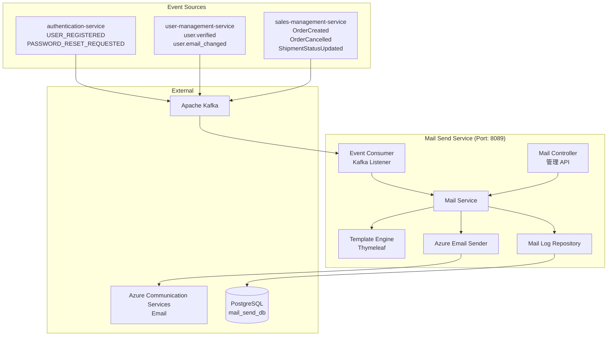
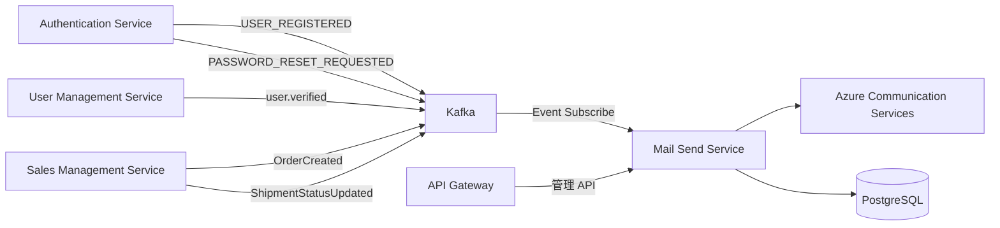
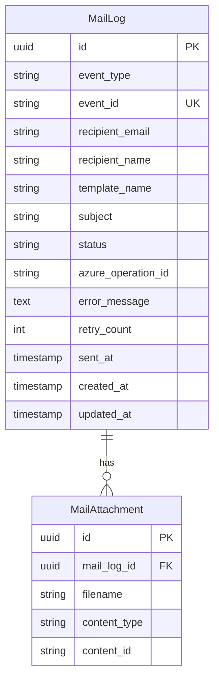
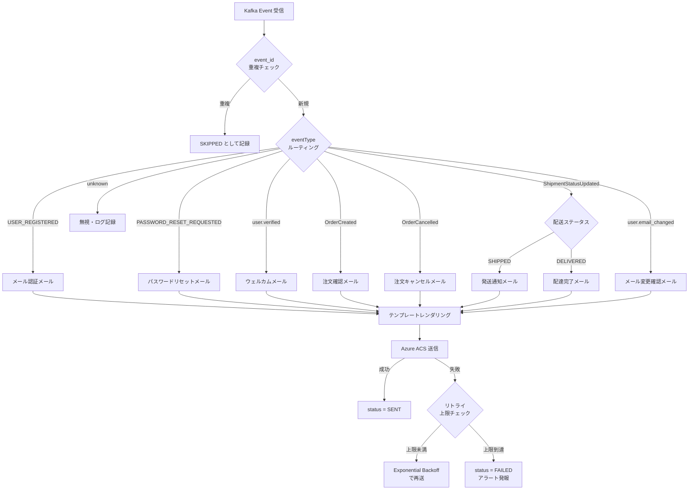

# Mail Send Service - Detailed Design Document

## 1. Overview

Mail Send Service は Azure SkiShop EC プラットフォームのトランザクションメール配信を担うマイクロサービスである。Azure Communication Services Email を利用してメール送信を行い、他サービスから Kafka イベントを購読して非同期にメール配信をトリガーする。

### 1.1 目的

- EC サイトにおけるトランザクションメール（注文確認、発送通知、パスワードリセット、メール認証）を一元管理する
- 各マイクロサービスはメール送信ロジックを持たず、ドメインイベントを発行するだけで自動的にメールが送信される
- テンプレートベースのメール生成により、一貫したブランド体験を提供する

### 1.2 スコープ

| 区分 | 内容 |
|------|------|
| **In Scope** | トランザクションメール配信（注文確認、発送通知、パスワードリセット、メール認証、アカウント関連通知）、テンプレート管理、送信履歴管理、リトライ処理 |
| **Out of Scope** | マーケティングメール（一括配信）、SMS 通知、プッシュ通知。これらは将来の Notification Service で対応 |

## 2. Technology Stack

### 開発環境

- **Language**: Java 21 (LTS)
- **Framework**: Spring Boot 3.5.0
- **Build Tool**: Maven 3.9+
- **Containerization**: Docker 25.x
- **Testing**: JUnit 5, Spring Boot Test, Testcontainers

### 本番環境

- Azure Container Apps
- Azure Communication Services Email
- Azure Database for PostgreSQL
- Apache Kafka (Azure Event Hubs for Kafka)

### 主要ライブラリ

| Library | Version | Purpose |
|---------|---------|---------|
| spring-boot-starter-web | 3.5.0 | REST API（管理用エンドポイント） |
| spring-boot-starter-data-jpa | 3.5.0 | JPA データアクセス |
| spring-cloud-stream-binder-kafka | 4.2.0 | Kafka イベント購読 |
| azure-communication-email | 1.1.3 | Azure Communication Services Email SDK |
| azure-identity | 1.15.4 | Azure 認証（Managed Identity） |
| spring-boot-starter-thymeleaf | 3.5.0 | メールテンプレートエンジン |
| spring-boot-starter-validation | 3.5.0 | 入力バリデーション |
| spring-boot-starter-actuator | 3.5.0 | ヘルスチェック・メトリクス |
| micrometer-registry-prometheus | 1.14.x | メトリクス収集 |
| springdoc-openapi-starter-webmvc-ui | 2.8.x | API ドキュメント |
| postgresql | 42.7.x | PostgreSQL JDBC ドライバ |

## 3. System Architecture

### 3.1 コンポーネントアーキテクチャ



### 3.2 マイクロサービス関係図



## 4. Data Model

### 4.1 Entity Relationship Diagram



### 4.2 テーブル定義

#### mail_logs table

| Column | Data Type | Constraints | Description |
|--------|-----------|-------------|-------------|
| id | UUID | PK | メールログ ID |
| event_type | VARCHAR(100) | NOT NULL | トリガーイベントタイプ |
| event_id | VARCHAR(100) | UNIQUE, NOT NULL | イベント ID（冪等性保証） |
| correlation_id | VARCHAR(100) | | 相関 ID（トレーサビリティ） |
| recipient_email | VARCHAR(255) | NOT NULL | 送信先メールアドレス |
| recipient_name | VARCHAR(200) | | 送信先氏名 |
| template_name | VARCHAR(100) | NOT NULL | 使用テンプレート名 |
| subject | VARCHAR(500) | NOT NULL | メール件名 |
| status | VARCHAR(30) | NOT NULL | 送信ステータス（PENDING, SENDING, SENT, FAILED, SKIPPED） |
| azure_operation_id | VARCHAR(200) | | Azure ACS 送信オペレーション ID |
| error_message | TEXT | | エラーメッセージ（失敗時） |
| retry_count | INTEGER | NOT NULL, DEFAULT 0 | リトライ回数 |
| sent_at | TIMESTAMP | | 送信完了日時 |
| created_at | TIMESTAMP | NOT NULL | 作成日時 |
| updated_at | TIMESTAMP | NOT NULL | 更新日時 |

**インデックス**:
- `idx_mail_logs_event_id` ON event_id（冪等性チェック用）
- `idx_mail_logs_status` ON status（リトライ対象検索用）
- `idx_mail_logs_recipient` ON recipient_email（履歴検索用）
- `idx_mail_logs_created_at` ON created_at（監査用）

## 5. Service Information

| Item | Value |
|------|-------|
| Service Name | mailsend-service |
| Port | 8089 |
| Database | PostgreSQL (skishop_mailsend) |
| Framework | Spring Boot 3.5.0 |
| Java Version | 21 |
| Architecture | Event-Driven Microservice |
| Email Provider | Azure Communication Services Email |
| Event Broker | Apache Kafka |

## 6. メール種別定義

### 6.1 トランザクションメール一覧

| # | メール種別 | テンプレート名 | トリガーイベント | 発行元サービス | 優先度 |
|---|-----------|-------------|---------------|-------------|-------|
| 1 | メール認証 | `email-verification` | USER_REGISTERED | authentication-service | HIGH |
| 2 | ウェルカムメール | `welcome` | user.verified | user-management-service | MEDIUM |
| 3 | パスワードリセット | `password-reset` | PASSWORD_RESET_REQUESTED | authentication-service | HIGH |
| 4 | 注文確認 | `order-confirmation` | OrderCreated | sales-management-service | HIGH |
| 5 | 注文キャンセル確認 | `order-cancelled` | OrderCancelled | sales-management-service | HIGH |
| 6 | 発送通知 | `shipment-notification` | ShipmentStatusUpdated (SHIPPED) | sales-management-service | HIGH |
| 7 | 配達完了通知 | `delivery-confirmation` | ShipmentStatusUpdated (DELIVERED) | sales-management-service | MEDIUM |
| 8 | メールアドレス変更確認 | `email-change-verification` | user.email_changed | user-management-service | HIGH |

### 6.2 テンプレート設計

テンプレートは Thymeleaf を使用し、`src/main/resources/templates/mail/` に HTML テンプレートとして配置する。

```
templates/mail/
├── layout/
│   └── base.html              # 共通レイアウト（ヘッダー、フッター、ブランドカラー）
├── email-verification.html    # メール認証
├── welcome.html               # ウェルカムメール
├── password-reset.html        # パスワードリセット
├── order-confirmation.html    # 注文確認
├── order-cancelled.html       # 注文キャンセル確認
├── shipment-notification.html # 発送通知
├── delivery-confirmation.html # 配達完了通知
└── email-change-verification.html # メールアドレス変更確認
```

#### テンプレート共通要素

- Azure SkiShop ロゴ・ブランドカラー
- レスポンシブ HTML メール（モバイル対応）
- プレーンテキストフォールバック自動生成
- フッター: 配信停止リンク（トランザクションメールのため非表示）、会社情報、プライバシーポリシーリンク

## 7. API 設計

### 7.1 管理用 REST API

管理者が送信履歴の確認・リトライを行うための API。

| Method | Path | Role | Description |
|--------|------|------|-------------|
| GET | /api/v1/mail/logs | ADMIN | メール送信履歴一覧（ページネーション） |
| GET | /api/v1/mail/logs/{id} | ADMIN | メール送信履歴詳細 |
| POST | /api/v1/mail/logs/{id}/retry | ADMIN | 失敗メールの手動リトライ |
| GET | /api/v1/mail/stats | ADMIN, MANAGER | メール送信統計（日別送信数・成功率） |
| POST | /api/v1/mail/test | ADMIN | テストメール送信（開発・検証用） |

### 7.2 レスポンス DTO

```java
public record MailLogResponse(
    UUID id,
    String eventType,
    String recipientEmail,
    String recipientName,
    String templateName,
    String subject,
    String status,
    int retryCount,
    String errorMessage,
    Instant sentAt,
    Instant createdAt
) {}

public record MailStatsResponse(
    long totalSent,
    long totalFailed,
    long totalPending,
    double successRate,
    Map<String, Long> sentByTemplate
) {}

public record TestMailRequest(
    @NotBlank String recipientEmail,
    @NotBlank String templateName,
    Map<String, Object> variables
) {}
```

## 8. イベント消費設計

### 8.1 Kafka Consumer 設定

```yaml
spring:
  cloud:
    stream:
      kafka:
        binder:
          brokers: ${KAFKA_BROKERS:localhost:9092}
      bindings:
        mailEventConsumer-in-0:
          destination: domain-events
          group: mailsend-service
          content-type: application/json
      function:
        definition: mailEventConsumer
```

### 8.2 イベントハンドリングフロー



### 8.3 冪等性保証

- 各イベントの `eventId` を `mail_logs.event_id` に UNIQUE 制約で格納
- 重複イベント受信時は INSERT が失敗 → `SKIPPED` としてログ記録
- 同一注文に対する重複メール送信を防止

### 8.4 リトライ戦略

| パラメータ | 値 |
|-----------|-----|
| 最大リトライ回数 | 3 |
| 初回リトライ間隔 | 30 秒 |
| バックオフ倍率 | 2.0（30s → 60s → 120s） |
| リトライ対象 | ネットワークエラー、Azure ACS 一時エラー（429, 5xx） |
| リトライ非対象 | バリデーションエラー（400）、認証エラー（401, 403） |

失敗が最大リトライ回数に達した場合:
1. `status = FAILED` に更新
2. `MailSendFailed` ドメインイベントを発行（将来の監視・アラートシステム連携用）
3. ログレベル ERROR で記録

## 9. Azure Communication Services 連携設計

### 9.1 認証方式

本番環境では **Managed Identity**（`DefaultAzureCredential`）を使用し、接続文字列やアクセスキーのハードコードを禁止する。

```java
@Configuration
public class AzureEmailConfig {

    @Value("${azure.communication.endpoint}")
    private String endpoint;

    @Bean
    public EmailClient emailClient() {
        return new EmailClientBuilder()
                .endpoint(endpoint)
                .credential(new DefaultAzureCredentialBuilder().build())
                .buildClient();
    }
}
```

ローカル開発環境では接続文字列を環境変数 `AZURE_COMMUNICATION_CONNECTION_STRING` から取得する。

### 9.2 送信処理

Azure Communication Services Email の `beginSend` は Long-Running Operation（LRO）であるため、`SyncPoller` を使用して結果をポーリングする。

```java
EmailMessage message = new EmailMessage()
    .setSenderAddress(senderAddress)
    .setToRecipients(recipientEmail)
    .setSubject(subject)
    .setBodyHtml(htmlContent)
    .setBodyPlainText(plainTextContent);

SyncPoller<EmailSendResult, EmailSendResult> poller =
    emailClient.beginSend(message);

PollResponse<EmailSendResult> response =
    poller.waitForCompletion(Duration.ofSeconds(30));
```

### 9.3 送信者アドレス

| 環境 | 送信者アドレス |
|-----|-------------|
| 本番 | `noreply@mail.skishop.example.com`（カスタムドメイン） |
| 開発 | `DoNotReply@<resource-id>.azurecomm.net`（ACS 既定ドメイン） |

### 9.4 レート制限・スロットリング対応

Azure Communication Services Email の送信レート制限に対応する:
- 429 Too Many Requests 受信時は `Retry-After` ヘッダーに従い待機
- Sandbox 環境ではメール送信数に制限あり（本番昇格申請が必要）

## 10. パッケージ構成

```
com.example.skishop.mailsend/
├── MailSendApplication.java
├── config/
│   ├── AzureEmailConfig.java          # Azure ACS EmailClient Bean
│   ├── SecurityConfig.java            # Spring Security 設定
│   └── KafkaConsumerConfig.java       # Kafka Consumer 設定（必要時）
├── controller/
│   └── MailController.java            # 管理用 REST API
├── service/
│   ├── MailService.java               # メール送信ビジネスロジック
│   ├── TemplateService.java           # Thymeleaf テンプレート処理
│   ├── AzureEmailSender.java          # Azure ACS 送信ラッパー
│   └── UserInfoResolver.java          # user-management-service API クライアント
├── consumer/
│   └── MailEventConsumer.java         # Kafka イベントリスナー
├── model/
│   └── MailLog.java                   # JPA エンティティ
├── dto/
│   ├── MailLogResponse.java           # レスポンス DTO
│   ├── MailStatsResponse.java         # 統計レスポンス DTO
│   └── TestMailRequest.java           # テストメールリクエスト DTO
└── repository/
    └── MailLogRepository.java         # Spring Data JPA リポジトリ
```

## 11. 設定ファイル

### application.yml

```yaml
server:
  port: 8089

spring:
  application:
    name: mailsend-service
  datasource:
    url: jdbc:postgresql://${DB_HOST:localhost}:5432/skishop_mailsend
    username: ${DB_USER:postgres}
    password: ${DB_PASSWORD:postgres}
  jpa:
    hibernate:
      ddl-auto: validate
    open-in-view: false
  flyway:
    enabled: true
  cloud:
    stream:
      kafka:
        binder:
          brokers: ${KAFKA_BROKERS:localhost:9092}
      bindings:
        mailEventConsumer-in-0:
          destination: domain-events
          group: mailsend-service
          content-type: application/json
      function:
        definition: mailEventConsumer

# Azure Communication Services
azure:
  communication:
    endpoint: ${AZURE_COMMUNICATION_ENDPOINT:https://skishop-acs.communication.azure.com}
    sender-address: ${MAIL_SENDER_ADDRESS:DoNotReply@skishop-acs.azurecomm.net}

# Mail Service Config
mail:
  retry:
    max-attempts: 3
    initial-interval-ms: 30000
    multiplier: 2.0
  base-url: ${APP_BASE_URL:http://localhost:3000}

# サービス間通信
services:
  user-management:
    url: ${USER_MANAGEMENT_SERVICE_URL:http://localhost:8083}

# JWT
jwt:
  secret: ${JWT_SECRET:dev-secret-key}

# Actuator
management:
  endpoints:
    web:
      exposure:
        include: health,info,prometheus
  endpoint:
    health:
      show-details: when-authorized

# Swagger
springdoc:
  swagger-ui:
    path: /swagger-ui.html
  api-docs:
    path: /v3/api-docs
```

## 12. イベントペイロード定義

### 12.1 消費するイベント

各サービスが発行する既存の DomainEvent ペイロードをそのまま受信し、メール送信に必要な情報を抽出する。

#### USER_REGISTERED (authentication-service)

**現状**: イベント発行済み。ただし `verificationToken` がペイロードに含まれていないため、セクション 19.1 の変更が必要。

現行ペイロード:
```java
public record UserRegisteredPayload(UUID userId, String email, String firstName,
                                     String lastName, String role) {}
```

変更後ペイロード (→ `verificationToken` を追加):
```json
{
  "eventId": "uuid",
  "eventType": "USER_REGISTERED",
  "producer": "authentication-service",
  "payload": {
    "userId": "uuid",
    "email": "user@example.com",
    "firstName": "太郎",
    "lastName": "山田",
    "role": "USER",
    "verificationToken": "uuid-token-value"
  }
}
```

→ メール認証リンク生成: `{base-url}/verify-email?token={verificationToken}`

> **注意**: 現在 user-management-service の `verifyEmail()` メソッドはスタブ実装（トークンをメールアドレスとして扱っている）。本サービス実装時に `verification_tokens` テーブルの作成とトークン検索ロジックの実装が必要（セクション 19.4 参照）。

#### PASSWORD_RESET_REQUESTED (authentication-service)

```json
{
  "eventId": "uuid",
  "eventType": "PASSWORD_RESET_REQUESTED",
  "producer": "authentication-service",
  "payload": {
    "userId": "uuid",
    "email": "user@example.com",
    "firstName": "太郎",
    "resetToken": "reset-token-value",
    "expiresAt": "2026-03-20T00:00:00Z"
  }
}
```

→ パスワードリセットリンク生成: `{base-url}/password/reset?token={resetToken}`

#### OrderCreated (sales-management-service)

**現状**: イベント発行済み。ペイロードに顧客メールアドレスが含まれないため、サービス間 API 呼び出しが必要。

```java
public record OrderEventPayload(UUID orderId, String orderNumber, UUID customerId, BigDecimal totalAmount) {}
```

```json
{
  "eventId": "uuid",
  "eventType": "OrderCreated",
  "producer": "sales-service",
  "payload": {
    "orderId": "uuid",
    "orderNumber": "ORD-20260319-001",
    "customerId": "uuid",
    "totalAmount": 89800
  }
}
```

→ 注文確認メール送信。**顧客情報（メールアドレス・氏名）は user-management-service へ API 呼び出しで取得する**（セクション 12.3 参照）。

#### OrderCancelled (sales-management-service)

**現状**: イベント発行済み。OrderCreated と同一の `OrderEventPayload` を使用。

```json
{
  "eventId": "uuid",
  "eventType": "OrderCancelled",
  "producer": "sales-service",
  "payload": {
    "orderId": "uuid",
    "orderNumber": "ORD-20260319-001",
    "customerId": "uuid",
    "totalAmount": 89800
  }
}
```

→ 注文キャンセル確認メール送信。顧客情報は OrderCreated と同様に user-management-service へ API 呼び出しで取得。

#### ShipmentStatusUpdated (sales-management-service)

**現状**: イベント未発行。セクション 19.2 の変更が必要。

現行の `ShipmentEventPayload`（`ShipmentCreated` イベントで使用）:
```java
public record ShipmentEventPayload(UUID shipmentId, UUID orderId, String carrier) {}
```

ShipmentStatusUpdated 用の新規ペイロード `ShipmentStatusPayload` を追加する:
```json
{
  "eventId": "uuid",
  "eventType": "ShipmentStatusUpdated",
  "producer": "sales-service",
  "payload": {
    "shipmentId": "uuid",
    "orderId": "uuid",
    "customerId": "uuid",
    "orderNumber": "ORD-20260319-001",
    "status": "SHIPPED",
    "trackingNumber": "1234567890",
    "carrier": "Yamato"
  }
}
```

> **注意**: 現行の `updateShipmentStatus()` メソッドは `shipmentId` のみを参照しているため、`orderNumber` と `customerId` は Order エンティティからの結合取得が必要。また `trackingNumber` は Shipment エンティティから取得する。セクション 19.2 の実装詳細を参照。

→ `status` が `SHIPPED` の場合は発送通知、`DELIVERED` の場合は配達完了通知を送信。顧客情報は `customerId` を使い user-management-service へ API 呼び出しで取得。

#### user.verified (user-management-service)

**現状**: イベント発行済み。

```java
public record UserEventPayload(UUID id, String email, String firstName, String lastName) {}
```

```json
{
  "eventId": "uuid",
  "eventType": "user.verified",
  "producer": "user-management-service",
  "payload": {
    "id": "uuid",
    "email": "user@example.com",
    "firstName": "太郎",
    "lastName": "山田"
  }
}
```

→ ウェルカムメール送信。ペイロードに email を含むためサービス間 API 呼び出しは不要。

#### user.email_changed (user-management-service)

**現状**: イベント未発行・メールアドレス変更 API も未実装。Phase 3 で対応（セクション 19.3 参照）。

```json
{
  "eventId": "uuid",
  "eventType": "user.email_changed",
  "producer": "user-management-service",
  "payload": {
    "userId": "uuid",
    "newEmail": "new@example.com",
    "firstName": "太郎",
    "verificationToken": "uuid-token-value"
  }
}
```

→ メールアドレス変更確認メール送信。新メールアドレス宛に認証リンクを送信: `{base-url}/verify-email?token={verificationToken}`

### 12.3 サービス間 API 呼び出し（顧客情報取得）

`OrderCreated`、`OrderCancelled`、`ShipmentStatusUpdated` イベントのペイロードには顧客メールアドレスが含まれないため、mailsend-service が user-management-service の内部 API を呼び出して取得する。

| 対象イベント | 取得元 | API | 取得情報 |
|-------------|-------|-----|----------|
| OrderCreated | user-management-service | `GET /api/v1/users/{customerId}` | email, firstName, lastName |
| OrderCancelled | user-management-service | `GET /api/v1/users/{customerId}` | email, firstName, lastName |
| ShipmentStatusUpdated | user-management-service | `GET /api/v1/users/{customerId}` | email, firstName, lastName |

**実装方針**:
- `WebClient`（または `RestClient`）を使用し、API Gateway 経由ではなく内部サービス直接呼び出し（`http://user-management-service:8083`）
- 呼び出し失敗時はメール送信を `FAILED` とし、リトライ対象とする
- キャッシュは不要（トランザクションメールは最新情報で送信すべき）
- タイムアウト: 5 秒

```java
@Component
public class UserInfoResolver {
    private final RestClient restClient;

    public UserInfoResolver(@Value("${services.user-management.url}") String baseUrl) {
        this.restClient = RestClient.builder().baseUrl(baseUrl).build();
    }

    public UserInfo resolve(UUID customerId) {
        return restClient.get()
                .uri("/api/v1/users/{id}", customerId)
                .retrieve()
                .body(UserInfo.class);
    }

    public record UserInfo(UUID id, String email, String firstName, String lastName) {}
}
```

`application.yml` 追加設定:
```yaml
services:
  user-management:
    url: ${USER_MANAGEMENT_SERVICE_URL:http://localhost:8083}
```

### 12.4 発行するイベント

| イベントタイプ | トリガー | ペイロード |
|-------------|---------|----------|
| MailSent | メール送信成功 | { mailLogId, eventType, recipientEmail } |
| MailSendFailed | リトライ上限到達 | { mailLogId, eventType, recipientEmail, errorMessage } |

## 13. セキュリティ設計

### 13.1 API アクセス制御

- 管理用 API（`/api/v1/mail/**`）は原則 `ADMIN` ロール必須
  - 例外: `GET /api/v1/mail/stats` は `ADMIN` または `MANAGER` ロールでアクセス可（セクション 7.1 参照）
- Actuator ヘルスチェック（`/actuator/health`）は認証不要
- Swagger UI（`/swagger-ui/**`）は認証不要

### 13.2 機密情報管理

| 情報 | 管理方法 |
|-----|---------|
| Azure ACS エンドポイント | 環境変数 `AZURE_COMMUNICATION_ENDPOINT` |
| Azure 認証情報 | Managed Identity（本番）、環境変数（開発） |
| DB 接続情報 | 環境変数 |
| JWT シークレット | 環境変数 |

- ソースコード・設定ファイルへのシークレット直書きは禁止
- 本番環境では Azure Key Vault からの取得を推奨

### 13.3 メールアドレスのバリデーション

- 受信イベントのメールアドレスを RFC 5322 準拠でバリデーション
- 不正なメールアドレスの場合は `SKIPPED` として記録し送信しない

## 14. 監視・運用

### 14.1 メトリクス

| メトリクス名 | タイプ | Description |
|------------|------|-------------|
| `mail.sent.total` | Counter | 送信成功メール総数（template タグ付き） |
| `mail.failed.total` | Counter | 送信失敗メール総数 |
| `mail.send.duration` | Timer | メール送信処理時間 |
| `mail.retry.total` | Counter | リトライ実行回数 |
| `mail.event.consumed.total` | Counter | 受信イベント総数（eventType タグ付き） |

### 14.2 ヘルスチェック

- PostgreSQL 接続チェック
- Kafka ブローカー接続チェック
- Azure Communication Services エンドポイント接続チェック

### 14.3 アラート条件

| 条件 | 重要度 | 対応 |
|------|--------|------|
| メール送信成功率 < 95%（直近 1 時間） | CRITICAL | 即時調査 |
| 未送信メール（PENDING）が 100 件超 | WARNING | キュー詰まり確認 |
| リトライ上限到達（FAILED）が 10 件/時超 | CRITICAL | ACS ステータス確認 |

## 15. API Gateway ルーティング

`RouteConfig.java` に以下のルートを追加する:

```java
.route("mailsend-service", r -> r
        .path("/api/v1/mail/**")
        .filters(f -> f
                .circuitBreaker(cb -> cb.setName("mailCircuitBreaker")
                        .setFallbackUri("forward:/fallback/mail"))
                .retry(retryConfig -> retryConfig.setRetries(3)))
        .uri(mailServiceUrl))
```

## 16. Docker Compose 追加設定

```yaml
  mailsend-service:
    build: ../mailsend-service
    ports:
      - "8089:8089"
    environment:
      DB_HOST: postgres
      DB_USER: postgres
      DB_PASSWORD: postgres
      KAFKA_BROKERS: kafka:29092
      JWT_SECRET: ${JWT_SECRET}
      AZURE_COMMUNICATION_ENDPOINT: ${AZURE_COMMUNICATION_ENDPOINT}
      MAIL_SENDER_ADDRESS: ${MAIL_SENDER_ADDRESS}
      APP_BASE_URL: ${APP_BASE_URL:-http://localhost:3000}
      USER_MANAGEMENT_SERVICE_URL: http://user-management-service:8083
    depends_on:
      postgres:
        condition: service_healthy
      kafka:
        condition: service_healthy
    profiles:
      - app
```

## 17. テスト戦略

### 17.1 単体テスト

| テスト対象 | テストクラス | カバレッジ目標 |
|-----------|-----------|-------------|
| MailService | MailServiceTest | 分岐 80%+ |
| TemplateService | TemplateServiceTest | 全テンプレート検証 |
| AzureEmailSender | AzureEmailSenderTest | 成功/失敗/リトライ |
| MailEventConsumer | MailEventConsumerTest | 全イベントタイプ + 冪等性 |
| MailController | MailControllerTest | 全エンドポイント |

### 17.2 テスト方針

- Azure Communication Services は Mock 化（`EmailClient` の Mock）
- Kafka イベント消費は `spring-cloud-stream-test-binder` で検証
- テンプレートレンダリングは実際の Thymeleaf エンジンで検証
- 冪等性テスト: 同一 eventId の重複送信で 1 通のみ送信されることを確認

## 18. 実装優先度

| Phase | 対応メール | 備考 |
|-------|----------|------|
| Phase 1（MVP） | メール認証、パスワードリセット、注文確認 | EC サイト Phase 1 ブロッカー |
| Phase 2 | 発送通知、配達完了通知、ウェルカムメール | 運用品質向上 |
| Phase 3 | 注文キャンセル確認、メールアドレス変更確認 | 全トランザクションメール完備 |

## 19. 既存サービスへの変更

### 19.1 authentication-service

#### 変更 1: `PASSWORD_RESET_REQUESTED` イベントの発行追加

**現状**: `requestPasswordReset()` メソッドはリセットトークンを生成・保存するが、イベントを発行していない。

**変更内容**: `passwordResetRepository.save()` の後にイベント発行を追加する。

```java
// AuthenticationService.java - requestPasswordReset() 内
userRepository.findByEmail(request.email()).ifPresent(user -> {
    String token = UUID.randomUUID().toString();
    var resetEntity = new PasswordReset(user.getId(), token,
            Instant.now().plus(1, ChronoUnit.HOURS));
    passwordResetRepository.save(resetEntity);

    // ⬇ 追加: イベント発行
    eventPublisher.publish(DomainEvent.create(
        "PASSWORD_RESET_REQUESTED",
        "authentication-service",
        new PasswordResetRequestedPayload(
            user.getId(), user.getEmail(), user.getFirstName(),
            token, resetEntity.getExpiresAt())
    ));
});
```

**新規ペイロード record**:
```java
public record PasswordResetRequestedPayload(
    UUID userId, String email, String firstName,
    String resetToken, Instant expiresAt) {}
```

#### 変更 2: `USER_REGISTERED` イベントに `verificationToken` を追加

**現状**: `UserRegisteredPayload` に `verificationToken` フィールドがない。ユーザー登録時にメール認証トークンを生成していない。

**変更内容**: `register()` メソッド内で認証トークンを生成し、`UserRegisteredPayload` に含める。

```java
// AuthenticationService.java - register() 内
String verificationToken = UUID.randomUUID().toString();
// verification_tokens テーブルに保存（新規作成必要）
verificationTokenRepository.save(
    new VerificationToken(user.getId(), verificationToken,
        Instant.now().plus(24, ChronoUnit.HOURS)));

eventPublisher.publish(DomainEvent.create(
    "USER_REGISTERED",
    "authentication-service",
    new UserRegisteredPayload(user.getId(), user.getEmail(),
        user.getFirstName(), user.getLastName(), user.getRole().name(),
        verificationToken)
));
```

**ペイロード record 変更**:
```java
// 変更前
public record UserRegisteredPayload(UUID userId, String email, String firstName,
                                     String lastName, String role) {}
// 変更後
public record UserRegisteredPayload(UUID userId, String email, String firstName,
                                     String lastName, String role,
                                     String verificationToken) {}
```

**新規テーブル**: `verification_tokens`
```sql
CREATE TABLE verification_tokens (
    id UUID PRIMARY KEY DEFAULT gen_random_uuid(),
    user_id UUID NOT NULL,
    token VARCHAR(100) NOT NULL UNIQUE,
    expires_at TIMESTAMP NOT NULL,
    used BOOLEAN NOT NULL DEFAULT FALSE,
    created_at TIMESTAMP NOT NULL DEFAULT CURRENT_TIMESTAMP
);
CREATE INDEX idx_verification_tokens_token ON verification_tokens(token);
```

### 19.2 sales-management-service

**現状**: `updateShipmentStatus()` メソッドはステータス更新のみでイベントを発行していない。また既存の `ShipmentEventPayload` はフィールドが不足（`trackingNumber`, `orderNumber`, `status`, `customerId` がない）。

**変更内容**: `updateShipmentStatus()` にイベント発行を追加し、新規の `ShipmentStatusPayload` を定義する。

```java
// OrderService.java - updateShipmentStatus() 内
@Transactional
public ShipmentResponse updateShipmentStatus(UUID shipmentId, String status) {
    Shipment shipment = shipmentRepository.findById(shipmentId)
            .orElseThrow(() -> new ResourceNotFoundException("Shipment", shipmentId.toString()));

    Shipment.ShipmentStatus newStatus = Shipment.ShipmentStatus.valueOf(status.toUpperCase());
    shipment.setStatus(newStatus);
    if (newStatus == Shipment.ShipmentStatus.SHIPPED) shipment.setShippedAt(Instant.now());
    if (newStatus == Shipment.ShipmentStatus.DELIVERED) shipment.setDeliveredAt(Instant.now());
    shipment = shipmentRepository.save(shipment);

    // ⬇ 追加: 注文情報を取得してイベント発行
    Order order = findOrderOrThrow(shipment.getOrderId());
    eventPublisher.publish(DomainEvent.create(
        "ShipmentStatusUpdated",
        "sales-service",
        new ShipmentStatusPayload(
            shipment.getId(), shipment.getOrderId(), order.getCustomerId(),
            order.getOrderNumber(), newStatus.name(),
            shipment.getTrackingNumber(), shipment.getCarrier())
    ));

    return toShipmentResponse(shipment);
}
```

**新規ペイロード record**:
```java
public record ShipmentStatusPayload(
    UUID shipmentId, UUID orderId, UUID customerId,
    String orderNumber, String status,
    String trackingNumber, String carrier) {}
```

### 19.3 user-management-service

**現状**: メールアドレス変更機能が存在しない。`UpdateUserRequest` に email フィールドがなく、`user.email_changed` イベントも存在しない。

**変更スコープ**（Phase 3 で実装）:
1. `UpdateUserRequest` に `email` フィールドを追加
2. `updateUser()` メソッド内でメール変更検知ロジックを追加（新メールアドレスの重複チェック含む）
3. 新メールアドレス用の認証トークンを生成（authentication-service の `verification_tokens` テーブルを共用または user-management-service 側に同様のテーブルを作成）
4. 認証完了までは旧メールアドレスを維持し、`email_pending` などの一時フィールドに新アドレスを保存
5. `user.email_changed` イベントを発行

```java
// メール変更時のイベントペイロード
eventPublisher.publish(DomainEvent.create(
    "user.email_changed",
    "user-management-service",
    new EmailChangedPayload(userId, newEmail, firstName, verificationToken)
));

public record EmailChangedPayload(
    UUID userId, String newEmail, String firstName,
    String verificationToken) {}
```

### 19.4 user-management-service—メール認証スタブの本実装化

**現状**: `verifyEmail(String token)` はスタブ実装であり、トークンをメールアドレスとして扱っている：
```java
// 現行実装（スタブ）
UserProfile user = userProfileRepository.findByEmail(token)  // token を email として検索
```

**変更内容**（Phase 1 で実装必須）:
1. `VerificationToken` エンティティとリポジトリを user-management-service（または authentication-service）に追加
2. `verifyEmail()` をトークン検索ベースに変更:

```java
// 本実装
public void verifyEmail(String token) {
    VerificationToken vt = verificationTokenRepository
        .findByTokenAndUsedFalse(token)
        .orElseThrow(() -> new BusinessRuleViolationException(
            "INVALID_TOKEN", "無効または期限切れのトークンです"));
    if (vt.getExpiresAt().isBefore(Instant.now())) {
        throw new BusinessRuleViolationException(
            "EXPIRED_TOKEN", "トークンが期限切れです");
    }
    UserProfile user = findUserOrThrow(vt.getUserId());
    user.setEmailVerified(true);
    if (user.getStatus() == UserProfile.UserStatus.PENDING_VERIFICATION) {
        user.setStatus(UserProfile.UserStatus.ACTIVE);
    }
    userProfileRepository.save(user);
    vt.setUsed(true);
    verificationTokenRepository.save(vt);
    // user.verified イベント発行（既存）
}
```

## 20. 制約・前提条件

1. Azure Communication Services Email リソースが作成済みであること
2. 送信ドメインが Azure ACS で検証済みであること（カスタムドメイン使用時）
3. Kafka ブローカーが稼働中であること
4. 各サービスが対応するドメインイベントを発行済みであること（下表参照）
5. フロントエンドの Base URL が環境変数で設定されていること（メール内リンク生成用）
6. user-management-service が内部ネットワークからアクセス可能であること（顧客情報取得用 API 呼び出し）

### 20.1 イベント発行状況サマリ

| イベント | 発行元 | 現在の状態 | 必要な変更 | 対応 Phase |
|---------|-------|----------|----------|-----------|
| USER_REGISTERED | authentication-service | ⚠️ 発行済み（verificationToken 不足） | ペイロードに verificationToken を追加 + verification_tokens テーブル作成 | Phase 1 |
| PASSWORD_RESET_REQUESTED | authentication-service | ❌ 未発行 | requestPasswordReset() にイベント発行を追加 | Phase 1 |
| user.verified | user-management-service | ✅ 発行済み | なし（ただし verifyEmail() スタブの本実装化が必要） | Phase 1 |
| OrderCreated | sales-management-service | ✅ 発行済み | なし | Phase 1 |
| OrderCancelled | sales-management-service | ✅ 発行済み | なし | Phase 3 |
| ShipmentStatusUpdated | sales-management-service | ❌ 未発行 | updateShipmentStatus() にイベント発行 + ShipmentStatusPayload 新規追加 | Phase 2 |
| user.email_changed | user-management-service | ❌ 未発行・API 未実装 | メールアドレス変更 API + イベント発行 + 認証トークン生成 | Phase 3 |
